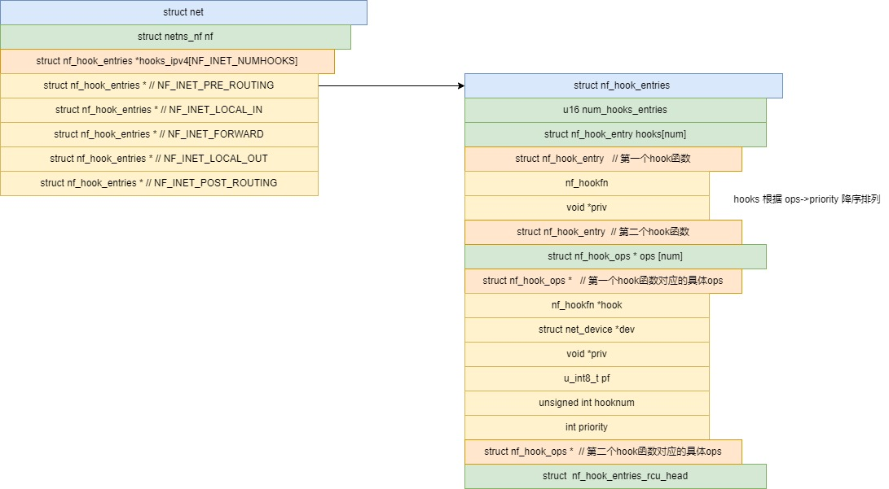
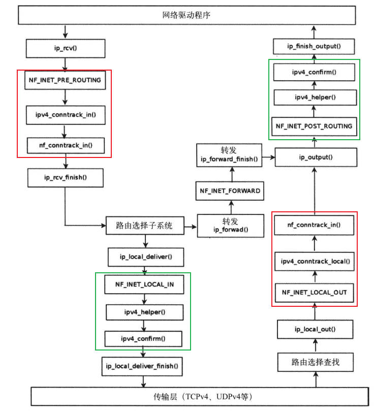

# 初步介绍 netfilter
## netfilter 的位置

协议栈通过调用NF_HOOK，将skb交给netfilter处理，netfilter处理完成后，可能将skb返还给协议栈，也可能消耗了skb。

用户通过iptables命令，和ip_tables模块交互，ip_tables模块调整netfilter模块的hook链，从而实现对skb处理逻辑的调整。

             ┌───────┐         ┌────────────┐ setsockopt
             │socket │         │iptables命令│ getsockopt
             └───┬───┘         └────────────┘
                 │ ▲              │ ▲
       ──────────┼─┼──────────────┼─┼───────────────►
                 ▼ │              ▼ │
            ┌──────────────────────────────────┐
            │           内核接口               │
            └───┬─────────────────┬────────────┘
                ▼ ▲               ▼ ▲
            ┌─────┴───┐        ┌────┴────────────┐
            │ 传输层  │        │ip_tables内核模块│
            └───┬─────┘        └──┬──────────────┘
                ▼ ▲               ▼ ▲
            ┌─────┴──┐  hook   ┌────┴─────────┐
            │ 网络层 │◄────────┤netfilter模块 │
            └───┬────┘───────► └──────────────┘
                ▼ ▲
            ┌─────┴─────┐
            │ 网络接口层│
            └───┬───────┘
                ▼ ▲
            ┌─────┴────┐
            │ 驱动层   │
            └──────────┘

## 网络层和netfilter

### hook点

网络层在5个位置调用了NF_HOOK，以将skb的所有权交给netfilter

                 ┌──────────────────────────────────────────────┐
                 │                   传输层                     │
                 └───────────────────────────────┬──────────────┘
                         ▲                       │
                         │                       ▼
                         │                    ┌──────┐
                         │                    │route │
                         │                    └──┬───┘
                         │                       ▼
                      ┌──┴──┐                 ┌───────┐
                      │INPUT│                 │OUTPUT │
                      └─────┘                 └──┬────┘
                         ▲                       ▼
      ┌───────────┐   ┌──┴──┐    ┌───────┐    ┌──────────┐    ┌───────────┐
      │ PREROUTING├─► │route├───►│FORWARD├───►│dst_output├──► │POSTROUTING│
      └───────────┘   └─────┘    └───────┘    └──────────┘    └─────┬─────┘
            ▲                                                       │
            │                                                       │
            │                                                       ▼
      ┌─────┴──────────────────────────────────────────────────────────────┐
      │                               接口层                               │
      └────────────────────────────────────────────────────────────────────┘

### 返回值
进入netfilter的skb可能被netfilter消耗掉，也可能返回协议栈，netfilter通过返回值告知协议栈skb的现状，具体返回值包括以下5种:
- NF_ACCEPT 继续正常传skb。这个返回值告诉 Netfilter：到目前为止，该数据包还是被接受的并且该数据包应当被递交到网络协议栈的下一个阶段。
- NF_DROP 丢弃该skb，不再传输。
- NF_STOLEN 模块接管该skb，告诉Netfilter“忘掉”该skb。该回调函数将从此开始对skb的处理，并且Netfilter应当放弃对该skb做任何的处理。但是，这并不意味着该数据包的资源已经被释放。这个数据包以及它独自的sk_buff数据结构仍然有效，只是回调函数从Netfilter 获取了该数据包的所有权。
- NF_QUEUE 对该数据报进行排队(通常用于将数据报给用户空间的进程进行处理)
- NF_REPEAT 再次调用该回调函数，应当谨慎使用这个值，以免造成死循环。

## 详解hook

### NF_HOOK : 协议栈到 netfilter
IP层通过调用NF_HOOK，来标记hook点，此处的skb交给netfilter处理
```c
// @ pf：协议族名，Netfilter架构同样可以用于IP层之外，因此这个变量还可以有诸如PF_INET6，PF_DECnet等名字。
// @ hook：HOOK点的名字，对于IP层，就是取上面的五个值；
// @ skb：不解释；
// @ indev：数据包进来的设备，以struct net_device结构表示；
// @ outdev：数据包出去的设备，以struct net_device结构表示；
// @ okfn:是个函数指针，当所有的该HOOK点的所有登记函数调用完后，转而走此流程
//
// 返回 1 表示数据包还回给网络层，其他值表示数据包已经被netfilter消费掉
static inline int
NF_HOOK(uint8_t pf, unsigned int hook, struct net *net, struct sock *sk, struct sk_buff *skb,
	struct net_device *in, struct net_device *out,
	int (*okfn)(struct net *, struct sock *, struct sk_buff *))
{
	int ret = nf_hook(pf, hook, net, sk, skb, in, out, okfn);
	if (ret == 1)
		ret = okfn(net, sk, skb);
	return ret;
}
```

### nf_hook : netfilter处理数据包
netfilter获得数据包后，根据数据包的协议族找到对应的hooks链，根据hook点，找到具体的hook链，使用具体的hook链对skb进行处理
```c
/**
 * nf_hook - 调用 netfilter 捕获点
 * 返回 1 表示钩子已允许数据包通过。在这种情况下，调用者必须调用 okfn 函数。返回其他值表示钩子已经消耗了该数据包。
 */
static inline int nf_hook(u_int8_t pf, unsigned int hook, struct net *net,
			  struct sock *sk, struct sk_buff *skb,
			  struct net_device *indev, struct net_device *outdev,
			  int (*okfn)(struct net *, struct sock *, struct sk_buff *))
{
	struct nf_hook_entries *hook_head = NULL;
	int ret = 1;

	rcu_read_lock();
    // 根据协议族找到hooks，再根据hook点找到对应hook链
	switch (pf) {
	case NFPROTO_IPV4:
		hook_head = rcu_dereference(net->nf.hooks_ipv4[hook]);
		break;
    // ...
	}

	if (hook_head) {
		struct nf_hook_state state;
        // 将参数封装到state
		nf_hook_state_init(&state, hook, pf, indev, outdev,
				   sk, net, okfn);
        // 遍历hook链规则，处理数据包
		ret = nf_hook_slow(skb, &state, hook_head, 0);
	}
	rcu_read_unlock();

	return ret;
}
```

### nf_hook_slow
使用某条hook链进行遍历处理skb
```c
/* 如果 okfn() 需要由调用者执行，
 * 返回 1 对于 NF_DROP，否则返回 0。 调用方必须持有 rcu_read_lock 锁。 */
int nf_hook_slow(struct sk_buff *skb, struct nf_hook_state *state,
		 const struct nf_hook_entries *e, unsigned int s)
{
	unsigned int verdict;
	int ret;

	for (; s < e->num_hook_entries; s++) {
        // 由s索引到当前规则，对skb进行检查
		verdict = nf_hook_entry_hookfn(&e->hooks[s], skb, state);
            return entry->hook(entry->priv, skb, state);
        // 根据规则的结果执行内置目标
		switch (verdict & NF_VERDICT_MASK) {
		case NF_ACCEPT:
			break;
		case NF_DROP:
			kfree_skb(skb);
			ret = NF_DROP_GETERR(verdict);
			if (ret == 0)
				ret = -EPERM;
			return ret;
		case NF_QUEUE:
			ret = nf_queue(skb, state, e, s, verdict);
			if (ret == 1)
				continue;
			return ret;
		default:
            /* 对于 NF_STOLEN 的隐式处理，以及任何其他非常规判定结果。*/
			return 0;
		}
	}

	return 1;
}
```

### 二维数据hook链表

具体hook函数是通过二维索引找到，hook表示hook点，s表示顺序即优先级
`net->nf.hooks_ipv4[hook][s]`

相关数据结构:
```c
struct net {
	struct netns_nf		nf;
	struct netns_xt		xt;
    // ...
};

enum nf_inet_hooks {
	NF_INET_PRE_ROUTING,
	NF_INET_LOCAL_IN,
	NF_INET_FORWARD,
	NF_INET_LOCAL_OUT,
	NF_INET_POST_ROUTING,
	NF_INET_NUMHOOKS
};

struct netns_nf {
	struct nf_hook_entries __rcu *hooks_ipv4[NF_INET_NUMHOOKS];
	struct nf_hook_entries __rcu *hooks_ipv6[NF_INET_NUMHOOKS];
    // ...
};

struct nf_hook_entries {
	u16				num_hook_entries;
	/* padding */
	struct nf_hook_entry		hooks[];

/* 背景资料：指向每个钩子原始 orig_ops 的指针，
 * 随后是用于通过 call_rcu 函数释放结构的 RCU 头和空闲空间。
 *
 * 这不是 struct nf_hook_entry 结构的一部分，因为它在慢路径（钩子注册/注销）中唯一需要：
 * const struct nf_hook_ops     *orig_ops[]
 *
 * 同样出于这个原因，我们将这些信息存储在末尾——只有在删除钩子时才需要，
 * 而在处理数据包路径过程中不需要：struct nf_hook_entries_rcu_head     head
 */
};

struct nf_hook_ops {
	/* User fills in from here down. */
	nf_hookfn		*hook;
	struct net_device	*dev;
	void			*priv;
	u_int8_t		pf;
	unsigned int		hooknum;
	/* Hooks are ordered in ascending priority. */
	int			priority;
};

struct nf_hook_entry {
	nf_hookfn			*hook;
	void				*priv;
};
```
# 从netfilter 到 iptables
- netfilter只有链的概念
  - netfilter提供的`struct netns_nf`，实现了不同协议族的`hook[链][顺序]`
- iptables在其上增加了table的概念。
  - xt_table: 为实现不同协议族的不同功能的表提供支持, 表的核心内容是多个hook点的规则链集合

## 什么是表
表是相同功能hook的统一入口

表首先转换自己为 nf_hook_ops ，再加入nf的对应链

如filter表将自己加入nf 的 INPUT, OUTPUT, FORWARD三个位置，处理方法统一为 `iptable_filter_hook`

```c
#define FILTER_VALID_HOOKS ((1 << NF_INET_LOCAL_IN) | \
			    (1 << NF_INET_FORWARD) | \
			    (1 << NF_INET_LOCAL_OUT))

static const struct xt_table packet_filter = {
	.name		= "filter",
	.valid_hooks	= FILTER_VALID_HOOKS,
	.me		= THIS_MODULE,
	.af		= NFPROTO_IPV4,
	.priority	= NF_IP_PRI_FILTER,
	.table_init	= iptable_filter_table_init,
};

static int __init iptable_filter_init(void)
	filter_ops = xt_hook_ops_alloc(&packet_filter, iptable_filter_hook);

static unsigned int
iptable_filter_hook(void *priv, struct sk_buff *skb,
		    const struct nf_hook_state *state)
	return ipt_do_table(skb, state, state->net->ipv4.iptable_filter);
```

## xt_table
### xt_table 初始化
对init_net的 netns_xt的各个协议族链表初始化
```c
static int __init xt_init(void)
    xt_net_init(net)
        for (i = 0; i < NFPROTO_NUMPROTO; i++)
            INIT_LIST_HEAD(&net->xt.tables[i]);
```

xt_table除了 `net->xt.tables[]`还有iptables的各个类型的表

```c
struct net
	struct netns_ipv4	ipv4;
        struct xt_table		*iptable_filter;
        struct xt_table		*iptable_mangle;
        struct xt_table		*iptable_raw;
        struct xt_table		*arptable_filter;
        struct xt_table		*nat_table;
```

在ip_table中xt_table的private会被设置为 xt_table_info，
xt_table_info记录了表的所有hook点的规则链
```c
/* 表格本身 */
struct xt_table_info {
	/* 每个表的大小 */
	unsigned int size;
	/* 入口数量： FIXME. --RR */
	unsigned int number;
	/* 初始入口数量。用于模块使用计数 */
	unsigned int initial_entries;

    // 每个hook点在entry的偏移
	unsigned int hook_entry[NF_INET_NUMHOOKS];

	unsigned int underflow[NF_INET_NUMHOOKS];

	/*
	 * 用户链的数目。由于表中不能有循环，最多可能有 @stacksize 次跳转（用户链数）。
	 */
	unsigned int stacksize;
	void ***jumpstack;

	/* 大小对齐的字节数组，用于存储规则 */
	unsigned char entries[0] __aligned(8);
};

```

### xt_hook_ops_alloc : 从xt_table 到 nf_hook_ops

xt_table模块提供了 xt_hook_ops_alloc 方法，用于将表注册到netfilter，

具体来说是将 xt_table 转换成功 netns_nf 可用的 nf_hook_ops数组，nf_hook_ops数组可以用于加入netns_nf的对应hook链

通常一个表需要关联多个hook点，所以需要创建对应数量的nf_hook_ops，而hook的回调方法是一样的。

```c
/**
 * xt_hook_ops_alloc - 设置新表的钩子
 * @table: 需要设置钩子所需的原数据表
 * @fn: 钩子函数
 *
 * 此函数将创建 x_table 所需的 nf_hook_ops，以便将其传递给 xt_hook_link_net()。
 */
struct nf_hook_ops *
xt_hook_ops_alloc(const struct xt_table *table, nf_hookfn *fn)
	unsigned int hook_mask = table->valid_hooks;
	struct nf_hook_ops *ops;
	uint8_t hooknum;

    // 根据表插入链的数量，创建对应的多个nf_hook_ops
    // hweight32 计算32bit中置一位的个数
	uint8_t i, num_hooks = hweight32(hook_mask);

	ops = kcalloc(num_hooks, sizeof(*ops), GFP_KERNEL);

	for (i = 0, hooknum = 0; i < num_hooks && hook_mask != 0;
	     hook_mask >>= 1, ++hooknum) {
		if (!(hook_mask & 1))
			continue;
		ops[i].hook     = fn;
		ops[i].pf       = table->af;
		ops[i].hooknum  = hooknum;
		ops[i].priority = table->priority;
		++i;
	}

	return ops;
}
```
### packet_filter —— filter表
iptables 的 filter 模块通过定义 packet_filter 来定义自己的表。
之后需要将 packet_filter加入 xt_table 模块。
```c
// filter表需要注册到3个hook点
#define FILTER_VALID_HOOKS ((1 << NF_INET_LOCAL_IN) | \
			    (1 << NF_INET_FORWARD) | \
			    (1 << NF_INET_LOCAL_OUT))

static const struct xt_table packet_filter = {
	.name		= "filter",
	.valid_hooks	= FILTER_VALID_HOOKS,
	.me		= THIS_MODULE,
	.af		= NFPROTO_IPV4,
	.priority	= NF_IP_PRI_FILTER,
	.table_init	= iptable_filter_table_init, // 实现对nf和xt_table的注册
};
```
### filter_ops —— hook回调函数
iptables 的 filter 模块定义 filter_ops 用于插入 netfilter 的hook点
filter_ops 的初始化通过 xt_hook_ops_alloc 完成

```c
static struct nf_hook_ops *filter_ops __read_mostly; // nf_hook_ops数组
```

filter模组中利用 packet_filter 构造 filter_ops ，将 iptable_filter_hook设置为回调函数
```c

// 根据xt_table表packet_filter构造用于注册nf的ops
static int __init iptable_filter_init(void)
	filter_ops = xt_hook_ops_alloc(&packet_filter, iptable_filter_hook);

// ip_tables的nf回调函数
static unsigned int
iptable_filter_hook(void *priv, struct sk_buff *skb,
		    const struct nf_hook_state *state)
    // skb 数据包
    // state 数据包相关信息
    // iptable_filter filter表，其中有所有三种hook点的规则链
    // ipt_do_table会根据实际hook 点从iptable_filter表中找到对应规则链，
    // 完成对skb的处理
	return ipt_do_table(skb, state, state->net->ipv4.iptable_filter );
```

## netfilter 提供的核心数据结构
```c
typedef unsigned int nf_hookfn(void *priv,
			       struct sk_buff *skb,
			       const struct nf_hook_state *state);

struct nf_hook_ops {
	/* User fills in from here down. */
	nf_hookfn		*hook;   // 回调函数
	struct net_device	*dev; // 输出/输出设备
	void			*priv;  // 回调函数的参数
	u_int8_t		pf;   // 协议族
	unsigned int		hooknum; // hook编号，说明hook位置
    /* 挂钩按升序优先级排列。*/
	int			priority; // 优先级
};

// nf某个hook点的hook数组
struct nf_hook_entries {
	u16				num_hook_entries; // hook数量
	/* padding */
	struct nf_hook_entry		hooks[];
};

struct nf_hook_entry {
	nf_hookfn			*hook; // 回调函数
	void				*priv; // 回调函数的参数
};
```

# ipt_filter的初始化
```c
// 在xt_tables注册filter表
// 在nf注册filter的3个hook点
static int __init iptable_filter_init(void)
    // 创建 nf_hook_ops 数组
	filter_ops = xt_hook_ops_alloc(&packet_filter, iptable_filter_hook);
    // 向xt_table和netfilter进行注册
    iptable_filter_table_init(net);
        struct ipt_replace *repl;
        // 创建filter表的替换表
        repl = ipt_alloc_initial_table(&packet_filter);
        ((struct ipt_standard *)repl->entries)[1].target.verdict =
            forward ? -NF_ACCEPT - 1 : -NF_DROP - 1;
        err = ipt_register_table(net, &packet_filter, repl, filter_ops,
                     &net->ipv4.iptable_filter);

            struct xt_table_info *newinfo;
            struct xt_table_info bootstrap = {0}; // 空的规则表
            struct xt_table *new_table;
            void *loc_cpu_entry;
            // 创建记录表规则的实际对象 newinfo
            newinfo = xt_alloc_table_info(repl->size);
                info = kvmalloc(sz, GFP_KERNEL_ACCOUNT);
                memset(info, 0, sizeof(*info));
                info->size = size;
                return info;
            // 将规则拷贝到newinfo
            loc_cpu_entry = newinfo->entries;
            memcpy(loc_cpu_entry, repl->entries, repl->size);
            // 根据用户空间传入的 repl设置内核空间使用的newinfo
            // 并且确保设置的合法行
            ret = translate_table(net, newinfo, loc_cpu_entry, repl);
            // 进行filter表的注册
            new_table = xt_register_table(net, table, &bootstrap, newinfo);
                struct xt_table_info *private;
                struct xt_table *t, *table;
                // 拷贝filter表
                table = kmemdup(input_table, sizeof(struct xt_table), GFP_KERNEL);
                // 当前表的规则是空
                table->private = bootstrap;
                // 将newinfo设置为表的规则
                xt_replace_table(table, 0, newinfo, &ret);
                    table->private = newinfo;
                // 将表加入网络命令空间的xt
                list_add(&table->list, &net->xt.tables[table->af]);
                // 返回完成注册的表
                return table;
            // 设置网络命名空间的iptables表，如果是filter则为
            // net->ipv4.iptable_filter = new_table;
            WRITE_ONCE(*res, new_table);
            // 进行nf的注册
            // 表通常有多个hook点，所以注册多个hook点
            ret = nf_register_net_hooks(net, ops, hweight32(table->valid_hooks));
                for (i = 0; i < n; i++)
                    err = nf_register_net_hook(net, &reg[i]);
```

### 向xt_table注册
```c
// input_table[input] -> static const struct xt_table packet_filter
// boostrap[output] -> 
// newinfo[input] -> 根据 static const struct xt_table packet_filter 转换的 xt_table_info
// 复制 input_table 到new_table, 将newinfo加入 net->xt.tables[table->af] 链表头部
struct xt_table *xt_register_table(struct net *net,
                   const struct xt_table *input_table,
                   struct xt_table_info *bootstrap,
                   struct xt_table_info *newinfo)
	struct xt_table_info *private;
	struct xt_table *t, *table;
    // 把filter表复制一份
	table = kmemdup(input_table, sizeof(struct xt_table), GFP_KERNEL);
    // 如果filter已经注册，则退出
	list_for_each_entry(t, &net->xt.tables[table->af], list) {
		if (strcmp(t->name, table->name) == 0) {
			ret = -EEXIST;
			goto unlock;
		}
	}
    // newinfo中会具体的规则，将其绑定到table
	xt_replace_table(table, 0, newinfo, &ret);
        ret = xt_jumpstack_alloc(newinfo);
        table->private = newinfo;

	private = table->private;
	private->initial_entries = private->number;
    // filter表加入xt
	list_add(&table->list, &net->xt.tables[table->af]);
```

### 向netfilter注册
```c
// reg 需要注册的hook操作
// n : 注册数量，比如filter有三个hook点，则需要三次
int nf_register_net_hooks(struct net *net, const struct nf_hook_ops *reg,
			  unsigned int n)
	for (i = 0; i < n; i++) 
        // 对具体hook点进行注册
		nf_register_net_hook(net, &reg[i]);

int nf_register_net_hook(struct net *net, const struct nf_hook_ops *reg)
		__nf_register_net_hook(net, NFPROTO_IPV4, reg);

static int __nf_register_net_hook(struct net *net, int pf,
				  const struct nf_hook_ops *reg)
    // 根据协议族pf找到为 nf.hooks_ipv4
    // 根据hook位置找到对应动态数组 nf_hook_entries
	pp = nf_hook_entry_head(net, pf, reg->hooknum, reg->dev);
        return net->nf.hooks_ipv4 + hooknum;
	p = nf_entry_dereference(*pp);
    // 将hook操作加入数组
	new_hooks = nf_hook_entries_grow(p, reg);
	if (!IS_ERR(new_hooks))
		rcu_assign_pointer(*pp, new_hooks);
```

```c
// 完成hook方法的注册
// nf_hook_entries是动态数据，并且是两个动态数组拼接而成(nf_hook_entry 和 nf_hook_ops)
static struct nf_hook_entries *
nf_hook_entries_grow(const struct nf_hook_entries *old,
		     const struct nf_hook_ops *reg)
	if (old) {
        // 找到原有数据的 ops数组 和 entry数量
		orig_ops = nf_hook_entries_get_hook_ops(old);
            unsigned int n = e->num_hook_entries;
            const void *hook_end;
            hook_end = &e->hooks[n]; /* this is *past* ->hooks[]! */
            return (struct nf_hook_ops **)hook_end;

		for (i = 0; i < old_entries; i++)
			if (orig_ops[i] != &dummy_ops)
				alloc_entries++;
    }

    // 创建新的第二维度数组
	new = allocate_hook_entries_size(alloc_entries);
        struct nf_hook_entries *e;
        // 注意数组分为三部分
        size_t alloc = sizeof(*e) + // num_hook_entries
                   sizeof(struct nf_hook_entry) * num +
                   sizeof(struct nf_hook_ops *) * num +
                   sizeof(struct nf_hook_entries_rcu_head);
        e = kvzalloc(alloc, GFP_KERNEL);
        if (e)
            e->num_hook_entries = num;
        return e;

    // 找到新第二维数据中ops起点
	new_ops = nf_hook_entries_get_hook_ops(new);
        unsigned int n = e->num_hook_entries;
        const void *hook_end;
        hook_end = &e->hooks[n]; /* this is *past* ->hooks[]! */
        return (struct nf_hook_ops **)hook_end;

    // 根据旧数据和新节点填充new数组
	i = 0;
	nhooks = 0;
	while (i < old_entries) {
		if (orig_ops[i] == &dummy_ops) {
			++i;
			continue;
		}

		if (inserted || reg->priority > orig_ops[i]->priority) {
			new_ops[nhooks] = (void *)orig_ops[i];
			new->hooks[nhooks] = old->hooks[i];
			i++;
		} else {
			new_ops[nhooks] = (void *)reg;
			new->hooks[nhooks].hook = reg->hook;
			new->hooks[nhooks].priv = reg->priv;
			inserted = true;
		}
		nhooks++;
	}

	if (!inserted) {
		new_ops[nhooks] = (void *)reg;
		new->hooks[nhooks].hook = reg->hook;
		new->hooks[nhooks].priv = reg->priv;
	}

	return new;
```

## 总结
### xt_table 部分
```c
new_table = xt_register_table(net, table, &bootstrap, newinfo);

    net
	   struct netns_xt xt;
	       struct list_head tables[NFPROTO_NUMPROTO];    packet_filter
                NFPROTO_UNSPEC =  0,                        │ 复制
                NFPROTO_INET   =  1,                        ▼
                NFPROTO_IPV4   =  2,──────────────────►  table ──────────┐
                NFPROTO_ARP    =  3,      加入链表          ▲            ▼
                NFPROTO_NETDEV =  5,                        │           xt_table_info
                NFPROTO_BRIDGE =  7,                        │               entries 规则 
                NFPROTO_IPV6   = 10,                        │
                NFPROTO_DECNET = 12,                        │
        struct xt_table		*iptable_filter;────────────────┘
        struct xt_table		*iptable_mangle;     更新iptable_filter表
        struct xt_table		*iptable_raw;
        struct xt_table		*arptable_filter;
        struct xt_table		*nat_table;


```
`struct xt_table packet_filter` 加入 `net->xt.tables[table->af]` 链表

### netfilter部分

```c

                                   struct xt_table packet_filter 
                                              │
                                              ▼
	       struct nf_hook_ops * filter_ops = xt_hook_ops_alloc(&packet_filter, iptable_filter_hook);
                                              │
                                              ▼
                                         filter_ops
                                              │
                                              └─────────────────────────────────────────────────┐
                                                                                                │
   init_net                                                                                     │
       nf                                                                                       │
         struct nf_hook_entries *hooks_ipv4[]                                                   │
            NF_INET_PRE_ROUTING                                                                 │
            NF_INET_LOCAL_IN                                                                    │
            NF_INET_FORWARD      ─────► struct nf_hook_entries                                  │
            NF_INET_LOCAL_OUT                 num_hook_entries                         ◄────────┤
            NF_INET_POST_ROUTING              struct nf_hook_entry[num_hook_entries]   ◄────────┤
                                              struct nf_hook_ops[num_hook_entries]     ◄────────┘
                                              struct nf_hook_entries_rcu_head


```
利用xt_table提供的xt_hook_ops_alloc，将xt_table类型的 packet_filter构造出 nf_hook_ops 类型的filter_ops，
再将filter_ops加入netfilter 对应的数组,
并且回调函数为 iptable_filter_hook 


# iptables的规则实现
## 数据结构
内核中iptables的规则的实现

         iptables规则数组
        ┌────────────┬─────────────────────┬─────────────────────┐
        │  ipt_entry │ ipt_entry_match(es) │  ipt_entry_target   │
        ├────────────┼─────────────────────┼─────────────────────┤
        │  ipt_entry │ ipt_entry_match(es) │  ipt_entry_target   │
        ├────────────┴─────────────────────┴─────────────────────┤
        │                     ...                                │
        └────────────────────────────────────────────────────────┘


- ipt_entry：标准匹配结构，主要包含数据包的源、目的IP，出、入接口和掩码等；
- ipt_entry_match：扩展匹配。一条rule规则可能有零个或多个ipt_entry_match结构；
- ipt_entry_target：一条rule规则有且仅有一个target动作。就是当所有的标准匹配和扩展匹配都符合之后才来执行该target。


### ipt_entry
```c
/* 
这个结构定义了每个防火墙规则。由三部分组成：
1）通用的IP头信息 
2）匹配特定的信息 
3）如果规则匹配则执行的目标操作 
*/
struct ipt_entry {
    // IP头匹配条件（源/目标IP、协议等）
    struct ipt_ip ip;          
    // 缓存标记（内核内部使用）
    unsigned int nfcache;      
    /*ipt_entry 和 匹配 的大小之和*/
    // 从当前entry到target的偏移量
    __u16 target_offset;       
    /* ipt_entry、matches 和 target 的总大小 */
    // 当前entry总长度（用于遍历）
    __u16 next_offset;         
    // 规则来源标记（调试用）
    unsigned int comefrom;     
    // 计数器（包数、字节数统计）
    struct xt_counters counters; 
    // 动态数组，内容为 ipt_entry_match(s) 和 ipt_entry_target
    unsigned char elems[0];    
};
```
#### ipt_ip
iptables标准匹配
```c
// 必须初始化为零
struct ipt_ip {
    /* 源IP和目的IP地址 */
    struct in_addr src, dst;
    /* 源和目的IP地址的掩码 */
    struct in_addr smsk, dmsk;
    char iniface[IFNAMSIZ], outiface[IFNAMSIZ];
    unsigned char iniface_mask[IFNAMSIZ], outiface_mask[IFNAMSIZ];

    /* 协议，0 = ANY */
    __u16 proto;

    /* 标志字节 */
    __u8 flags;
    /* 反向标志字节 */
    __u8 invflags;
};
```

### ipt_entry_match
该结构是Linux内核Netfilter框架中实现iptables扩展匹配模块的核心数据结构，用于描述一条规则中的匹配条件

匹配分为标准匹配和扩展匹配.
- 标准匹配只会检查IP地址，端口等通用信息，不会用到xt_match, 所以ipt_entry_match的match为NULL
- 扩展匹配就需要自己是实现 xt_match对象和相关回调函数

如下就是扩展匹配
```bash
-m tcp --dport 80
```

```c
#define ipt_entry_match xt_entry_match
struct xt_entry_match {
    union {
        struct {
            __u16 match_size;     // 匹配结构总大小
            char name[XT_EXTENSION_MAXNAMELEN]; // 用户空间使用的扩展模块名（如"tcp"）
            __u8 revision;        // 模块版本号
        } user;
        struct {
            __u16 match_size;
            // 决定是否是扩展匹配
            struct xt_match *match; // 内核空间指向匹配模块的指针（如xt_tcp_mt_reg）
        } kernel;
        __u16 match_size;          // 总长度（兼容性设计）
    } u;
    unsigned char data[0];         // 柔性数组，存储模块私有数据（如端口范围）
};
```
#### xt_match
 Linux Netfilter框架中扩展匹配模块的核心描述结构
```c
struct xt_match {
    struct list_head list;        // 内核链表节点，用于模块注册管理

    const char name[XT_EXTENSION_MAXNAMELEN]; // 匹配模块名称（如"tcp"）
    u_int8_t revision;            // 模块版本号（兼容性控制）

    bool (*match)(const struct sk_buff *skb, struct xt_action_param *); // 核心匹配函数
    int (*checkentry)(const struct xt_mtchk_param *);  // 规则加载时的校验函数
    void (*destroy)(const struct xt_mtdtor_param *);   // 规则删除时的清理函数

#ifdef CONFIG_COMPAT
    void (*compat_from_user)(void *dst, const void *src); // 32/64位用户空间数据转换
    int (*compat_to_user)(void __user *dst, const void *src);
#endif

    struct module *me;            // 指向模块的指针（THIS_MODULE）
    const char *table;            // 所属表名（如"filter"）
    unsigned int matchsize;       // 模块私有数据大小（如tcp_mtinfo结构）
    unsigned int usersize;        // 用户空间数据大小（可能含对齐填充）
#ifdef CONFIG_COMPAT
    unsigned int compatsize;      // 兼容模式下的数据大小
#endif
    
    unsigned int hooks;           // 生效的钩子位置（如NF_INET_LOCAL_IN）
    unsigned short proto;         // 协议类型（IPPROTO_TCP等）
    unsigned short family;        // 协议族（NFPROTO_IPV4/NFPROTO_IPV6）
};
```

### ipt_entry_target
通用目标，支持标准动作和自定义扩展动作。

target分为标准target和扩展target，
标准target就是 ACCEPT DROP REJECT等
扩展target就是 DNAT SNAT等以模块形式存在的target.
对于标准target不需要xt_target对象，即ipt_entry_target的target设置为NULL,
对于扩展target需要自己实现xt_target对象。
对于xt_target的target回调函数的编写需要注意一点：
该函数必须向netfilter框架返回IPT_CONTINUE, NF_ACCEPT, NF_DROP等值。
```c
struct xt_entry_target {
    union {
        struct {
            __u16 target_size;    // 目标结构总大小（包含头部+数据）
            char name[XT_EXTENSION_MAXNAMELEN]; // 用户空间识别的目标名称(如"ACCEPT")
            __u8 revision;        // 模块版本号（兼容性控制）
        } user;
        struct {
            __u16 target_size;   // 确保内存对齐：内核根据此值计算目标结构的真实长度
                                 // 支持动态扩展：如LOG目标需要存储日志前缀等额外信息时动态扩展空间
            struct xt_target *target; // 内核空间指向目标模块的指针
        } kernel;
        __u16 target_size;        // 总长度（兼容性设计）
    } u;
    unsigned char data[0];        // 柔性数组，存储目标私有数据
};
```

#### xt_target
扩展动作目标的核心结构，用于描述规则匹配后的处理动作（如-j SNAT），支持标准动作（ACCEPT/DROP）和自定义扩展动作（如NAT、LOG等）。
```c
struct xt_target {
    struct list_head list;         // 内核链表节点，用于模块注册管理
    const char name[XT_EXTENSION_MAXNAMELEN]; // 目标模块名称（如"SNAT"）
    u_int8_t revision;             // 模块版本号（兼容性控制）
    
    // 核心动作执行函数
    // 数据包处理主函数，返回值决定后续流程：
    //   XT_CONTINUE：继续匹配后续规则
    //   NF_DROP：立即丢弃数据包
    //   NF_ACCEPT：放行数据包
    unsigned int (*target)(struct sk_buff *skb, const struct xt_action_param *); 

    // 规则加载时的校验函数
    int (*checkentry)(const struct xt_tgchk_param *); 

    void (*destroy)(const struct xt_tgdtor_param *);   // 规则删除时的清理函数
    
#ifdef CONFIG_COMPAT
    void (*compat_from_user)(void *dst, const void *src); // 32/64位用户空间数据转换
    int (*compat_to_user)(void __user *dst, const void *src);
#endif
    
    struct module *me;             // 指向模块的指针（THIS_MODULE）
    const char *table;             // 所属表名（如"nat"）
    unsigned int targetsize;       // 模块私有数据大小（如SNAT的IP地址结构）
    unsigned int usersize;         // 用户空间数据大小（含对齐填充）
#ifdef CONFIG_COMPAT
    unsigned int compatsize;       // 兼容模式下的数据大小
#endif
    
    unsigned int hooks;            // 生效的钩子位置（如NF_INET_POST_ROUTING）
    unsigned short proto;          // 协议类型（IPPROTO_TCP等）
    unsigned short family;         // 协议族（NFPROTO_IPV4/NFPROTO_IPV6）
};
```

### xt_standard_target
标准目标的核心数据结构，用于实现-j ACCEPT/DROP/RETURN 等基础动作

```c
struct xt_standard_target {
    // 继承自通用目标结构，标识模块信息
    // 基础目标结构（含名称/模块指针）
    struct xt_entry_target target;  
    // 裁决结果（如NF_ACCEPT/DROP或跳转偏移）
    // 裁决结果决定数据包命运
    int verdict;                    
};
```

### ipt_replace
用于iptables整张表替换的数据结构，主要见于用户空间配置规则时进行表的替换。
```c
struct ipt_replace {
    char name[XT_TABLE_MAXNAMELEN];       // 表名（如 "filter"）
    unsigned int valid_hooks;             // 有效的钩子位掩码（如 NF_INET_LOCAL_IN）
    unsigned int num_entries;             // 新规则的总数
    unsigned int size;                    // 新规则数据的总大小
    unsigned int hook_entry[NF_INET_NUMHOOKS]; // 各钩子点的规则入口偏移
    unsigned int underflow[NF_INET_NUMHOOKS];  // 各钩子点的规则下溢偏移
    unsigned int num_counters;            // 计数器数量
    struct xt_counters __user *counters;  // 用户空间传递的计数器指针
    unsigned char entries[];              // 实际规则数据（ipt_entry 数组）
};
```

### xt_table_info
iptables中记录表规则的实际结构
```c
struct xt_table_info {
    unsigned int size;       // 规则数据总大小（字节）
    unsigned int number;     // 当前规则条目总数
    unsigned int initial_entries;  // 初始规则数（用于优化）

    // 每个钩子点的规则入口偏移和下溢偏移
    unsigned int hook_entry[NF_INET_NUMHOOKS];
    unsigned int underflow[NF_INET_NUMHOOKS]; // 防止规则链越界，确保规则链结束在正确的位置

    void *entries[];         // 规则数据（存储实际规则链 ipt_entry 的数组）
};
```

## 防火墙算法

### ipt_do_table
iptables的所有表的入口方法都是ipt_do_table，如filter表

```c
static unsigned int
iptable_filter_hook(void *priv, struct sk_buff *skb,
		    const struct nf_hook_state *state)
	return ipt_do_table(skb, state, state->net->ipv4.iptable_filter);
```

```c
/*
 * skb : 被处理的数据
 * state : 包含输入输出设备，hook点等信息
 * table : filter/mangle/nat/raw 之一，包含表中所有hook规则链
 */
unsigned int
ipt_do_table(struct sk_buff *skb,
	     const struct nf_hook_state *state,
	     struct xt_table *table)
    unsigned int verdict = NF_DROP; // 默认裁决：丢弃数据包
	unsigned int hook = state->hook;
	const struct xt_table_info *private;
	const void *table_base;
	struct ipt_entry *e, **jumpstack;

    const char *indev = state->in ? state->in->name : nulldevname;  // 输入设备名
    const char *outdev = state->out ? state->out->name : nulldevname; // 输出设备名

    // 获得表的规则链集合
	private = READ_ONCE(table->private); /* Address dependency. */
	table_base = private->entries;
	jumpstack  = (struct ipt_entry **)private->jumpstack[cpu];

    // 根据hook点从对应规则链中取得第一条规则
	e = get_entry(table_base, private->hook_entry[hook]);
        return (struct ipt_entry *)(base + offset);

	do {
		const struct xt_entry_target *t;
		const struct xt_entry_match *ematch;

        // 1. IP层基础匹配（源/目标IP、分片标记等）
        // skb必须符合标准匹配
		if (!ip_packet_match(ip, indev, outdev,
		    &e->ip, acpar.fragoff)) {
 no_match:
            // 如果标准匹配或扩展匹配失败，则使用下一条规则
			e = ipt_next_entry(e);
			continue;
		}

        // 2. 扩展匹配模块检查（TCP/UDP端口等）
        // 如果通过标准匹配再进行扩展匹配
		xt_ematch_foreach(ematch, e) {
			acpar.match     = ematch->u.kernel.match;
			acpar.matchinfo = ematch->data;
			if (!acpar.match->match(skb, &acpar))
				goto no_match;
		}

        // 3. 计数器更新（每个规则命中统计）
        // 匹配成功，增加当前规则的计数器
		counter = xt_get_this_cpu_counter(&e->counters);
		ADD_COUNTER(*counter, skb->len, 1);

        // 获得规则的target
		t = ipt_get_target_c(e);

        // 4. 目标动作处理（分标准/扩展两种类型）
        // 如果没有定义扩展target，则使用标准target
		if (!t->u.kernel.target->target) {
			int v; // 表示判决

            // v <  0 为最终判决
            // v >= 0 为下条规则的偏移
            // 标准target没有逻辑操作，所以直接获得判决
			v = ((struct xt_standard_target *)t)->verdict;
			if (v < 0) {
				if (v != XT_RETURN) { // 如果是ACCEPT , REJECT，则得到最终判决
					verdict = (unsigned int)(-v) - 1;
					break;
				}
                // 判决为 RETURN，则需要考虑自定义链
				if (stackidx == 0) {
                    // policy ?
					e = get_entry(table_base,
					    private->underflow[hook]);
				} else {
                    // 自定义链返回到上层规则
					e = jumpstack[--stackidx];
					e = ipt_next_entry(e);
				}
				continue;
			}

            // v > 0 则为跳转到自定义规则或下一条规则
			if (table_base + v != ipt_next_entry(e) &&
			    !(e->ip.flags & IPT_F_GOTO)) {
                // 若不是跳转到下一条规则，则跳转到自定义规则链
				if (unlikely(stackidx >= private->stacksize)) {
					verdict = NF_DROP;
					break;
				}
                // 需要记录返回原有链的地址
				jumpstack[stackidx++] = e;
			}

            // 遍历下条规则
			e = get_entry(table_base, v);
			continue;
		}

        // 使用扩展target
		acpar.target   = t->u.kernel.target;
		acpar.targinfo = t->data;
		verdict = t->u.kernel.target->target(skb, &acpar);
		if (verdict == XT_CONTINUE) {
            /* 目标可能已经改变了某些东西。*/
			ip = ip_hdr(skb);
			e = ipt_next_entry(e);
		} else {
            // 完成判决
			break;
		}
	} while (!acpar.hotdrop);

	if (acpar.hotdrop)
		return NF_DROP;
	else return verdict; // 最终裁决结果
```

# 连接跟踪
## 知识概述
```
                                   ┌─────────────────────────────────────────┐ 
                                   │                                         │ 
                                   │                                         │ 
                                   │          ┌──────┐                       │ 
                                   │          │route │                       │ 
   ┌───────────────────────────────┼─────┐    └──┬───┘                       │ 
   │                               │     │       ▼                           │ 
   │                  ┌─────┐      │     │    ┌───────┐                      │ 
   │                  │INPUT│ ◄────┘     └───►│OUTPUT │                      │ 
   │                  └─────┘                 └──┬────┘                      │ 
   │                     ▲                       ▼                           │ 
   │  ┌───────────┐   ┌──┴──┐    ┌───────┐    ┌──────────┐    ┌───────────┐  │ 
   │  │ PREROUTING├─► │route├───►│FORWARD├───►│dst_output├──► │POSTROUTING│  │ 
   │  └───────────┘   └─────┘    └───────┘    └──────────┘    └───────────┘  │ 
   │         ▲                                                       ▲       │ 
   │         │                                             ┌─────────┘       │ 
   │         │                                             │                 │ 
   └─── nf_conntrack_in                        nf_conntrack_confirm ─────────┘ 
```
conntrack有两个hook入口函数，
- nf_conntrack_in: hook点PREROUTING和OUTPUT
- nf_conntrack_confirm: hook点POSTROUTING和INPUT

### 功能
连接跟踪所做的事情就是发现并跟踪这些连接的状态，具体包括：
 - 从数据包中提取元组（tuple）信息，辨别数据流（flow）和对应的连接（connection）
 - 为所有连接维护一个状态数据库（conntrack table），例如连接的创建时间、发送 包数、发送字节数等等
 - 回收过期的连接（GC）
 - 为更上层的功能（例如 NAT）提供服务
需要注意的是，连接跟踪中所说的“连接”，概念和 TCP/IP 协议中“面向连接”（ connection oriented）的“连接”并不完全相同，简单来说：
TCP/IP 协议中，连接是一个四层（Layer 4）的概念。
TCP 是有连接的，或称面向连接的（connection oriented），发送出去的包都要求对端应答（ACK），并且有重传机制
UDP 是无连接的，发送的包无需对端应答，也没有重传机制
CT 中，一个元组（tuple）定义的一条数据流（flow ）就表示一条连接（connection）。

当加载内核模块 nf_conntrack 后，conntrack 机制就开始工作。网络数据包通过 Netfilter 时的工作流向，conntrack（椭圆形方框）在内核中有两处位置（PREROUTING 和 OUTPUT 之前）能够跟踪数据包。
每个通过 conntrack 的数据包，内核都为其生成一个 conntrack 条目用以跟踪此连接，对于后续通过的数据包，内核会判断若此数据包属于一个已有的连接，则更新所对应的 conntrack 条目的状态(譬如更新为 ESTABLISHED 状态)，否则内核会为它新建一个 conntrack 条目。
所有的 conntrack 条目都存放在一张表里，称为连接跟踪表（conntrack table）。连接跟踪表存放于系统内存中，可用 cat /proc/net/nf_conntrack 命令查看当前跟踪的所有 conntrack 条目，conntrack 维护的所有信息都包含在条目中，通过它就可以知道某个连接处于什么状态。

### 状态
连接跟踪（Conntrack）是 Linux 内核中用于追踪网络连接状态的机制，其核心是通过维护一个连接跟踪表（Conntrack Table）记录网络流的元组信息及状态。以下是各状态的详细说明：

- NEW（新建）
  - 定义：表示连接的第一个数据包，此前无相关记录。此时系统会尝试创建新条目，但需通过安全校验后才确认。
  - 流程：
    - 1.数据包触发连接跟踪模块，若未匹配现有条目，则生成临时 NEW 状态条目。
    - 2.需通过 INPUT 或 POSTROUTING 链的 iptables 规则校验后，条目才被“确认”并加入主表。
  - 示例：TCP 的 SYN 包首次到达时标记为 NEW。
- ESTABLISHED（已建立）
  - 定义：当数据包匹配到现有连接条目且通过传输层（如 TCP/UDP）的状态验证时，该连接状态会被标记为 ESTABLISHED。
  - 特点：
    - 表示双向通信已建立，后续数据包无需重新创建连接条目。
    - 例如，TCP 连接完成三次握手后进入此状态，UDP 则在首个双向数据包交换后标记为 ESTABLISHED。
  - 应用场景：防火墙规则中允许已建立连接的流量通过，提升过滤效率。
- RELATED（关联）
  - 定义：数据包与现有连接存在逻辑关联，但属于独立的新连接。
  - 触发条件：
    - ICMP 错误：如目标不可达（ICMP Destination Unreachable）包含原始连接信息。
    - 辅助协议：如 FTP 的数据通道（端口协商通过控制连接完成）。
    - 期望表（Expect Table）：由连接跟踪助手（如 nf_conntrack_ftp）预先创建关联条目。
  - 作用：允许相关流量自动放行，避免手动开放额外端口。
- 4. UNTRACKED（未跟踪）
  - 定义：数据包被显式排除在连接跟踪之外，通常用于特定协议或优化场景。
  - 常见场景：
    - IPv6 邻居发现协议（NDP）：如邻居请求（Neighbor Solicitation）和通告（Neighbor Advertisement）。
    - 自定义规则：通过 iptables 的 NOTRACK 目标标记无需跟踪的流量。
  - 优势：减少内核资源消耗，适用于高频但无需状态管理的流量。
- 5. INVALID（无效）
  - 定义：数据包无法被归类为有效连接，可能因协议异常或校验失败导致。
  - 常见原因：
    - 传输层校验失败：如 TCP 序列号异常或 UDP 校验和错误。
    - 协议不匹配：例如 ICMP 报文未关联任何现有连接。
    - 内核模块限制：如未加载特定协议的支持模块（如 SCTP）。
  - 处理建议：防火墙规则通常默认丢弃 INVALID 状态流量以增强安全性。

### helper模块
#### 解决的问题
某些协议（如 FTP、SIP、H.323）的控制通道和数据通道分离，导致传统连接跟踪难以识别关联性。例如：

FTP 通过 TCP 端口 21（控制通道）协商动态端口（数据通道）。
SIP 通过信令消息协商媒体流端口。
Conntrack Helper 通过监控控制通道的流量（如 FTP 的 PORT 命令或 SIP 的 SDP 报文），解析协议内容以预测后续数据连接的参数（IP 和端口），并动态创建“期望”（Expectations），将这些新连接标记为 RELATED 状态。

#### 工作原理:动态添加“期望”（Expectations）
功能机制：当检测到控制通道的特定报文（如 FTP 的 PORT 命令），Helper 会生成一个预期条目，告知内核即将到来的数据连接属于当前控制连接的衍生流量。例如，若 FTP 客户端通过控制连接声明将使用端口 3000 传输数据，Helper 会预先允许该端口的连接。
NAT 支持：在生成期望时，Helper 会结合 NAT 规则调整预期连接的地址和端口，确保数据通道的 NAT 转换与控制通道一致。
#### 优缺点
- 优势与设计目标
  - 减少端口开放需求：传统方案需为动态端口开放大范围端口，而 Helper 通过动态跟踪仅允许必要的端口，提升安全性。
  - 避免 1:1 NAT 配置：例如 FTP 主动模式下，无需为每个客户端配置固定 NAT 映射，Helper 自动处理动态端口转换。
- 局限性
  - 尽力而为（Best Effort）：Helper 不进行 TCP 流重组或深度解析，可能因报文分片或乱序导致跟踪失败。

### 主连接跟踪表
主连接跟踪表（Main Conntrack Table）是 Linux 内核中用于记录网络连接状态的核心数据结构，其实现机制和特性可总结如下：

1. 哈希表结构与并发控制
哈希表实现：采用哈希表存储连接条目，通过元组（tuple）作为键值，包含源/目的 IP、端口、协议等信息。每个条目会被哈希两次：一次基于原始方向（客户端到服务端），另一次基于回复方向（服务端到客户端），以支持 NAT 场景下双向流量的快速匹配。
并发机制：通过 RCU（Read-Copy-Update）实现无锁读取，保证高并发下的高效查询；哈希锁定则允许多个线程在不同哈希桶（bucket）上并行执行添加/删除操作，避免全局锁竞争。
2. 表容量与限制
固定大小与上限：哈希表的桶数量由 nf_conntrack_buckets 参数指定，总条目上限由 nf_conntrack_max 控制，两者均为固定值且无自动扩容机制。初始大小根据系统内存自动计算（例如默认桶数为总内存的 1/16384）。
内存管理：每个条目对应 nf_conn 结构体，包含连接状态、超时时间、NAT 信息等。当条目达到上限时，新连接可能因无法分配条目而被丢弃。
3. 设计特点与 NAT 支持
双向哈希优化：为处理 NAT 的地址/端口转换，每个连接在表中存储两个哈希条目（原始流和回复流），确保双向流量均能快速匹配到同一连接记录。
性能权衡：固定大小的设计简化了内存管理，但可能因突发流量导致表满，需依赖垃圾回收（GC）机制清理超时条目。
4. 参数配置与监控
用户可通过 /proc/sys/net/netfilter/ 下的参数动态调整表大小和超时策略。
监控工具（如 conntrack -L 或 Prometheus 的 node_nf_conntrack_entries 指标）可实时查看表使用情况，预防因表满引发的连接故障。

### conntrack和NAT
NAT（网络地址转换）的实现依赖于连接跟踪（Connection Tracking，简称conntrack）机制，其核心原理和实现细节可总结如下：

#### 一、NAT与连接跟踪的关系
1.构建于连接跟踪之上
NAT功能的实现需要连接跟踪提供会话状态信息。连接跟踪模块会为每个网络连接（包括TCP/UDP/ICMP等协议）创建并维护一个状态记录（conntrack entry），包含源/目的IP、端口、协议类型及状态（如TCP握手阶段）。NAT模块则基于这些信息动态生成地址转换规则，例如将内网IP:Port映射为公网IP:Port。

2.NAT映射的创建时机
NAT映射在连接跟踪条目创建时设置。当流的第一个数据包经过系统时，连接跟踪模块会初始化conntrack entry，同时NAT模块根据配置的规则（如iptables的nat表）生成对应的地址映射。后续数据包直接复用该映射，无需重复处理。
示例：内网主机（192.168.1.100:5000）首次访问公网服务器时，NAT会记录其映射为公网IP（203.0.113.10:6000），后续同一连接的数据包直接使用该映射。

#### 二、关键实现机制
1.iptables的nat表仅处理首包
由于NAT映射在连接跟踪初始化时生成，iptables的nat表规则仅在流的第一个数据包触发。后续数据包直接通过连接跟踪表中已建立的映射进行转换，不再经过nat表规则匹配。这种设计大幅提升了处理效率。

2.nat bysource哈希表
这是一个辅助数据结构，用于确保NAT映射的唯一性。当新增映射时，系统会检查此表，避免同一公网IP:Port被重复分配给不同内网连接。例如：

若两个内网主机（192.168.1.2:3000和192.168.1.3:3000）尝试通过同一公网IP（203.0.113.10）映射到相同端口（5000），nat bysource table会强制为第二个连接分配不同的端口（如5001）。

3.NAT钩子的全局影响
一旦NAT功能启用（如通过iptables加载nat规则），所有经过系统的连接都会触发NAT钩子（hook），即使某些连接无需地址转换。钩子会为每个连接生成NAT映射记录，但仅对匹配规则的数据包实际修改地址。

### 溢出处理
关于 nf_conntrack 的溢出处理机制，结合 Linux 内核连接跟踪模块的设计逻辑，其核心是通过动态替换非关键连接条目来缓解表满问题。以下是具体分析：

溢出处理机制解析
1. 状态分类与“确保”条目
“确保”条目（Assured）：由第4层协议（如 TCP）在特定阶段标记为稳定状态的连接。例如，TCP 连接完成三次握手后，协议跟踪器会将其标记为“确保”状态。这类条目通常对应已建立的、需长期维护的有效连接（如已建立的 HTTP 会话）。
非“确保”条目：处于初始化或中间状态的连接（如 SYN 未完成、UDP 临时会话），未通过协议层完整性验证，优先级较低。
2. 表满时的处理流程
触发条件：当活跃连接数 nf_conntrack_count 达到 nf_conntrack_max 上限时，新连接因无空间记录而被丢弃。
替换策略：
内核会在哈希表中最多搜索 8 个桶（Bucket），寻找非“确保”条目。
若找到，则销毁该条目并分配新条目给当前连接；若未找到，直接丢弃新数据包。
设计假设：大多数连接是非“确保”的，且短生命周期连接（如 DNS 查询）占比较高，优先替换此类条目可减少对核心业务的影响。

技术背景与优化关联
1. 
参数调优与监控

增大表容量：通过 sysctl 调整 nf_conntrack_max，公式为 内存容量 (Bytes) / 16384 / (架构位数/32)（例如 64GB 内存的 64 位系统约为 2097152）。
缩短超时时间：减少 nf_conntrack_tcp_timeout_* 参数值（如将 established 从默认 5 天改为 1 小时），加速条目回收。
监控告警：通过工具（如 categraf）监控 nf_conntrack_count 使用率，阈值超过 80% 时触发告警。

生产环境应对建议
1.规避策略
禁用非必要跟踪：在 iptables 的 raw 表中添加 NOTRACK 规则，跳过特定流量（如 Web 服务器 80/443 端口）的连接跟踪。
卸载模块：若无 NAT 或状态检测需求，直接卸载 nf_conntrack 模块。
2.架构优化
连接池管理：应用程序使用长连接替代频繁的短连接，减少跟踪条目创建频率。
负载均衡：在高并发场景下，通过分布式网关分散连接跟踪压力


### conntrack命令
conntrack命令支持多种参数，用于执行不同的操作：
 - -L, --list：列出连接跟踪表中的所有条目。
 - -G, --get：获取单个连接跟踪条目的信息。
 - -D, --delete：从连接跟踪表中删除条目。
 - -I, --create：创建一个新的连接跟踪条目。
 - -U, --update：更新已存在的连接跟踪条目。
 - -E, --event：监听连接跟踪事件。

conntrack -L 输出结果解析：
- 协议：表示连接使用的协议，如tcp、udp等。
- 协议号：表示连接使用的协议号，如6代表tcp连接、17代表udp连接等。
- TCP状态计数器，可以理解为超时时间（Timeout）：表示连接条目在连接跟踪表中保持的剩余时间（秒）。当这个时间到达0时，条目将被自动从跟踪表中移除。
  - 对于TCP连接，该数字表示连接跟踪条目在内核连接跟踪表中的剩余时间。这个计时器的值会根据连接的状态（如ESTABLISHED、TIME_WAIT等）和配置的超时设置变化。计时器的值为零时，连接跟踪条目会从表中删除。
  - 对于非TCP连接（如UDP），因为UDP是无连接的，所以这个计数器代表连接跟踪条目在没有任何新的数据包更新的情况下，还可以在连接跟踪表中存活多长时间。
- 连接状态：描述TCP连接的当前状态。
  - ESTABLISHED：已建立连接
  - TIME_WAIT：等待足够的时间以确保远程TCP接收到连接终止请求的确认）
  - CLOSE_WAIT：CLOSE_WAIT状态表示对端（远程主机）已经关闭了连接的一半（发送了一个FIN包），并且本地端（你的计算机）已经接收到这个关闭请求，但是本地应用程序还没有关闭（或者说还没有调用close来关闭连接）。简单来说，CLOSE_WAIT状态意味着TCP连接在等待本地应用程序去关闭连接。
  - SYN_SENT：客户端已发送一个连接请求（SYN包）给服务器，并等待服务器的确认。这表示客户端已经开始了TCP三次握手过程
  - SYN_RECE：服务器收到客户端的SYN包，并回应一个SYN+ACK包，等待客户端的确认。这个状态表示服务器端已经响应了连接请求，正在进行三次握手的第二步。
  - FIN_WAIT_1：一方（通常是客户端）决定关闭连接，并发送一个FIN包给对方，等待对方的确认。这标志着连接关闭过程的开始
  - FIN_WAIT_2：在发送FIN包并收到ACK包后，连接进入FIN_WAIT_2状态。在这个状态下，连接的关闭一方等待对方的FIN包。
  - CLOSE_WAIT：当一方收到另一方的FIN包，即对方请求关闭连接时，它会发送一个ACK包作为回应，并进入CLOSE_WAIT状态。在这个状态下，等待本地应用程序关闭连接。
  - CLOSING：在同时关闭的情况下，当双方几乎同时发送FIN包时，连接会进入CLOSING状态，表示双方都在等待对方的FIN包的确认。
  - LAST_ACK：当处于CLOSE_WAIT状态的一方发送FIN包，并等待对方的最终ACK包时，连接进入LAST_ACK状态。
  - TIME_WAIT：在收到对方的FIN包并发送ACK包后，连接进入TIME_WAIT状态。这个状态持续一段时间（2倍的MSL，最大报文生存时间），以确保对方收到了最终的ACK包。这也允许老的重复数据包在网络中消失。
  - CLOSED：连接完全关闭，两端都释放了连接的资源。
- 源地址（src）、目的地址（dst）：发送数据包的主机的IP地址。src=源IP dst=目的IP：表示数据包的源和目的IP地址。
- 源端口（sport）、目的端口（dport）：发送数据包的主机的端口号。sport=源端口 dport=目的端口：表示数据包的源和目的端口号。
- UNREPLIED / ASSURED：
  - UNREPLIED：表示从源到目标的连接请求尚未收到回复。
  - ASSURED：表示连接已经被确认，不会因为短时间内没有数据包而被清除。
- Mark（标记）：mark字段用于表示特定的连接跟踪条目被打上的标记（或称为标签）
  - 这个标记是一个整数值，通常由防火墙规则（如iptables）设置，用于对特定的数据包或连接进行分类或执行特定的处理逻辑。
  - 可能的取值：mark的取值范围是从0到4294967295（即2^32-1），其中0通常表示未被标记的连接。非零的值则根据实际的防火墙规则和策略而定，不同的值可以代表不同的分类或处理逻辑。例如，在某些配置中，mark可以用来区分经过VPN的流量、被特定规
- Use（使用）：use字段表示当前有多少个内核组件正在引用这个连接跟踪条目。简而言之，它表明这个连接跟踪条目的“使用度”或“引用计数”。
可能的取值：use的取值是一个正整数，起始值至少为1，表示至少有一个引用（即连接跟踪本身）。如果有多个内核组件因为某些原因（如特定的路由或防火墙规则）同时需要跟踪这个连接，use的值会相应增加。一般而言，大多数情况下use的值会比较低，除非系统配置导致多个组件需要引用同一个连接跟踪条目。


| 命令   | 说明    |
|--------------- | --------------- |
| conntrack -L -p tcp   | 查看所有 TCP 连接   |
| conntrack -L -p udp   | 	查看所有 UDP 连接   |
| conntrack -L -p tcp --state ESTABLISHED   | 显示具有特定状态的连接条目   |
| conntrack -L -s 192.168.201.111   | 显示来自或发送到特定IP的连接条目   |
| conntrack -E  | 监听连接跟踪事件: 实时显示连接跟踪事件，如新建（NEW）、更新（UPDATE）和销毁（DESTROY）事件。   |
| conntrack -D --src 192.168.1.2   | 删除指定源地址的连接   |
| conntrack -D --state TIME_WAIT  | 删除所有处于特定状态的连接   |

## 实现分析
skb -> ip_conntrack_tuple
ip_conntrack_tuple 是 conntrack认识的数据包
skb 如何转换为 ip_conntrack_tuple， 和具体协议有关，
TCP/UDP : 源目的IP，源目的端口+ 序列号
ICMP : 源目的IP + 类型 + 代号 + 序列号 

谨记：入口时创建连接跟踪记录，出口时将该记录加入到连接跟踪表中。我们分别来看看。


   ┌─────┐    ┌─────────────────────────────┐     ┌───────────────────────────────┐        ┌───────────────────────────┐      ┌──────────────────┐
   │ skb ├───►│ 转换成conntrack的数据包类型 ├────►│创建/查找获得相关连接跟踪记录项├───────►│ 调用该报文所属协议的      ├─────►│ 改变连接记录状态 │
   └─────┘    │     ip_conntrack_tuple      │     └───────────────────────────────┘        │ 连接跟踪模块提供的packet()│      └──────────────────┘
              └─────────────────────────────┘                                              └───────────────────────────┘


整个入口的流程简述如下：对于每个到来的skb，连接跟踪都将其转换成一个tuple结构，然后用该tuple去查连接跟踪表。如果该类型的数据包没有被跟踪过，将为其在连接跟踪的hash表里建立一个连接记录项，对于已经跟踪过了的数据包则不用此操作。紧接着，调用该报文所属协议的连接跟踪模块的所提供的packet()回调函数，最后根据状态改变连接跟踪记录的状态。

    ┌───┐   ┌──────────────────────┐     ┌──────────────────────────────┐
    │skb├──►│调用协议的helper(可选)├────►│丢弃数据包或将其加入连接跟踪表│
    └───┘   └──────────────────────┘     └──────────────────────────────┘

整个出口的流程简述如下：对于每个即将离开Netfilter框架的数据包，如果用于处理该协议类型报文的连接跟踪模块提供了helper函数，那么该数据包首先会被helper函数处理，然后才去判断，如果该报文已经被跟踪过了，那么其所属连接的状态，决定该包是该被丢弃、或是返回协议栈继续传输，又或者将其加入到连接跟踪表中。


需要开发对于协议的连接跟踪模块，就需要构造协议对应的ip_conntrack_protocol
调用ip_conntrack_protocol_register将对象注册
 
### nf_conntrack_in
```c
// 处理进入连接跟踪的流量，创建或更新连接跟踪条目。
// skb : 数据包
// state : nf钩子状态，如协议栈，hook点等
unsigned int
nf_conntrack_in(struct sk_buff *skb, const struct nf_hook_state *state)
	enum ip_conntrack_info ctinfo;
	struct nf_conn *ct, *tmpl;
	u_int8_t protonum;
	int dataoff, ret;

	tmpl = nf_ct_get(skb, &ctinfo); // 获取skb的连接信息
	if (tmpl || ctinfo == IP_CT_UNTRACKED) { // 若skb已经存在连接信息，或不需要跟踪则直接返回
		if ((tmpl && !nf_ct_is_template(tmpl)) ||
		     ctinfo == IP_CT_UNTRACKED)
			return NF_ACCEPT;
		skb->_nfct = 0;
    }

    // skb没有nf_conn，接下来要给skb创建nf_conn，
    // 需要从skb获得5元组，所以先获得L4的偏移
	dataoff = get_l4proto(skb, skb_network_offset(skb), state->pf, &protonum);

repeat:
    // 根据skb构造元组，并创建/查找nf_conn
    // 处理期望连接
	ret = resolve_normal_ct(tmpl, skb, dataoff,
				protonum, state);
	if (ret < 0) { // 系统太忙，丢弃数据包
		NF_CT_STAT_INC_ATOMIC(state->net, drop);
		ret = NF_DROP;
		goto out;
	}

    // 获得skb的nf_conn
	ct = nf_ct_get(skb, &ctinfo);

    // 根据具体L4协议判断数据包的合法性，更新连接状态(如超时时长，数据包数量等)
	ret = nf_conntrack_handle_packet(ct, skb, dataoff, ctinfo, state);
    if (ret <= 0) { // 数据包非法, 丢弃数据包
		nf_conntrack_put(&ct->ct_general);
		skb->_nfct = 0;
        // 特殊情形：TCP跟踪报告尝试重新打开一个关闭或失败的连接。我们必须回滚并创建一个新的conntrack。
		if (ret == -NF_REPEAT)
			goto repeat;

		NF_CT_STAT_INC_ATOMIC(state->net, invalid);
		if (ret == -NF_DROP)
			NF_CT_STAT_INC_ATOMIC(state->net, drop);

		ret = -ret;
		goto out;
	}

    // IPS_SEEN_REPLY_BIT: 标记某个网络连接是否已收到双向通信的响应包
    // 如果是第一次建立双向通信，发送 IPCT_REPLY 事件
	if (ctinfo == IP_CT_ESTABLISHED_REPLY &&
	    !test_and_set_bit(IPS_SEEN_REPLY_BIT, &ct->status))
		nf_conntrack_event_cache(IPCT_REPLY, ct);

	if (tmpl)
		nf_ct_put(tmpl);

	return ret;
```

#### resolve_normal_ct
```c
// 根据skb构造元组，并创建/查找nf_conn, 并将nf_conn加入未确认连接表
static int
resolve_normal_ct(struct nf_conn *tmpl,
		  struct sk_buff *skb,
		  unsigned int dataoff,
		  u_int8_t protonum,
		  const struct nf_hook_state *state)
	const struct nf_conntrack_zone *zone;
	struct nf_conntrack_tuple tuple;
	struct nf_conntrack_tuple_hash *h;
	enum ip_conntrack_info ctinfo;
	struct nf_conntrack_zone tmp;
	struct nf_conn *ct;
	u32 hash;

    /*根据协议类型（如TCP/UDP/ICMP）从数据包中提取五元组*/
	nf_ct_get_tuple(skb, skb_network_offset(skb),
			     dataoff, state->pf, protonum, state->net,
			     &tuple);

	zone = nf_ct_zone_tmpl(tmpl, skb, &tmp);
    /*计算tuple的哈希值*/
	hash = hash_conntrack_raw(&tuple, state->net);
    /*全局连接跟踪表中查找匹配项*/
	h = __nf_conntrack_find_get(state->net, zone, &tuple, hash);

    /*创建新的nf_conn结构，并初始化其状态（如方向、超时时间等）*/
    /*新连接会暂时加入“未确认列表”（unconfirmed_list）*/
    /*直到后续确认阶段才会加入全局表*/
	if (!h)
		h = init_conntrack(state->net, tmpl, &tuple,
				   skb, dataoff, hash);

    /*获得nf_conn*/
	ct = nf_ct_tuplehash_to_ctrack(h);
        return container_of(hash, struct nf_conn,
                    tuplehash[hash->tuple.dst.dir]);

    /*确定连接状态*/
        /*如果skb方向是响应*/
	if (NF_CT_DIRECTION(h) == IP_CT_DIR_REPLY) {
		ctinfo = IP_CT_ESTABLISHED_REPLY;
	} else {
        /*如果skb方向是请求*/
            /*如果nf_conn已经有双向通信*/
		if (test_bit(IPS_SEEN_REPLY_BIT, &ct->status)) {
			ctinfo = IP_CT_ESTABLISHED;
            /*如果是期待*/
		} else if (test_bit(IPS_EXPECTED_BIT, &ct->status)) {
			ctinfo = IP_CT_RELATED;
		} else {
			ctinfo = IP_CT_NEW;
		}
	}

    /*将nf_conn指针和ctinfo状态附加到skb->_nfct字段，*/
    /*供后续Netfilter钩子（如NAT、防火墙规则）使用。*/
	nf_ct_set(skb, ct, ctinfo);
```

##### init_conntrack
init_conntrack的工作:
- 元组反转：生成反向流量元组（如响应方向的数据包信息）。
- 内存分配：为连接跟踪结构体nf_conn分配内存。
- 扩展模块加载：添加超时、统计、时间戳等扩展功能。
- 期望连接处理：处理预定义的连接期望（如FTP数据通道的被动模式）。
- 连接状态管理：将新连接加入未确认列表，等待后续确认（如TCP三次握手完成）。
```c
static noinline struct nf_conntrack_tuple_hash *
init_conntrack(struct net *net, struct nf_conn *tmpl,
	       const struct nf_conntrack_tuple *tuple,
	       struct sk_buff *skb,
	       unsigned int dataoff, u32 hash)
{
	struct nf_conn *ct;
	struct nf_conn_help *help;
	struct nf_conntrack_tuple repl_tuple;
	struct nf_conntrack_ecache *ecache;
	struct nf_conntrack_expect *exp = NULL;
	const struct nf_conntrack_zone *zone;
	struct nf_conn_timeout *timeout_ext;
	struct nf_conntrack_zone tmp;

    // 1. 反转元组
    // 作用：通过nf_ct_invert_tuple反转输入元组（如将源/目的IP和端口交换），生成反向元组repl_tuple。这是为了后续处理双向流量（如请求与响应）。
    // 失败处理：若反转失败（如协议不支持），返回NULL。
	if (!nf_ct_invert_tuple(&repl_tuple, tuple)) {
		pr_debug("Can't invert tuple.\n");
		return NULL;
	}

	zone = nf_ct_zone_tmpl(tmpl, skb, &tmp);
    // 2. 分配nf_conn
    // 分配nf_conn结构体内存，并初始化基础元组信息。
	ct = __nf_conntrack_alloc(net, zone, tuple, &repl_tuple, GFP_ATOMIC,
				  hash);
	if (IS_ERR(ct))
		return (struct nf_conntrack_tuple_hash *)ct;

    // 3. 扩展模块初始化
    // 添加SYN代理支持（如防御SYN洪水攻击）
	if (!nf_ct_add_synproxy(ct, tmpl)) {
		nf_conntrack_free(ct);
		return ERR_PTR(-ENOMEM);
	}
    // 加载超时策略
	timeout_ext = tmpl ? nf_ct_timeout_find(tmpl) : NULL;

	if (timeout_ext)
		nf_ct_timeout_ext_add(ct, rcu_dereference(timeout_ext->timeout),
				      GFP_ATOMIC);
    // 启用流量统计
	nf_ct_acct_ext_add(ct, GFP_ATOMIC);
    // 记录时间戳
	nf_ct_tstamp_ext_add(ct, GFP_ATOMIC);
    // 添加标签（用于策略路由）
	nf_ct_labels_ext_add(ct);

    // event模块
	ecache = tmpl ? nf_ct_ecache_find(tmpl) : NULL;
	nf_ct_ecache_ext_add(ct, ecache ? ecache->ctmask : 0,
				 ecache ? ecache->expmask : 0,
			     GFP_ATOMIC);

	local_bh_disable();
    // 如果网络存在预定义的期望连接
	if (net->ct.expect_count) {
		spin_lock(&nf_conntrack_expect_lock);
        // 如果网络存在预定义的期望连接
        // 将当前连接标记为“期望的”，并关联到主连接。
		exp = nf_ct_find_expectation(net, zone, tuple);
		if (exp) {
			pr_debug("expectation arrives ct=%p exp=%p\n",
				 ct, exp);
			/* Welcome, Mr. Bond.  We've been expecting you... */
			__set_bit(IPS_EXPECTED_BIT, &ct->status);
			/* exp->master safe, refcnt bumped in nf_ct_find_expectation */
			ct->master = exp->master;
			if (exp->helper) {
				help = nf_ct_helper_ext_add(ct, GFP_ATOMIC);
				if (help)
					rcu_assign_pointer(help->helper, exp->helper);
			}

#ifdef CONFIG_NF_CONNTRACK_MARK
            // 主连接若被标记，则期望连接也被标记
			ct->mark = READ_ONCE(exp->master->mark);
#endif
#ifdef CONFIG_NF_CONNTRACK_SECMARK
			ct->secmark = exp->master->secmark;
#endif
			NF_CT_STAT_INC(net, expect_new);
		}
		spin_unlock(&nf_conntrack_expect_lock);
	}
    // 如当前连接不属于已有期望，则当前连接可能为以后连接的主连接,
    // 需要找到并向他绑定他的helper函数
	if (!exp)
		__nf_ct_try_assign_helper(ct, tmpl, GFP_ATOMIC);

    // 添加引用计数
	nf_conntrack_get(&ct->ct_general);
    // 加入未确认列表
	nf_ct_add_to_unconfirmed_list(ct);

	local_bh_enable();

    // 若当前连接是已有连接的子链接，则调用期望函数
	if (exp) {
		if (exp->expectfn)
			exp->expectfn(ct, exp);
		nf_ct_expect_put(exp);
	}

	return &ct->tuplehash[IP_CT_DIR_ORIGINAL];
}
```


#### nf_conntrack_handle_packet
根据数据包L4的类型进行合法性检查，并更新连接状态（如超时时间）
```c
static int nf_conntrack_handle_packet(struct nf_conn *ct,
				      struct sk_buff *skb,
				      unsigned int dataoff,
				      enum ip_conntrack_info ctinfo,
				      const struct nf_hook_state *state)
{
	switch (nf_ct_protonum(ct)) {
	case IPPROTO_TCP:
		return nf_conntrack_tcp_packet(ct, skb, dataoff,
					       ctinfo, state);
	case IPPROTO_UDP:
		return nf_conntrack_udp_packet(ct, skb, dataoff,
					       ctinfo, state);
	case IPPROTO_ICMP:
		return nf_conntrack_icmp_packet(ct, skb, ctinfo, state);
#if IS_ENABLED(CONFIG_IPV6)
	case IPPROTO_ICMPV6:
		return nf_conntrack_icmpv6_packet(ct, skb, ctinfo, state);
#endif
#ifdef CONFIG_NF_CT_PROTO_UDPLITE
	case IPPROTO_UDPLITE:
		return nf_conntrack_udplite_packet(ct, skb, dataoff,
						   ctinfo, state);
#endif
#ifdef CONFIG_NF_CT_PROTO_SCTP
	case IPPROTO_SCTP:
		return nf_conntrack_sctp_packet(ct, skb, dataoff,
						ctinfo, state);
#endif
#ifdef CONFIG_NF_CT_PROTO_DCCP
	case IPPROTO_DCCP:
		return nf_conntrack_dccp_packet(ct, skb, dataoff,
						ctinfo, state);
#endif
#ifdef CONFIG_NF_CT_PROTO_GRE
	case IPPROTO_GRE:
		return nf_conntrack_gre_packet(ct, skb, dataoff,
					       ctinfo, state);
#endif
	}

	return generic_packet(ct, skb, ctinfo);
}
```

##### nf_conntrack_icmp_packet
该函数用于判定 ICMP 数据包是否合法，并更新连接跟踪表（conntrack table）中对应连接的状态和超时时间。其返回值决定了数据包在内核中的处理结果（接受、丢弃等）。
```c
int nf_conntrack_icmp_packet(struct nf_conn *ct,
			     struct sk_buff *skb,
			     enum ip_conntrack_info ctinfo,
			     const struct nf_hook_state *state)
{
    // 作用：从连接跟踪条目 ct 中查找协议特定的超时配置（如 ICMP 默认超时时间）。
    // 背景：不同协议（如 TCP/UDP/ICMP）的连接在无活动后会被自动回收，超时时间由内核参数控制。
	unsigned int *timeout = nf_ct_timeout_lookup(ct);
	static const u_int8_t valid_new[] = {
		[ICMP_ECHO] = 1,
		[ICMP_TIMESTAMP] = 1,
		[ICMP_INFO_REQUEST] = 1,
		[ICMP_ADDRESS] = 1
	};

	if (state->pf != NFPROTO_IPV4)
		return -NF_ACCEPT;

    // 仅允许icmp type为 ICMP_ECHO、ICMP_TIMESTAMP、ICMP_INFO_REQUEST、ICMP_ADDRESS 的数据包进入连接跟踪系统。
	if (ct->tuplehash[0].tuple.dst.u.icmp.type >= sizeof(valid_new) ||
	    !valid_new[ct->tuplehash[0].tuple.dst.u.icmp.type]) {
		pr_debug("icmp: can't create new conn with type %u\n",
			 ct->tuplehash[0].tuple.dst.u.icmp.type);
		nf_ct_dump_tuple_ip(&ct->tuplehash[0].tuple);
		return -NF_ACCEPT;
	}

    // 作用：若未找到协议特定超时，则使用网络命名空间（netns）中的默认 ICMP 超时值。
    // 背景：超时配置可通过 /proc/sys/net/netfilter/nf_conntrack_icmp_timeout 调整。
	if (!timeout)
		timeout = &nf_icmp_pernet(nf_ct_net(ct))->timeout;

    // 作用：更新连接的活跃时间戳，防止因超时被垃圾回收（GC）。
    // 机制：每次收到属于该连接的数据包时，重置超时计时器，延长连接生命周期。
	nf_ct_refresh_acct(ct, ctinfo, skb, *timeout);
	return NF_ACCEPT;
}
```

##### nf_conntrack_udp_packet
核心功能是管理UDP连接的状态超时机制，并为NAT等上层功能提供支持。
```c
// ct：表示当前连接跟踪条目（conntrack entry），包含连接的五元组（源/目的IP、端口、协议）和状态信息。
// skb：网络数据包的缓冲区指针。
// dataoff：UDP头部在数据包中的偏移量。
// ctinfo：连接跟踪状态标志（如新建连接、已有连接等）。
// state：Netfilter钩子的上下文信息。
int nf_conntrack_udp_packet(struct nf_conn *ct,
			    struct sk_buff *skb,
			    unsigned int dataoff,
			    enum ip_conntrack_info ctinfo,
			    const struct nf_hook_state *state)
{
	unsigned int *timeouts;

    // 校验udp数据包的合法性
	if (udp_error(skb, dataoff, state))
		return -NF_ACCEPT;

    // 超时策略加载：优先从连接跟踪条目中获取协议特定的超时配置（如用户自定义规则），若未定义则使用内核默认的UDP超时配置。
    // UDP默认超时包含两种状态：
    // UDP_CT_UNREPLIED：未收到双向流量的超时（通常较短，默认30秒）。
    // UDP_CT_REPLIED：已建立双向通信的超时（默认180秒）。
	timeouts = nf_ct_timeout_lookup(ct);
	if (!timeouts)
		timeouts = udp_get_timeouts(nf_ct_net(ct));

    // 首次确认连接：若连接尚未确认（如新建连接），设置stream_ts为当前时间（jiffies）加2秒。
    // 此字段用于判断UDP流是否持续活跃，超过该时间阈值后依旧活跃，则此连接可能升级为"Assured"状态。
	if (!nf_ct_is_confirmed(ct))
		ct->proto.udp.stream_ts = 2 * HZ + jiffies;

    // 双向流量检测：IPS_SEEN_REPLY_BIT标志表示已观察到双向数据流（请求+响应）。
    // 超时升级逻辑：
    // 若当前时间超过stream_ts（即连接活跃超过2秒），将超时时间从UNREPLIED切换为REPLIED，并标记为流式传输（stream = true）。
    // 此设计避免短暂探针（如DNS查询）占用过久跟踪资源，同时允许长连接（如视频流）维持更久。
	if (test_bit(IPS_SEEN_REPLY_BIT, &ct->status)) {
		unsigned long extra = timeouts[UDP_CT_UNREPLIED];
		bool stream = false;

        // 如果连接活跃时间跨度超过2s, 则认为他是流式连接
		if (time_after(jiffies, ct->proto.udp.stream_ts)) {
			extra = timeouts[UDP_CT_REPLIED];
			stream = true;
		}

        // 更新连接
        // 更新连接的报文，字节计数
        // 增加连接的timeout阈值
		nf_ct_refresh_acct(ct, ctinfo, skb, extra);

        // 如果存在NAT冲突，则不需要将连接设置为 ASSURED 状态
        // 因为这种连接很快会结束
		if (unlikely((ct->status & IPS_NAT_CLASH)))
			return NF_ACCEPT;

        // 状态提升：对持续活跃的流（stream == true），
        // 设置IPS_ASSURED_BIT标志并通过nf_conntrack_event_cache通知上层（如NAT模块）。
		if (stream && !test_and_set_bit(IPS_ASSURED_BIT, &ct->status))
			nf_conntrack_event_cache(IPCT_ASSURED, ct);
	} else {
        // 首次确认连接
        // 更新连接的报文，字节计数
        // 设置timetout为30s
		nf_ct_refresh_acct(ct, ctinfo, skb, timeouts[UDP_CT_UNREPLIED]);
	}
	return NF_ACCEPT;
}
```
无状态协议的状态跟踪：尽管UDP本身无连接，但通过超时机制和双向流量检测，内核仍能有效管理"虚拟连接"，为NAT、防火墙等功能奠定基础。
动态超时调整：根据流量模式动态切换超时策略，平衡资源占用与连接保持需求。
事件驱动机制：通过IPCT_ASSURED事件通知，实现与NAT等模块的解耦协作。
附：UDP连接跟踪状态机

| 状态      | 触发条件                     | 超时时间       |
|-----------|------------------------------|----------------|
| UNREPLIED | 仅单方向流量                 | 30秒（默认）   |
| REPLIED   | 双向流量且持续超过2秒        | 180秒（默认）  |
| ASSURED   | 持续活跃流                   | 同REPLIED      |

##### nf_conntrack_tcp_packet
```c
// struct nf_conn *ct：当前连接的跟踪条目，包含协议状态、元组（源/目标 IP、端口）等信息。
// struct sk_buff *skb：数据包缓冲区，用于提取 TCP 头部内容。
// ctinfo：连接方向（如 IP_CT_ESTABLISHED、IP_CT_RELATED）。
int nf_conntrack_tcp_packet(struct nf_conn *ct,
			    struct sk_buff *skb,
			    unsigned int dataoff,
			    enum ip_conntrack_info ctinfo,
			    const struct nf_hook_state *state)
{
	struct net *net = nf_ct_net(ct);
	struct nf_tcp_net *tn = nf_tcp_pernet(net);
	struct nf_conntrack_tuple *tuple;
	enum tcp_conntrack new_state, old_state;
	unsigned int index, *timeouts;
	enum ip_conntrack_dir dir;
	const struct tcphdr *th;
	struct tcphdr _tcph;
	unsigned long timeout;

	th = skb_header_pointer(skb, dataoff, sizeof(_tcph), &_tcph);
	if (th == NULL)
		return -NF_ACCEPT;

    // 校验TCP，确保数据包合法性
	if (tcp_error(th, skb, dataoff, state))
		return -NF_ACCEPT;

    // 若连接未确认（!nf_ct_is_confirmed(ct)），
    // 调用 tcp_new 初始化新连接（如处理 SYN 包）。
	if (!nf_ct_is_confirmed(ct) && !tcp_new(ct, skb, dataoff, th))
		return -NF_ACCEPT;

	spin_lock_bh(&ct->lock);

    // 状态表查询：根据数据包方向（dir）、
    // TCP 标志（index）和旧状态（old_state），
    // 从预定义的 tcp_conntracks 状态表中获取新状态（new_state）。
    // 例如，收到 SYN-ACK 包时，状态可能从 TCP_CONNTRACK_SYN_SENT 
    // 转换为 TCP_CONNTRACK_SYN_RECV。
	old_state = ct->proto.tcp.state;
	dir = CTINFO2DIR(ctinfo);
	index = get_conntrack_index(th);
	new_state = tcp_conntracks[dir][index][old_state];
	tuple = &ct->tuplehash[dir].tuple;

    // 根据预期状态进行数据包过滤
    // 比如
    // 挑战 ACK（Challenge ACK）：检测 RFC 5961 定义的盲复位攻击，通过 IP_CT_EXP_CHALLENGE_ACK 标志过滤无效 RST 包。
    // 同时打开（Simultaneous Open）：处理双方同时发送 SYN 的情况，设置 IP_CT_TCP_SIMULTANEOUS_OPEN 标志。
	switch (new_state) {
	case TCP_CONNTRACK_SYN_SENT:
		if (old_state < TCP_CONNTRACK_TIME_WAIT)
			break;
		if (((ct->proto.tcp.seen[dir].flags
		      | ct->proto.tcp.seen[!dir].flags)
		     & IP_CT_TCP_FLAG_CLOSE_INIT)
		    || (ct->proto.tcp.last_dir == dir
		        && ct->proto.tcp.last_index == TCP_RST_SET)) {
			spin_unlock_bh(&ct->lock);

			if (nf_ct_kill(ct))
				return -NF_REPEAT;
			return NF_DROP;
		}
		fallthrough;
	case TCP_CONNTRACK_IGNORE:
		if (index == TCP_SYNACK_SET
		    && ct->proto.tcp.last_index == TCP_SYN_SET
		    && ct->proto.tcp.last_dir != dir
		    && ntohl(th->ack_seq) == ct->proto.tcp.last_end) {
			old_state = TCP_CONNTRACK_SYN_SENT;
			new_state = TCP_CONNTRACK_SYN_RECV;
			ct->proto.tcp.seen[ct->proto.tcp.last_dir].td_end =
				ct->proto.tcp.last_end;
			ct->proto.tcp.seen[ct->proto.tcp.last_dir].td_maxend =
				ct->proto.tcp.last_end;
			ct->proto.tcp.seen[ct->proto.tcp.last_dir].td_maxwin =
				ct->proto.tcp.last_win == 0 ?
					1 : ct->proto.tcp.last_win;
			ct->proto.tcp.seen[ct->proto.tcp.last_dir].td_scale =
				ct->proto.tcp.last_wscale;
			ct->proto.tcp.last_flags &= ~IP_CT_EXP_CHALLENGE_ACK;
			ct->proto.tcp.seen[ct->proto.tcp.last_dir].flags =
				ct->proto.tcp.last_flags;
			nf_ct_tcp_state_reset(&ct->proto.tcp.seen[dir]);
			break;
		}
		ct->proto.tcp.last_index = index;
		ct->proto.tcp.last_dir = dir;
		ct->proto.tcp.last_seq = ntohl(th->seq);
		ct->proto.tcp.last_end =
		    segment_seq_plus_len(ntohl(th->seq), skb->len, dataoff, th);
		ct->proto.tcp.last_win = ntohs(th->window);

		if (index == TCP_SYN_SET && dir == IP_CT_DIR_ORIGINAL) {
			struct ip_ct_tcp_state seen = {};

			ct->proto.tcp.last_flags =
			ct->proto.tcp.last_wscale = 0;
			tcp_options(skb, dataoff, th, &seen);
			if (seen.flags & IP_CT_TCP_FLAG_WINDOW_SCALE) {
				ct->proto.tcp.last_flags |=
					IP_CT_TCP_FLAG_WINDOW_SCALE;
				ct->proto.tcp.last_wscale = seen.td_scale;
			}
			if (seen.flags & IP_CT_TCP_FLAG_SACK_PERM) {
				ct->proto.tcp.last_flags |=
					IP_CT_TCP_FLAG_SACK_PERM;
			}
			if (old_state == TCP_CONNTRACK_LAST_ACK)
				ct->proto.tcp.last_flags |=
					IP_CT_EXP_CHALLENGE_ACK;
		}
		spin_unlock_bh(&ct->lock);
		nf_ct_l4proto_log_invalid(skb, ct, "invalid packet ignored in "
					  "state %s ", tcp_conntrack_names[old_state]);
		return NF_ACCEPT;
	case TCP_CONNTRACK_MAX:
		if (nfct_synproxy(ct) && old_state == TCP_CONNTRACK_SYN_SENT &&
		    index == TCP_ACK_SET && dir == IP_CT_DIR_ORIGINAL &&
		    ct->proto.tcp.last_dir == IP_CT_DIR_ORIGINAL &&
		    ct->proto.tcp.seen[dir].td_end - 1 == ntohl(th->seq)) {
			pr_debug("nf_ct_tcp: SYN proxy client keep alive\n");
			spin_unlock_bh(&ct->lock);
			return NF_ACCEPT;
		}

		/* Invalid packet */
		pr_debug("nf_ct_tcp: Invalid dir=%i index=%u ostate=%u\n",
			 dir, get_conntrack_index(th), old_state);
		spin_unlock_bh(&ct->lock);
		nf_ct_l4proto_log_invalid(skb, ct, "invalid state");
		return -NF_ACCEPT;
	case TCP_CONNTRACK_TIME_WAIT:
		if (old_state == TCP_CONNTRACK_LAST_ACK &&
		    index == TCP_ACK_SET &&
		    ct->proto.tcp.last_dir != dir &&
		    ct->proto.tcp.last_index == TCP_SYN_SET &&
		    (ct->proto.tcp.last_flags & IP_CT_EXP_CHALLENGE_ACK)) {
			ct->proto.tcp.last_flags &= ~IP_CT_EXP_CHALLENGE_ACK;
			spin_unlock_bh(&ct->lock);
			nf_ct_l4proto_log_invalid(skb, ct, "challenge-ack ignored");
			return NF_ACCEPT; /* Don't change state */
		}
		break;
	case TCP_CONNTRACK_SYN_SENT2:
		ct->proto.tcp.last_flags |= IP_CT_TCP_SIMULTANEOUS_OPEN;
		break;
	case TCP_CONNTRACK_SYN_RECV:
		if (dir == IP_CT_DIR_REPLY && index == TCP_ACK_SET &&
		    ct->proto.tcp.last_flags & IP_CT_TCP_SIMULTANEOUS_OPEN)
			new_state = TCP_CONNTRACK_ESTABLISHED;
		break;
	case TCP_CONNTRACK_CLOSE:
		if (index != TCP_RST_SET)
			break;

		if (ct->proto.tcp.seen[!dir].flags & IP_CT_TCP_FLAG_MAXACK_SET) {
			u32 seq = ntohl(th->seq);

			if (before(seq, ct->proto.tcp.seen[!dir].td_maxack)) {
				/* Invalid RST  */
				spin_unlock_bh(&ct->lock);
				nf_ct_l4proto_log_invalid(skb, ct, "invalid rst");
				return -NF_ACCEPT;
			}

			if (!nf_conntrack_tcp_established(ct) ||
			    seq == ct->proto.tcp.seen[!dir].td_maxack)
				break;

			if (ct->proto.tcp.last_index == TCP_ACK_SET &&
			    ct->proto.tcp.last_dir == dir &&
			    seq == ct->proto.tcp.last_end)
				break;
                
			new_state = old_state;
		}
		if (((test_bit(IPS_SEEN_REPLY_BIT, &ct->status)
			 && ct->proto.tcp.last_index == TCP_SYN_SET)
			|| (!test_bit(IPS_ASSURED_BIT, &ct->status)
			    && ct->proto.tcp.last_index == TCP_ACK_SET))
		    && ntohl(th->ack_seq) == ct->proto.tcp.last_end) {
			goto in_window;
		}
		break;
	default:
		break;
	}

    // TCP 选项解析：在 SYN 包中解析窗口缩放（Window Scale）和 SACK 选项，保存到 ct->proto.tcp 结构。
    // 序列号校验：通过 tcp_in_window 验证数据包序列号是否在预期窗口内，防止无效数据干扰连接状态。
	if (!tcp_in_window(ct, &ct->proto.tcp, dir, index,
			   skb, dataoff, th)) {
		spin_unlock_bh(&ct->lock);
		return -NF_ACCEPT;
	}
     in_window:
	/* From now on we have got in-window packets */
	ct->proto.tcp.last_index = index;
	ct->proto.tcp.last_dir = dir;

	pr_debug("tcp_conntracks: ");
	nf_ct_dump_tuple(tuple);
	pr_debug("syn=%i ack=%i fin=%i rst=%i old=%i new=%i\n",
		 (th->syn ? 1 : 0), (th->ack ? 1 : 0),
		 (th->fin ? 1 : 0), (th->rst ? 1 : 0),
		 old_state, new_state);

	ct->proto.tcp.state = new_state;
	if (old_state != new_state
	    && new_state == TCP_CONNTRACK_FIN_WAIT)
		ct->proto.tcp.seen[dir].flags |= IP_CT_TCP_FLAG_CLOSE_INIT;

    // 动态获得超时时间
    // 超时设置：根据新状态从预定义超时表（tn->timeouts）中选择超时时间。例如，TCP_CONNTRACK_ESTABLISHED 使用默认超时，而重传过多时切换为 TCP_CONNTRACK_RETRANS 超时。
	timeouts = nf_ct_timeout_lookup(ct);
	if (!timeouts)
		timeouts = tn->timeouts;

	if (ct->proto.tcp.retrans >= tn->tcp_max_retrans &&
	    timeouts[new_state] > timeouts[TCP_CONNTRACK_RETRANS])
		timeout = timeouts[TCP_CONNTRACK_RETRANS];
	else if (unlikely(index == TCP_RST_SET))
		timeout = timeouts[TCP_CONNTRACK_CLOSE];
	else if ((ct->proto.tcp.seen[0].flags | ct->proto.tcp.seen[1].flags) &
		 IP_CT_TCP_FLAG_DATA_UNACKNOWLEDGED &&
		 timeouts[new_state] > timeouts[TCP_CONNTRACK_UNACK])
		timeout = timeouts[TCP_CONNTRACK_UNACK];
	else if (ct->proto.tcp.last_win == 0 &&
		 timeouts[new_state] > timeouts[TCP_CONNTRACK_RETRANS])
		timeout = timeouts[TCP_CONNTRACK_RETRANS];
	else
		timeout = timeouts[new_state];
	spin_unlock_bh(&ct->lock);

    // 状态事件触发：若状态变化（如进入 ESTABLISHED），通过 nf_conntrack_event_cache 通知其他模块（如 NAT 或防火墙）。
	if (new_state != old_state)
		nf_conntrack_event_cache(IPCT_PROTOINFO, ct);

	if (!test_bit(IPS_SEEN_REPLY_BIT, &ct->status)) {
		if (th->rst) {
			nf_ct_kill_acct(ct, ctinfo, skb);
			return NF_ACCEPT;
		}

		if (index == TCP_SYN_SET && old_state == TCP_CONNTRACK_SYN_SENT) {
			return NF_ACCEPT;
		}

		if (new_state == TCP_CONNTRACK_ESTABLISHED &&
		    timeout > timeouts[TCP_CONNTRACK_UNACK])
			timeout = timeouts[TCP_CONNTRACK_UNACK];
	} else if (!test_bit(IPS_ASSURED_BIT, &ct->status)
		   && (old_state == TCP_CONNTRACK_SYN_RECV
		       || old_state == TCP_CONNTRACK_ESTABLISHED)
		   && new_state == TCP_CONNTRACK_ESTABLISHED) {
		set_bit(IPS_ASSURED_BIT, &ct->status);
		nf_conntrack_event_cache(IPCT_ASSURED, ct);
	}
	nf_ct_refresh_acct(ct, ctinfo, skb, timeout);

	return NF_ACCEPT;
}
```

##### generic_packet
该函数generic_packet是Linux内核网络连接跟踪（Netfilter Conntrack）模块中用于处理通用协议数据包的核心函数。其作用是通过更新连接状态和超时时间，维护网络连接的跟踪信息
```c
// 输入参数：
// struct nf_conn *ct：表示当前跟踪的网络连接（如TCP/UDP连接）。
// struct sk_buff *skb：指向待处理的数据包缓冲区。
// enum ip_conntrack_info ctinfo：连接跟踪状态信息（如新建连接、已有连接等）。
static int generic_packet(struct nf_conn *ct, struct sk_buff *skb,
			  enum ip_conntrack_info ctinfo)
{
    // 尝试从连接跟踪条目ct中获取协议特定的超时配置。例如，某些协议（如FTP）可能自定义超时时间。
	const unsigned int *timeout = nf_ct_timeout_lookup(ct);

    // 若未找到自定义超时（timeout == NULL），则通过nf_generic_pernet获取当前网络命名空间的全局默认超时值。这确保了即使协议未显式定义超时，连接仍能基于系统默认值管理生命周期。
	if (!timeout)
		timeout = &nf_generic_pernet(nf_ct_net(ct))->timeout;

    // 连接状态刷新
    // 此函数完成两个核心操作：
    // 1.更新超时时间：将连接的超时时间延长为当前时间加上*timeout值，防止因空闲而过期。
    // 2.流量统计：记录数据包的字节数和数量，用于连接级别的流量监控。
	nf_ct_refresh_acct(ct, ctinfo, skb, *timeout);
	return NF_ACCEPT;
}
```

### nf_conntrack_confirm
nf_conntrack_confirm() 负责确认一个连接跟踪条目（nf_conn）的有效性，并将其首次完成确认的连接正式加入全局连接跟踪表。

1. 函数功能概述
此函数的主要作用是对临时连接跟踪条目进行最终确认，将其从“未确认列表”（unconfirmed list）移至“确认列表”（confirmed list），并触发相关事件处理。

2 . 调用时机与上下文
此函数通常在以下 Netfilter Hook 点被调用：

NF_INET_POST_ROUTING：数据包离开本机前（如转发或本地生成的数据包）。
NF_INET_LOCAL_IN：数据包目标为本机时。
其目的是在连接的第一个数据包通过关键路径后，确保连接跟踪条目被正式记录，避免因未确认条目过多导致内存泄漏或性能问题。

```c
/* 确认连接：返回NF_DROP表示数据包必须丢弃。 */
static inline int nf_conntrack_confirm(struct sk_buff *skb)
    // 获取连接跟踪条目
	struct nf_conn *ct = (struct nf_conn *)skb_nfct(skb);
	int ret = NF_ACCEPT;
	if (ct) {
        // 检查是否已确认
		if (!nf_ct_is_confirmed(ct)) {
            // 进行实际确认操作
			ret = __nf_conntrack_confirm(skb);
			if (ret == NF_ACCEPT)
				ct = (struct nf_conn *)skb_nfct(skb);

		if (likely(ret == NF_ACCEPT))
            // 事件传递
            // 处理缓存的事件（如 NAT 转换后的通知事件）
			nf_ct_deliver_cached_events(ct);

	return ret;
```

#### __nf_conntrack_confirm
```c
/* 确认传入的连接，并将其存入散列表中 */
int __nf_conntrack_confirm(struct sk_buff *skb)
	unsigned int hash, reply_hash;
	struct nf_conntrack_tuple_hash *h;
	struct nf_conn *ct;
	struct nf_conn_help *help;
	struct hlist_nulls_node *n;
	enum ip_conntrack_info ctinfo;
	unsigned int sequence;
	int ret = NF_DROP;

	ct = nf_ct_get(skb, &ctinfo);

	if (CTINFO2DIR(ctinfo) != IP_CT_DIR_ORIGINAL)
		return NF_ACCEPT;

	do {
        // 获取顺序锁的序列号
		sequence = read_seqcount_begin(&nf_conntrack_generation);
        // 获得请求方向的哈希值
		hash = *(unsigned long *)&ct->tuplehash[IP_CT_DIR_REPLY].hnnode.pprev;
        // 缩放哈希值
		hash = scale_hash(hash);
        // 获得响应方向的哈希值
		reply_hash = hash_conntrack(net,
					   &ct->tuplehash[IP_CT_DIR_REPLY].tuple);

        // 对请求/响应相关的两个哈希桶加锁
	} while (nf_conntrack_double_lock(net, hash, reply_hash, sequence));

    // 过滤已确认的连接
	if (unlikely(nf_ct_is_confirmed(ct))) {
		nf_conntrack_double_unlock(hash, reply_hash);
		local_bh_enable();
		return NF_DROP;

    // 从未确认列表移除
	nf_ct_del_from_dying_or_unconfirmed_list(ct);
        struct ct_pcpu *pcpu;
        pcpu = per_cpu_ptr(nf_ct_net(ct)->ct.pcpu_lists, ct->cpu);
        hlist_nulls_del_rcu(&ct->tuplehash[IP_CT_DIR_ORIGINAL].hnnode);

    // 如果连接已死亡，则加到已死亡列表
	if (unlikely(nf_ct_is_dying(ct))) {
		nf_ct_add_to_dying_list(ct);
            hlist_nulls_add_head(&ct->tuplehash[IP_CT_DIR_ORIGINAL].hnnode,
                         &pcpu->dying);
		NF_CT_STAT_INC(net, insert_failed);
		goto dying;
	}

    // 若相同元组的连接已经加入已确认表
    // 则处理冲突
	hlist_nulls_for_each_entry(h, n, &nf_conntrack_hash[hash], hnnode)
		if (nf_ct_key_equal(h, &ct->tuplehash[IP_CT_DIR_ORIGINAL].tuple,
				    zone, net))
			goto out;

	hlist_nulls_for_each_entry(h, n, &nf_conntrack_hash[reply_hash], hnnode)
		if (nf_ct_key_equal(h, &ct->tuplehash[IP_CT_DIR_REPLY].tuple,
				    zone, net))
			goto out;

    // 增加连接的生命周期
	ct->timeout += nfct_time_stamp;

    // 将连接设置为已确认
    // 启动超时计时器
	__nf_conntrack_insert_prepare(ct);
        ct->status |= IPS_CONFIRMED;
        tstamp = nf_conn_tstamp_find(ct);
        if (tstamp)
            tstamp->start = ktime_get_real_ns();

    // 将连接加入已确认表
	__nf_conntrack_hash_insert(ct, hash, reply_hash);
        hlist_nulls_add_head_rcu(&ct->tuplehash[IP_CT_DIR_ORIGINAL].hnnode,
                   &nf_conntrack_hash[hash]);
        hlist_nulls_add_head_rcu(&ct->tuplehash[IP_CT_DIR_REPLY].hnnode,
                   &nf_conntrack_hash[reply_hash]);

	local_bh_enable();

    // 处理应用层协议（如 FTP、SIP）
    // 应用层协议支持：通过 Helper 解析协议内容（如 FTP 端口命令），动态创建期望连接（Expectation）。
	help = nfct_help(ct);
	if (help && help->helper) 
		nf_conntrack_event_cache(IPCT_HELPER, ct);

    // 发送连接创建事件
    // 事件通知：通知上层模块（如 NAT、防火墙）连接状态变化，触发后续处理。
	nf_conntrack_event_cache(master_ct(ct) ?
				 IPCT_RELATED : IPCT_NEW, ct);

	return NF_ACCEPT;

out:
    // 处理哈希冲突
	ret = nf_ct_resolve_clash(skb, h, reply_hash);
dying:
    // 将连接从已确认表移除
	nf_conntrack_double_unlock(hash, reply_hash);
	local_bh_enable();
	return ret;
```


## 核心数据结构
### ip_conntrack_info
```c
enum ip_conntrack_info {
    /*核心状态定义*/
	IP_CT_ESTABLISHED,
	IP_CT_RELATED,
	IP_CT_NEW,
    /*方向标志*/
        /*响应方向*/
	IP_CT_IS_REPLY,

        /*响应方向的 ESTABLISHED 状态（如 TCP ACK 包）*/
	IP_CT_ESTABLISHED_REPLY = IP_CT_ESTABLISHED + IP_CT_IS_REPLY,
        /*响应方向的 RELATED 状态（如 FTP 数据通道的响应包）*/
	IP_CT_RELATED_REPLY = IP_CT_RELATED + IP_CT_IS_REPLY,

    /*特殊状态和兼容性*/
        /*统计内核中连接状态类型的总数（不包含 IP_CT_UNTRACKED）*/
	IP_CT_NUMBER,

#ifndef __KERNEL__
        /*统计内核中连接状态类型的总数（不包含 IP_CT_UNTRACKED）。用户态兼容性代码中，IP_CT_NEW_REPLY 被设为 IP_CT_NUMBER，但内核实际未使用此状态*/
	IP_CT_NEW_REPLY = IP_CT_NUMBER,
#else
        /*仅在内核中定义（__KERNEL__ 宏生效时），表示数据包未被连接跟踪*/
	IP_CT_UNTRACKED = 7,
#endif
};
```

### nf_conn
```c
struct nf_conntrack {
	atomic_t use;
};

struct nf_conn {
    /*引用计数器，用于管理nf_conn的生命周期*/
    /*nf_conntrack_get() 增加引用*/
    /*nf_connpu_put() 减少引用*/
    /*当引用为0时，释放nf_conn*/
	struct nf_conntrack ct_general;

	spinlock_t	lock;

    /*连接超时时间（单位为 jiffies）。*/
    /*若连接长时间无活动，超时后将被垃圾回收（GC）机制清理*/
	u32 timeout;

#ifdef CONFIG_NF_CONNTRACK_ZONES
	struct nf_conntrack_zone zone;
#endif
    /*存储双向元组的哈希值，分别对应原始方向(original)和应答方向(reply)*/
    /*每个元组包含源/目的IP，端口，协议号等信息，用于唯一标记一条连接*/
	struct nf_conntrack_tuple_hash tuplehash[IP_CT_DIR_MAX];

    /*连接状态:*/
    /*IPS_EXPECTED：表示该连接是某个期望连接（如 FTP 数据通道）的子连接。*/
    /*IPS_CONFIRMED：表示连接已确认并加入哈希表。*/
    /*IPS_DYING：表示连接正在被销毁*/
	unsigned long status;

	u16		cpu;

    /*网络命名空间标识，支持容器化环境中不同命名空间的连接隔离*/
	possible_net_t ct_net;

#if IS_ENABLED(CONFIG_NF_NAT)
    /*当连接经过 NAT（如 SNAT/DNAT）处理后，此节点将连接插入 NAT 哈希链表中，便于快速查找转换后的连接。*/
	struct hlist_node	nat_bysource;
#endif
	/* all members below initialized via memset */
	struct { } __nfct_init_offset;

    /*若当前连接是另一个连接的子连接（如 FTP 数据连接），此指针指向主连接（如 FTP 控制连接）*/
	struct nf_conn *master;

#if defined(CONFIG_NF_CONNTRACK_MARK)
    /*用于存储安全标记（如 iptables 的 MARK 或 SELinux 的 SECMARK），支持基于标记的过滤策略*/
	u_int32_t mark;
#endif

#ifdef CONFIG_NF_CONNTRACK_SECMARK
    /*用于存储安全标记（如 iptables 的 MARK 或 SELinux 的 SECMARK），支持基于标记的过滤策略*/
	u_int32_t secmark;
#endif

    /*扩展结构，支持动态添加功能模块（如 NAT、Helper、ACCT 等）。*/
    /*例如，NAT 扩展会修改元组信息以实现地址转换。*/
	struct nf_ct_ext *ext;

    /*存储协议私有数据。例如，TCP 协议记录序列号、UDP 记录超时策略、ICMP 记录类型/代码等*/
	union nf_conntrack_proto proto;
};
```

### nf_conntrack_tuple
该结构体的核心功能是唯一标识一个网络连接，通过以下设计实现：
- 协议无关性：支持 TCP、UDP、ICMP 等多种协议。
- 方向区分：通过 dir 字段标记数据包方向（如请求与响应）。
- NAT 兼容性：区分「可操作部分」（src）与「固定部分」（dst），便于 NAT 修改源/目的信息时保持连接标识一致
```c
/*表示连接的可操作部分（Manipulable），通常用于 NAT 转换。*/
struct nf_conntrack_man {
    /*源IP*/
	union nf_inet_addr u3;
    /*源端口等*/
	union nf_conntrack_man_proto u;
	/* Layer 3 protocol */
	u_int16_t l3num;
};

/*用于唯一标识一个网络连接*/
struct nf_conntrack_tuple {
    /*表示连接的可操作部分（Manipulable），通常用于 NAT 转换。*/
	struct nf_conntrack_man src;

    /*表示连接的固定部分，用于唯一标识连接。*/
	struct {
        /*目标地址，IPv4/IPv6 兼容的联合体。*/
		union nf_inet_addr u3;

        /*TCP/UDP：使用端口标识连接*/
        /*ICMP：通过 type/code 区分报文类型（如 Echo Request 与 Reply）*/
        /*GRE：使用密钥标识隧道，适用于 VPN 等场景*/
		union {
			/* Add other protocols here. */
			__be16 all;

			struct {
				__be16 port;
			} tcp;
			struct {
				__be16 port;
			} udp;
			struct {
				u_int8_t type, code;
			} icmp;
			struct {
				__be16 port;
			} dccp;
			struct {
				__be16 port;
			} sctp;
			struct {
				__be16 key;
			} gre;
		} u;

        /*协议号（如 TCP=6，UDP=17），决定 u 字段的解析方式*/
		u_int8_t protonum;

        /*方向*/
		u_int8_t dir;
	} dst;
};
```

### nf_conntrack_tuple_hash
每个连接在哈希表中会有两个条目，分别对应原始方向（ORIGINAL）和回复方向（REPLY）的元组。例如，客户端到服务器的请求（ORIGINAL）和服务器到客户端的响应（REPLY）会分别生成两个 tuple，但这两个条目通过 ip_conntrack 结构体关联，共同描述一个完整的连接.
在 NAT 场景中，元组会被修改（如替换 IP 或端口），此时需更新对应的 tuple 条目。例如，SNAT 会修改原始方向的源地址，DNAT 会修改目的地址，而连接跟踪需确保两个方向的元组均正确映射。
```c
struct hlist_nulls_node {
	struct hlist_nulls_node *next, **pprev;
};

struct nf_conntrack_tuple_hash {
	struct hlist_nulls_node hnnode;
	struct nf_conntrack_tuple tuple;
};
```
### nf_conntrack_zone
用于区分不同的连接跟踪区域（Zone），以实现更细粒度的连接管理
```c
struct nf_conntrack_zone {
    /*作用：唯一标识一个连接跟踪区域。不同 Zone 的 id 值不同，内核通过此字段区分不同 Zone 的流量。*/
    /*应用场景：例如在容器化环境中，不同网络命名空间（Network Namespace）可能分配不同的 Zone ID，确保连接跟踪表隔离    */
	u16	id;

    /*作用：标志位字段，用于配置 Zone 的属性和行为。常见的标志可能包括：*/
        /*NF_CT_ZONE_DIR_ORIG：标记原始方向的流量（如客户端发起的请求）。*/
        /*NF_CT_ZONE_DIR_REPLY：标记回复方向的流量（如服务端返回的响应）。*/
    /*其他扩展标志，如是否启用特定协议的支持或安全策略。*/
    /*功能扩展：通过标志位，Zone 可以灵活支持 NAT、安全标记（如 CONFIG_NF_CONNTRACK_SECMARK）等特性。*/
	u8	flags;

    /*作用：指示流量方向，通常与 Netfilter 钩子（Hook）的位置相关。例如：*/
        /*IP_CT_DIR_ORIGINAL：原始方向（如客户端到服务端）。*/
        /*IP_CT_DIR_REPLY：回复方向（如服务端到客户端）。*/
    /*实现机制：在连接跟踪过程中，内核根据 dir 区分数据包属于连接的发起端还是响应端，从而正确更新连接状态*/
	u8	dir;
};
```

### nf_conntrack_expect
由helper创建的连接预期
```c
struct nf_conntrack_expect {
    // 连接预期链表的节点，用于将多个预期连接组织成链表结构。
	struct hlist_node lnode;
    // 哈希表节点，用于将预期连接快速插入和查询哈希表。
	struct hlist_node hnode;

    // 定义预期的连接元组（struct nf_conntrack_tuple），包含协议、源/目的地址、端口等标识信息。
	struct nf_conntrack_tuple tuple;
    // 元组的掩码（struct nf_conntrack_tuple_mask），用于模糊匹配实际数据包的元组（例如忽略某些字段）。
	struct nf_conntrack_tuple_mask mask;

    // 回调函数指针，在预期连接建立后触发，用于自定义处理逻辑（如 NAT 转换）。
	void (*expectfn)(struct nf_conn *new,
			 struct nf_conntrack_expect *this);

    // 用于关联应用层协议的辅助模块（如 FTP 的主动/被动模式处理）。
	struct nf_conntrack_helper *helper;

    // 指向主连接（struct nf_conn）的指针，表示此预期连接属于哪个主连接（例如 FTP 控制连接关联的数据连接）。
	struct nf_conn *master;

    // 定时器，用于在超时后删除未完成的预期连接。
	struct timer_list timeout;

    // 引用计数（refcount_t），确保资源在多线程环境下安全释放。
	refcount_t use;

    // 控制预期连接行为的标志位（例如是否允许 NAT 修改元组）。
	unsigned int flags;

    // 预期连接的分类标识，用于区分不同类型的预期（如 FTP 数据连接与 ICMP 错误消息）。
	unsigned int class;

#if IS_ENABLED(CONFIG_NF_NAT)
    // 保存原始地址和协议信息，用于 NAT 场景下的反向转换。
	union nf_inet_addr saved_addr;
	union nf_conntrack_man_proto saved_proto;
    // 表示预期连接相对于主连接的方向（如 IP_CT_DIR_ORIGINAL 或 IP_CT_DIR_REPLY）。
	enum ip_conntrack_dir dir;
#endif

	struct rcu_head rcu;
};
```
工作机制
1. 预期连接的创建
当内核检测到需要动态协商端口的协议（如 FTP 的 PORT 命令）时，会通过 nf_ct_expect_related() 创建一个 nf_conntrack_expect 实例，记录预期的元组和掩码。

2. 数据包匹配
后续数据包到达时，内核会检查其元组是否与预期连接的 tuple 和 mask 匹配。若匹配，则触发关联的 helper 和 expectfn 完成连接建立。

3. 超时与清理
若预期连接未在指定时间内完成（例如未收到 FTP 数据连接），定时器 timeout 会触发删除操作，防止资源泄漏。

应用场景
FTP 数据通道：跟踪 PORT/PASV 命令协商的临时端口，预建数据连接跟踪条目。
SIP 媒体流：处理 SIP 信令协商的 RTP/RTCP 端口。
NAT 穿透：为 ALG（应用层网关）提供动态端口映射支持。
与其他组件的关联
连接跟踪表：预期连接独立于 nf_conn 的主连接表，但通过 master 字段关联。
Netfilter 钩子：预期连接的匹配和触发发生在 nf_conntrack_in 等钩子函数中。


### nf_conn_help
该结构体用于存储与连接跟踪（nf_conn）关联的辅助模块（Helper）信息，主要用于支持需要应用层协议识别的连接（如 FTP、SIP 等）。
```c
#define NF_CT_MAX_EXPECT_CLASSES	4
struct nf_conn_help {
    // 具体的helper
    // 表示当前连接关联的协议辅助模块（如 FTP、SIP 等）。
    // 这些辅助模块用于解析协议内容（如 FTP 的 PORT 命令），
    // 并动态创建子连接的预期（Expectations）。
	struct nf_conntrack_helper __rcu *helper;

    // 哈希链表头，用于管理该连接预期的子连接（Expectations）。
    // 预期条目记录了子连接的五元组（如 IP、端口），
    // 确保后续匹配的数据包能被识别为相关（RELATED）状态。
    // 例如，FTP 协议在主动模式下会通过 expectations 预分配数据通道的连接跟踪条目。
	struct hlist_head expectations;

    // 数组记录当前连接预期的子连接类型及数量。
    // NF_CT_MAX_EXPECT_CLASSES 定义了最大支持的预期连接类型数，避免资源耗尽。
	u8 expecting[NF_CT_MAX_EXPECT_CLASSES];

    // 用户态或内核态辅助模块的私有数据存储区，长度为 32 字节。
    // 例如，SIP ALG 可能在此存储会话标识符或临时端口信息。
	char data[32] __aligned(8);
};
```

#### nf_conntrack_helper
具体的helper，中用于支持应用层协议解析的关键结构体。它通过扩展连接跟踪能力，帮助内核处理需要应用层协议分析的连接（如 FTP、SIP 等）。
```c
struct nf_conntrack_helper {
    // 1. 基础标识与模块管理
    // 内部哈希表节点，用于将 Helper 注册到全局哈希表中。
	struct hlist_node hnode;	/* Internal use. */
    // 标识 Helper 的名称（如 "ftp" 或 "sip"），用于模块注册和用户态工具识别。
	char name[NF_CT_HELPER_NAME_LEN]; /* name of the module */
    // 控制 Helper 的行为标志，例如是否支持 NAT 场景下的特殊处理。
	unsigned int flags;
    // 指向所属内核模块的指针和引用计数，用于模块生命周期管理（自动加载/卸载）。
	refcount_t refcnt;
	struct module *me;		/* pointer to self */

    // 2. 连接匹配规则
    // 定义 Helper 需要匹配的五元组规则（如协议类型、端口号）。例如 SIP Helper 可能匹配目的端口 5060 的 UDP 流量。
    // 示例：若 tuple.protonum 设为 IPPROTO_UDP 且 tuple.dst.u.udp.port 为 5060，则匹配 SIP 协议的初始包。
	struct nf_conntrack_tuple tuple;

    // 3. 数据处理与回调函数
    // 核心回调函数，当数据包匹配 tuple 时触发。负责解析应用层协议（如 SIP 的 SDP 载荷），修改数据包或创建子连接期望（Expectation）。核心回调函数，当数据包匹配 tuple 时触发。负责解析应用层协议（如 SIP 的 SDP 载荷），修改数据包或创建子连接期望（Expectation）。心回调函数，当数据包匹配 tuple 时触发。负责解析应用层协议（如 SIP 的 SDP 载荷），修改数据包或创建子连接期望（Expectation）。
    // 例如 FTP Helper 通过此函数解析 PORT/PASV 命令，动态创建数据通道的期望连接。
	int (*help)(struct sk_buff *skb,
		    unsigned int protoff,
		    struct nf_conn *ct,
		    enum ip_conntrack_info conntrackinfo);
    // 连接销毁时的清理函数，释放 Helper 分配的资源（如应用层解析的临时数据）。
	void (*destroy)(struct nf_conn *ct);

    // 4. 期望连接管理
    // 期望连接的分类上限，用于限制同一主连接关联的子连接数量。
	unsigned int expect_class_max;
    // 定义由 Helper 创建的期望连接（如 FTP 数据通道）的策略，包括最大数量、超时时间等。
	const struct nf_conntrack_expect_policy *expect_policy;

    // 5. 用户态与 NAT 集成
    // 支持用户态 Helper 扩展，存储私有数据长度和 Netlink 队列编号。
	unsigned int queue_num;
	u16 data_len;
    // 关联的 NAT 模块名称，用于在 NAT 场景下协同工作（如 SIP ALG 需要与 NAT 模块交互）。
	char nat_mod_name[NF_CT_HELPER_NAME_LEN];

    // 6. 其他成员
    // Netlink 属性序列化接口，用于用户态与内核间传递 Helper 配置。
	int (*from_nlattr)(struct nlattr *attr, struct nf_conn *ct);
	int (*to_nlattr)(struct sk_buff *skb, const struct nf_conn *ct);
};
```
工作流程
1. 连接初始化
当数据包首次匹配某个 nf_conntrack_helper 的 tuple 时，内核会为该连接创建 nf_conn_help 结构体，并绑定对应的 Helper。

2. 协议解析
后续数据包触发 help 函数，解析应用层协议（如 FTP 控制指令），生成预期连接（如数据通道的端口信息）并插入 expectations 链表。

3. 子连接处理
当预期连接的数据包到达时，内核通过 expectations 匹配并关联到父连接，完成状态跟踪和 NAT 转换。

4. 扩展机制的限制
内存限制
所有扩展（包括 nf_conn_help）的总长度不能超过 255 字节，因 nf_ct_ext.len 为 u8 类型。
注册流程
新增 Helper 需通过 nf_ct_extend_register 注册到全局数组 nf_ct_ext_types，并在 total_extension_size 中统计扩展长度。
总结
这两个结构体共同实现了连接跟踪的 应用层协议感知能力。nf_conntrack_helper 定义协议处理规则，而 nf_conn_help 在具体连接中存储运行时状态，二者通过扩展机制动态绑定，支撑了 NAT ALG、有状态防火墙等高级功能。

### nf_conntrack_ecache
nf_conntrack_ecache 是连接跟踪事件管理的核心组件，通过掩码机制、状态控制和事件队列，实现了高效的事件通知与处理，为 NAT、负载均衡等依赖连接状态的功能提供基础支持。
```c
struct nf_conntrack_ecache {
    // 作用：通过位操作（bitops）记录待处理的连接跟踪事件类型。
    // 背景：连接跟踪过程中可能触发多种事件（如连接新建、更新、销毁等），该字段通过位掩码标识具体事件类型。例如，IPCT_RELATED 表示关联连接事件（常用于 NAT 的关联连接处理）。
	unsigned long cache;		/* bitops want long */
    // 作用：记录因事件队列满或其他原因未能及时处理的事件数量。
    // 应用场景：在高流量场景下，若事件处理速度低于事件生成速度，该字段会递增，帮助诊断潜在的性能瓶颈或事件丢失问题。
	u16 missed;			/* missed events */
    // 连接事件掩码，标识需要传递到用户空间的连接跟踪事件类型（如 NFCT_SUBSYS_DESTROY 表示连接销毁事件）。
	u16 ctmask;			/* bitmask of ct events to be delivered */
    // 期望事件掩码，用于过滤与“期望连接”（expectation）相关的事件（如 NAT 预创建的关联连接）。
	u16 expmask;			/* bitmask of expect events to be delivered */
    // 状态类型：枚举值可能包括 NFCT_ECACHE_UNKNOWN（未初始化）、NFCT_ECACHE_ENABLED（事件缓存激活）、NFCT_ECACHE_DISABLED（禁用）等。
    // 动态控制：根据用户空间监听程序的存在与否，动态启用或禁用事件缓存，减少资源消耗。
	enum nf_ct_ecache_state state:8;/* ecache state */
    // 作用：记录触发连接销毁事件的 Netlink 端口 ID（通常与用户空间守护进程如 conntrackd 关联）。
    // 应用：确保事件通知的定向发送，例如在 NAT 规则更新时，仅通知相关监听进程。
	u32 portid;			/* netlink portid of destroyer */
};
```
该结构体主要用于 连接跟踪事件的通知机制：

1.事件生成：当连接状态变化（如新建、销毁）或与期望连接关联时，内核将事件标记到 cache 字段。
2.事件过滤：通过 ctmask 和 expmask 筛选需要处理的事件类型，避免无效处理。
3.事件传递：通过 Netlink 将事件发送到用户空间（如 conntrack 工具），用于实时监控或日志记录。
4.性能优化：missed 字段帮助监控事件处理延迟，state 字段动态管理缓存激活状态，平衡性能与功能需求。
3. 与 Netfilter 的关系
依赖框架：该结构体是 Netfilter 连接跟踪模块的一部分，依赖 Netfilter 的 Hook 机制拦截数据包并生成事件。
协同工作：与 nf_conntrack_tuple（连接元组）、nf_conn（连接状态主体）等结构体共同维护连接状态数据库（conntrack table）。


# nf hook
## 内核使用 nf hook 
协议栈在多处使用 NF_HOOK 留下hook点
```c
/*
 * pf : 协议族对于IPv4 NFPROTO_IPV4, IPv6 NFPROTO_IPV6
 * hook : 挂载点 
 * okfn : 当通过nf hook后调用的函数
 */
static inline int
NF_HOOK(uint8_t pf, unsigned int hook, struct net *net, struct sock *sk, struct sk_buff *skb,
	struct net_device *in, struct net_device *out,
	int (*okfn)(struct net *, struct sock *, struct sk_buff *))
{
	int ret = nf_hook(pf, hook, net, sk, skb, in, out, okfn);
	if (ret == 1)
		ret = okfn(net, sk, skb);
	return ret;
}
```
使用示例
```c
	return NF_HOOK(NFPROTO_IPV4, NF_INET_LOCAL_IN,
		       net, NULL, skb, skb->dev, NULL,
		       ip_local_deliver_finish);

```
可使用的挂载点
```c
enum nf_inet_hooks {
	NF_INET_PRE_ROUTING,
	NF_INET_LOCAL_IN,
	NF_INET_FORWARD,
	NF_INET_LOCAL_OUT,
	NF_INET_POST_ROUTING,
	NF_INET_NUMHOOKS,
	NF_INET_INGRESS = NF_INET_NUMHOOKS,
};
```

# 注册nf hook
模块使用如下方法注册hook

```c
int nf_register_net_hook(struct net *net, const struct nf_hook_ops *reg);
int nf_register_net_hooks(struct net *net, const struct nf_hook_ops *reg,
			  unsigned int n);
```


```c
typedef unsigned int nf_hookfn(void *priv,
			       struct sk_buff *skb,
			       const struct nf_hook_state *state);
struct nf_hook_ops {
	/* User fills in from here down. */
	nf_hookfn		*hook;     // hook回调函数
	struct net_device	*dev;
	void			*priv;
	u_int8_t		pf;        // 协议族
	unsigned int		hooknum; // 挂载点
	/* Hooks are ordered in ascending priority. */
	int			priority;       // 优先级，升序排队
};
```

每个hook的返回值
```c
#define NF_DROP 0
#define NF_ACCEPT 1
#define NF_STOLEN 2   // 数据包不传输，由hook方法处理
#define NF_QUEUE 3    // 将数据包排序，供用户空间使用
#define NF_REPEAT 4   // 再次调用hook
#define NF_STOP 5	/* Deprecated, for userspace nf_queue compatibility. */
#define NF_MAX_VERDICT NF_STOP
```
hook 的优先级
```c
enum nf_ip_hook_priorities {
	NF_IP_PRI_FIRST = INT_MIN,
	NF_IP_PRI_RAW_BEFORE_DEFRAG = -450,
	NF_IP_PRI_CONNTRACK_DEFRAG = -400,
	NF_IP_PRI_RAW = -300,              // raw
	NF_IP_PRI_SELINUX_FIRST = -225,
	NF_IP_PRI_CONNTRACK = -200,        // conntrack
	NF_IP_PRI_MANGLE = -150,           // mangle
	NF_IP_PRI_NAT_DST = -100,          // DNAT
	NF_IP_PRI_FILTER = 0,              // filter
	NF_IP_PRI_SECURITY = 50,
	NF_IP_PRI_NAT_SRC = 100,           // SNAT
	NF_IP_PRI_SELINUX_LAST = 225,
	NF_IP_PRI_CONNTRACK_HELPER = 300,
	NF_IP_PRI_CONNTRACK_CONFIRM = INT_MAX,
	NF_IP_PRI_LAST = INT_MAX,
};


```

## nf_register_net_hook


```c
struct nf_hook_ops a = 
	{
		.hook		= ipv4_conntrack_in,
		.pf		= NFPROTO_IPV4,
		.hooknum	= NF_INET_PRE_ROUTING,
		.priority	= NF_IP_PRI_CONNTRACK,   // -200
	};
```

```c
// nf_register_net_hook ->  __nf_register_net_hook

static int __nf_register_net_hook(struct net *net, int pf,
				  const struct nf_hook_ops *reg)
{
	struct nf_hook_entries *p, *new_hooks;
	struct nf_hook_entries __rcu **pp;
	int err;

	switch (pf) {
	case NFPROTO_NETDEV:
		err = nf_ingress_check(net, reg, NF_NETDEV_INGRESS);
		if (err < 0)
			return err;
		break;
	case NFPROTO_INET:
		if (reg->hooknum != NF_INET_INGRESS)
			break;

		err = nf_ingress_check(net, reg, NF_INET_INGRESS);
		if (err < 0)
			return err;
		break;
	}

	// 根据 pf hooknum 获得旧的 插入点, 注意返回的二级指针
	pp = nf_hook_entry_head(net, pf, reg->hooknum, reg->dev);
		switch (pf) {
		case NFPROTO_IPV4:
			if (WARN_ON_ONCE(ARRAY_SIZE(net->nf.hooks_ipv4) <= hooknum))
				return NULL;
			return net->nf.hooks_ipv4 + hooknum;

	mutex_lock(&nf_hook_mutex);

	// 获得旧的插入点
	p = nf_entry_dereference(*pp);

	// 将新的hook信息加入插入点
	new_hooks = nf_hook_entries_grow(p, reg);

	...

	// 释放旧的插入点
	nf_hook_entries_free(p);
	return 0;
}
```

### nf_hook_entries_grow
```c
static struct nf_hook_entries *
nf_hook_entries_grow(const struct nf_hook_entries *old,
		     const struct nf_hook_ops *reg)
{
	unsigned int i, alloc_entries, nhooks, old_entries;
	struct nf_hook_ops **orig_ops = NULL;
	struct nf_hook_ops **new_ops;
	struct nf_hook_entries *new;
	bool inserted = false;

	alloc_entries = 1;
	old_entries = old ? old->num_hook_entries : 0;

	// 如果有旧的插入点，得到 旧的ops 数组
	// 并计算需要拷贝的 ops 项
	if (old) {
		orig_ops = nf_hook_entries_get_hook_ops(old);

		for (i = 0; i < old_entries; i++) {
			if (orig_ops[i] != &dummy_ops)
				alloc_entries++;
		}
	}

	if (alloc_entries > MAX_HOOK_COUNT)
		return ERR_PTR(-E2BIG);

	// 分配空间给新的插入点
	new = allocate_hook_entries_size(alloc_entries);
		struct nf_hook_entries *e;
		size_t alloc = sizeof(*e) +
				   sizeof(struct nf_hook_entry) * num +
				   sizeof(struct nf_hook_ops *) * num +
				   sizeof(struct nf_hook_entries_rcu_head);
		e = kvzalloc(alloc, GFP_KERNEL);
		if (e)
			e->num_hook_entries = num;
		return e;

	// 获得新的ops数组
	new_ops = nf_hook_entries_get_hook_ops(new);
		unsigned int n = e->num_hook_entries;
		const void *hook_end;
		hook_end = &e->hooks[n]; /* this is *past* ->hooks[]! */
		return (struct nf_hook_ops **)hook_end;


	// 按照优先级将新的reg插入到新插入点，并拷贝旧的项
	i = 0;
	nhooks = 0;
	while (i < old_entries) {
		if (orig_ops[i] == &dummy_ops) {
			++i;
			continue;
		}

		if (inserted || reg->priority > orig_ops[i]->priority) {
			new_ops[nhooks] = (void *)orig_ops[i];
			new->hooks[nhooks] = old->hooks[i];
			i++;
		} else {
			new_ops[nhooks] = (void *)reg;
			new->hooks[nhooks].hook = reg->hook;
			new->hooks[nhooks].priv = reg->priv;
			inserted = true;
		}
		nhooks++;
	}

	if (!inserted) {
		new_ops[nhooks] = (void *)reg;
		new->hooks[nhooks].hook = reg->hook;
		new->hooks[nhooks].priv = reg->priv;
	}

	// 返回新的插入点
	return new;
}
```

数据结构图



## nf_hook 的调用
```c
static inline int
NF_HOOK(uint8_t pf, unsigned int hook, struct net *net, struct sock *sk, struct sk_buff *skb,
	struct net_device *in, struct net_device *out,
	int (*okfn)(struct net *, struct sock *, struct sk_buff *))
{
	int ret = nf_hook(pf, hook, net, sk, skb, in, out, okfn);

		// 根据 pf 和 hooknum 找到 hook_entries
		switch (pf) {
		case NFPROTO_IPV4:
			hook_head = rcu_dereference(net->nf.hooks_ipv4[hook]);
			break;
			...
		}

		if (hook_head) {
			struct nf_hook_state state;

			nf_hook_state_init(&state, hook, pf, indev, outdev,
					   sk, net, okfn);
				pstate->hook = hook;
				pstate->pf = pf;
				pstate->in = indev;
				pstate->out = outdev;
				pstate->sk = sk;
				pstate->net = net;
				pstate->okfn = okfn;

			// 从0开始经过 hook entries
			ret = nf_hook_slow(skb, &state, hook_head, 0);
		}
		rcu_read_unlock();

		return ret;

	if (ret == 1)
		ret = okfn(net, sk, skb);
	return ret;
}
```

```c
int nf_hook_slow(struct sk_buff *skb, struct nf_hook_state *state,
		 const struct nf_hook_entries *e, unsigned int s)
{
	unsigned int verdict;
	int ret;

	for (; s < e->num_hook_entries; s++) {
		
		// 执行 hook entry 的 hook方法
		verdict = nf_hook_entry_hookfn(&e->hooks[s], skb, state);
				return entry->hook(entry->priv, skb, state);

		switch (verdict & NF_VERDICT_MASK) {
		case NF_ACCEPT:
			break;
		case NF_DROP:
			kfree_skb(skb);
			ret = NF_DROP_GETERR(verdict);
			if (ret == 0)
				ret = -EPERM;
			return ret;
		case NF_QUEUE:
			ret = nf_queue(skb, state, s, verdict);
			if (ret == 1)
				continue;
			return ret;
		default:
			/* Implicit handling for NF_STOLEN, as well as any other
			 * non conventional verdicts.
			 */
			return 0;
		}
	}

	return 1;
}
```

# conntrack
conntrack 是基于 nf hook 实现，只要使用了conntrack模块，则一定会挂载 conntrack 的 hook
```c
static const struct nf_hook_ops ipv4_conntrack_ops[] = {
	{
		.hook		= ipv4_conntrack_in,
		.pf		= NFPROTO_IPV4,
		.hooknum	= NF_INET_PRE_ROUTING,
		.priority	= NF_IP_PRI_CONNTRACK,   // -200
	},
	{
		.hook		= ipv4_conntrack_local,
		.pf		= NFPROTO_IPV4,
		.hooknum	= NF_INET_LOCAL_OUT,
		.priority	= NF_IP_PRI_CONNTRACK, // -200
	},
	{
		.hook		= ipv4_confirm,
		.pf		= NFPROTO_IPV4,
		.hooknum	= NF_INET_POST_ROUTING,
		.priority	= NF_IP_PRI_CONNTRACK_CONFIRM, // INT_MAX
	},
	{
		.hook		= ipv4_confirm,
		.pf		= NFPROTO_IPV4,
		.hooknum	= NF_INET_LOCAL_IN,
		.priority	= NF_IP_PRI_CONNTRACK_CONFIRM, // INT_MAX
	},
};
```
其中最重要的是 ipv4_conntrack_in  和 ipv4_conntrack_local

他们的优先级高于 nat hook，他们为使用NAT提供必要帮助。



## 注册conntrack hook
```c
int nf_ct_netns_get(struct net *net, u8 nfproto)
	case NFPROTO_INET:
		nf_ct_netns_inet_get(net);
			nf_ct_netns_do_get(struct net *net, u8 nfproto)
					nf_register_net_hooks(net, ipv4_conntrack_ops,
									ARRAY_SIZE(ipv4_conntrack_ops));
```
## 连接跟踪 nf_conntrack_tuple
```c
```

## ipv4_conntrack_in
```c
static unsigned int ipv4_conntrack_in(void *priv,
				      struct sk_buff *skb,
				      const struct nf_hook_state *state)
	return nf_conntrack_in(skb, state);
```
