[[toc]]

# ipv6地址
## 特点

| 版本 | 长度 | 
| ------------- | -------------- |
| IPv4 | 32bit(4byte) |
| IPv6 | 128bit(16byte) |

- 更大的地址空间
  - 全球联通
  - 聚合
  - 无需NAT
- 更高的安全性
  - 内置Ipsec
- 头部更简单
  - 路由效率高
  - 没有广播
- 多种过渡方式
  - IPv4 IPv6双栈
  - 隧道
  - 转换

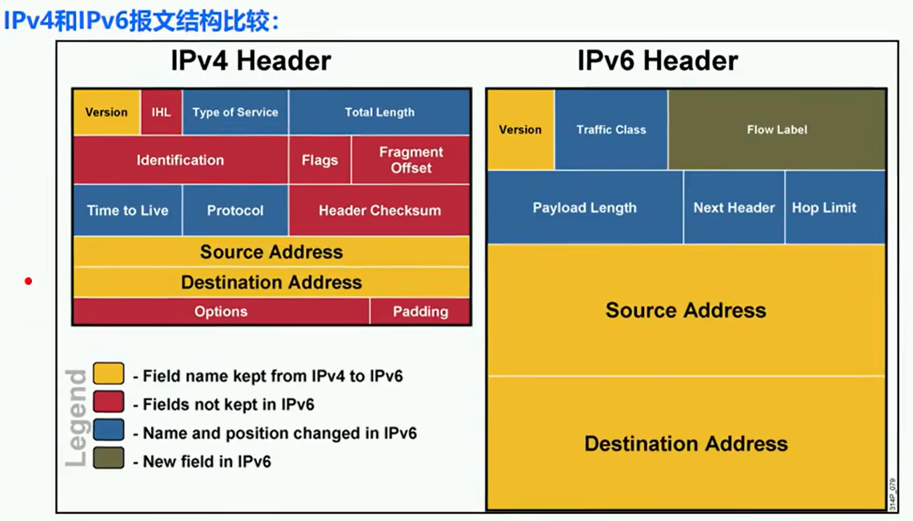
- 红色：废弃
  - IHL: ipv6头部长度固定
  - id flags fragoffset : ipv6不进行分片
  - header checksum：校验交给其他层
  - options pad: 
- 黄色：保留
- 蓝色：位置名称变化,作用不变
  - type of service -> traffic class
  - total length -> payload length
  - time to live -> hop limit
  - protocol -> next header
- 棕色：新增
  - flow label: 对traffic class的补充，增强qos

可以明显看出Ipv6更简单，所以效率更高

## 地址格式

### 基本
- 16字节16进制表示，以':'为分隔符，每两个字节一组，共8组
- 包括网络前缀和接口标识两部分

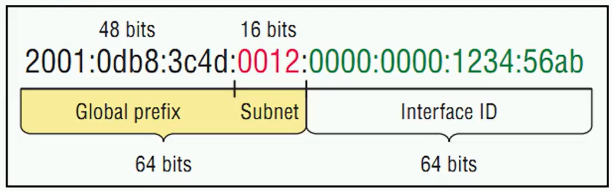

### 地址压缩
- 每组开头的0可以省略
- 连续的0的组可以用'::'代替，但只能使用一次

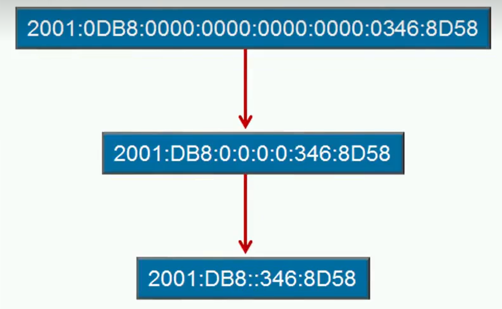

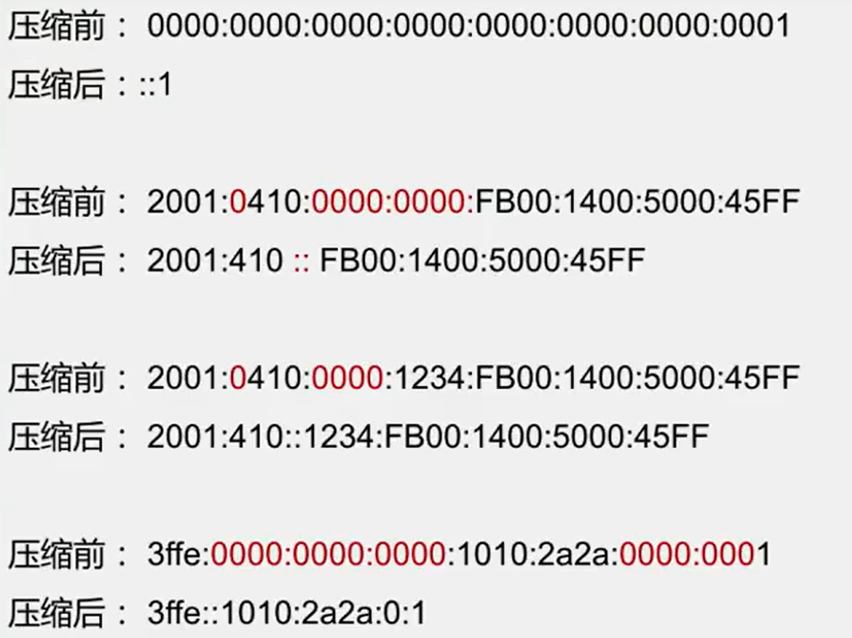

### windows的接口编号

windows的ipv6地址表示会加上网络设备的编号
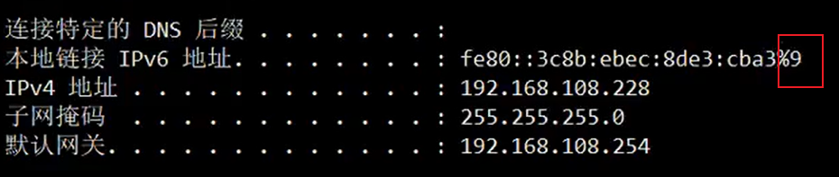

## 地址类型

                                                             ┌─────────────┐
                                                             │ ipv6 address│
                                                             └──────┬──────┘
                             ┌──────────────────────────────────────┼─────────────────────────────────────┐
                             ▼                                      ▼                                     ▼
                         ┌──────┐                              ┌─────────┐                            ┌────────┐
                         │unicas│                              │multicast│                            │ anycast│
                         └──┬───┘                              └────┬────┘                            └────────┘
                            │                            ┌──────────┴───────────────┐
                            │                            ▼                          ▼
                            │                       ┌─────────┐              ┌──────────────┐
                            │                       │ assigned│              │solicited mode│
                            │                       └─────────┘              └──────────────┘
                            │                       FF00::/8                 FF02::1:FF00:0000/104
                            │
                ┌───────────┴─────┬─────────────┬─────────────┬──────────────────┬─────────────────────┐
                ▼                 ▼             ▼             ▼                  ▼                     ▼
         ┌──────────────┐  ┌───────────┐    ┌────────┐  ┌────────────┐     ┌────────────┐       ┌─────────────┐
         │global unicast│  │ Link-Local│    │loopback│  │ unspecified│     │unique local│       │embedded ipv4│
         └──────────────┘  └───────────┘    └────────┘  └────────────┘     └────────────┘       └─────────────┘
          2000::/3           FE80::/10       ::1/128      ::/128             FC00::/7              ::/80

| 类型 | 描述 |
| -------------- | --------------- |
| unicast | 单播，一对一 |
| multicast | 组播，一对多 |
| anycast | 任意播，一到最近，本质是单播，提供相同服务的多个设置可以使用相同地址，用于冗余和负载 |

 - global unicast : 公网地址
   - 全是2或3开头 2000::/3  3fff::/3
   - 3表示前3bit固定为001，其他随意
   - 0010 0000 0000 0000 -- 2000
   - 0011 1111 1111 1111 -- 3fff
- unique local : 私网地址
   - 全是 FC 或FD开头
   - 7表示前7bit固定为1111 110，其他随意
   - 所以可以得出FD FC的由来
   - 1111 1100 0000 0000 -- FC00::/7
   - 1111 1101 1111 1111 -- FD00::/7
* multicast
   - 全是FF开头
   - FF00::/8
- link local : 链路地址
   - 全是FE80开头
   - FE80::/10
- loopback : 回环地址
   - ::1/128
- unspecified : 没地址
   - ::/128
- embedded IPv4: 嵌入ipv4类似于`::192:168:0:1/80`

### 任意播

如下有两台提供相同服务，但地域不同的服务器，客户访问时，路由会根据最近原则转发报文，以实现一到最近

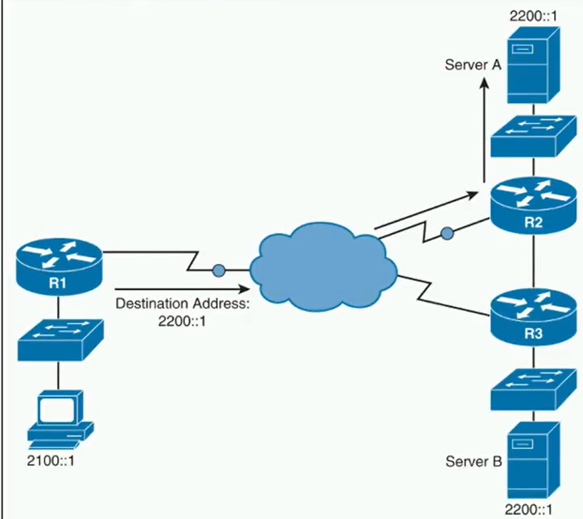

### 组播

| 地址范围   | 描述    |
|--------------- | --------------- |
| FF02::1    | 链路本地范围所有节点   |
| FF02::2    | 链路本地范围所有路由器   |
| FF02::5   | OSPFv3路由器   |
| FF02::6   | OSPFv3 DR&BDR   |
| FF02::9   | RIPng路由器   |

### 链路地址
用户指定网络位，网络位值，和如何生产接口位，通常使用EUI-64生产接口位地址。

EUI-64的规则：
1. 在接口MAC地址中间插入 FF:FE
2. 在接口MAC地址从左到右第7位进行二进制翻转

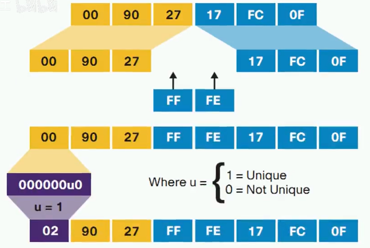

### IPv4子网划分

                       ┌─────┐
                       │::/96│
                       └──┬──┘
                          │ 96表示网络位为96,剩余32位为接口位，接口位是主机位的扩展，因为ipv6下一个主机可以有多个接口
                          ▼
               ┌────────────────────────────────────────┌────────────────┐
               │       网络位                           │     接口位     │
               └────────────────────────────────────────└────────────────┘
                                   │
                                   │ 对于终端用户只区分网络位和接口位，而对于地址分配方则细分为global routing prefix 和 subnet
                                   │ global routing prefix表示IANA分配，subnet表示本地机构分配
                          ┌────────┴───────────┐
                          ▼                    ▼
               ┌──────────────────────────┌─────────────┌────────────────┐
               │ global routing prefix    │  subnet     │    interface ID│
               └──────────────────────────└─────────────└────────────────┘

分配示例

                                                                      ┌───────────────┐
                                                                      │ 公司1         │
                                                             ┌───────►│ 2001:AAAA:1111│
                                                             │        └───────────────┘
                                           ┌──────────┐      │
                                           │ 移动     │      │        ┌───────────────┐
                                       ┌──►│ 2001:AAAA├──────┤        │ 公司2         │
                                       │   └──────────┘      └───────►│ 2001:AAAA:2222│
                         ┌────────┐    │                              └───────────────┘
                         │中国    │    │
                  ┌─────►│2001:...├────┤
                  │      └────────┘    │   ┌──────────┐
                  │                    │   │ 电信     │
         ┌────┐   │                    └──►│ 2001:BBBB│
         │IANA├───┤                        └──────────┘
         └────┘   │      ┌────────┐
                  │      │美国    │
                  └─────►│2ABC:...│
                         └────────┘

可见ipv6的分配是非常简单的，高效的，这也导致ipv6的路由非常简单

# IPv6地址分配

配置单播地址就是要配置 地址 + 前缀 + 网关 + dns

有如下方法

| 方式 | 地址/前缀 | 网关 | DNS | 备注 |
| --------------- | --------------- | --------------- | --------------- | --------------- |
| 静态 | 手动 | 手动 | 手动 | 无 |
| SLAAC | RS和RA | RS和RA | 无 | M=0, O=0 |
| stateful DHCPv6 | DHCPv6 | DHCPv6 | DHCPv6 | M=1 |
| stateless DHCPv6 | RS和RA | RS和RA | DHCPv6 | M=0, O=1 |

SLAAC : stateless address Autoconfiguration ，无状态地址自动配置

## NDP

ICMPv6 中定义的新消息类型，主要功能：
- 地址解析(类似于ARP)
- 重复地址检测(类似于ARP)
- 跟踪邻居状态(类似于ARP)
- 路由器发现
- 重定向

| ICMPv6类型   | 消息名称    |
|--------------- | --------------- |
| 133   | 路由器请求RS   |
| 134   | 路由器公告RA   |
| 135   | 邻居请求NS   |
| 136   | 邻居公告NA   |

### NS NA
IPv6地址发现，通过NS&NA实现ARP,DAD(重复地址检测)

ipv6没有广播，使用组播进行地址解析，如下

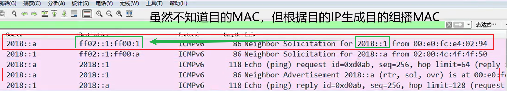

发送方只知道目的单播地址,怎么知道目的的组播地址?

原因是，但接收方配置IPv6单播后，会自动加入对应的 solicited node(请求节点组)

solicited node格式：开头 FF02::1:FF00/104 加上单播地址最后24位

问别人的地址，实现DAD
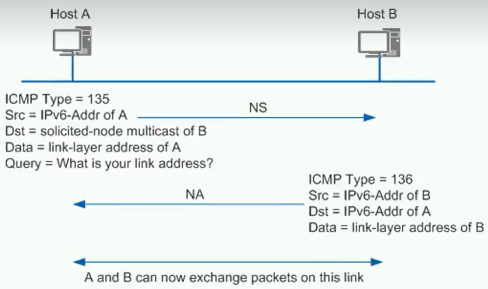

问自己的地址，实现DAD
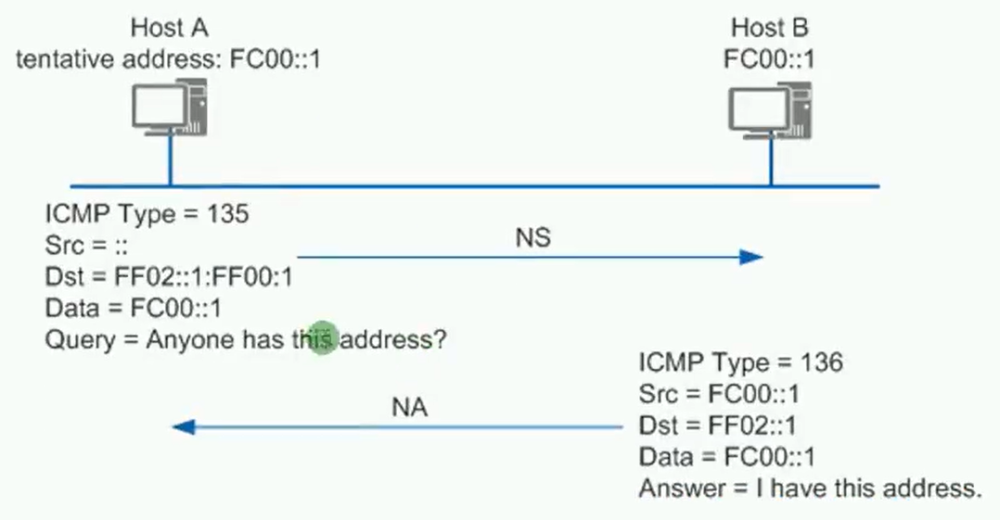

每配置一个地址，都会发送NS确认地址是否重复，如果没有回复，说明地址可以使用

下面配置了两个地址，都没有回复
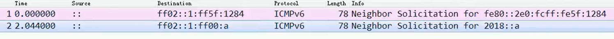

### RS RA

RS : 路由器请求，请求网络前缀，网关等
RA : 路由器通告，通告网络前缀，网关等

RS请求后路由器回复RA

路由器也会周期的发送RA
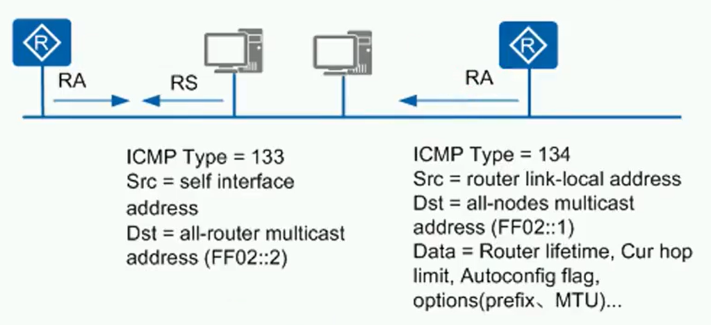

PC发送RS组播，若局域网内有路由器，则会回复RA，RA中会携带路由器的Link-Local,
Ipv6中，网关使用Link-Local而非 global unicast指向
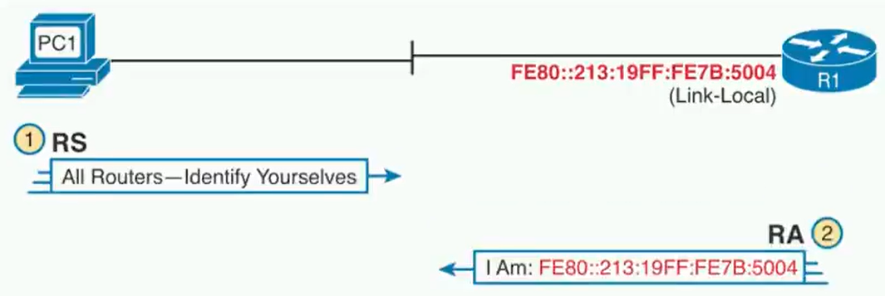

PC发现路由器后，发送RS单播申请网段，路由器回复网段，PC根据网段生成 global unicast地址
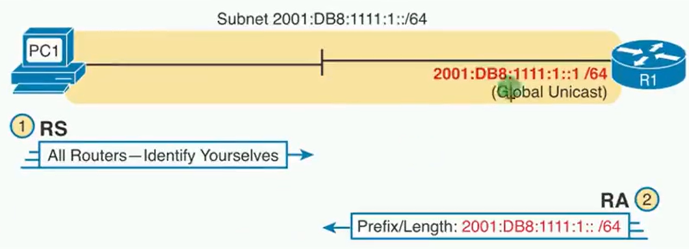

### PMTU

Path MTU: Ipv6不允许分片，但是不同设备支持的mtu不同，为保证数据正常转发，需要使用PMTU获得当前链路最合适的mtu

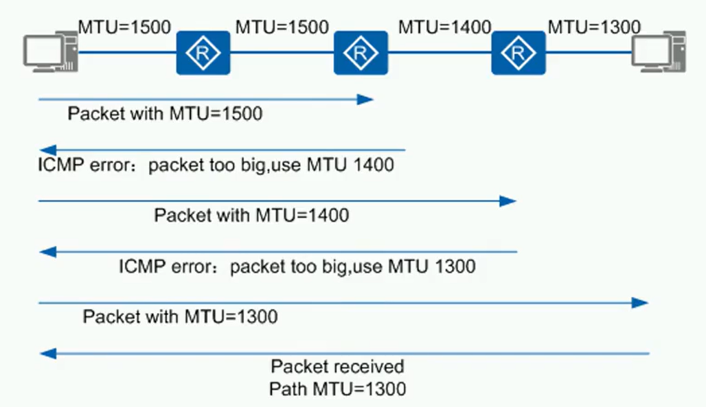

转发者最大支持mtu 1400，但报文的mtu过大，则使用icmpv6 pmtu告知对方使用mtu 1400
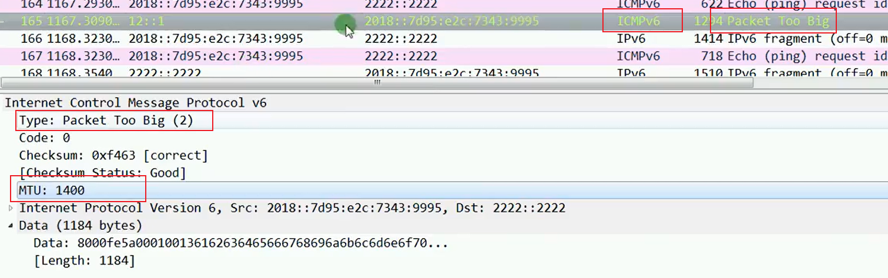

## DHCPv6

SLAAC虽然可以分配IP地址，但无法分配DNS，且是无状态的（无法获知管理哪个用户用了哪个地址）

DHCPv6可以解决上面问题

### 有状态和无状态对比

| 类型 | 备注 |
| -------------- | --------------- |
| 有状态dhcpv6 | 分配所有信息：地址/前缀，网关，DNS等 |
| 无状态dhcpv6 | 分配除ipv6地址外所有信息：DNS等 |

### 确定地址的分配方式

RA和dhcpv6都可以分配地址，client根据RA的 M O确认如何分配地址和其他信息

                                1) RS响应RA/RA周期通告
                                   M=1 O=0
                                                 ┌───┐
                                  ┌──────────────┤RTA│
              ┌───────────┐       │              └───┘
              │ipv6 client│ ◄─────┘
              └───────────┘ ──────────┐
                                      │          ┌────────────┐
                                      └─────────►│DHCPv6服务器│
                                                 └────────────┘
                               2) 通告dhcpv6分配地址

 
| 方式 | 地址/前缀 | 网关 | DNS | 备注 |
| --------------- | --------------- | --------------- | --------------- | --------------- |
| 静态 | 手动 | 手动 | 手动 | 无 |
| SLAAC | RS和RA | RS和RA | 无 | M=0, O=0 |
| stateful DHCPv6 | DHCPv6 | DHCPv6 | DHCPv6 | M=1 |
| stateless DHCPv6 | RS和RA | RS和RA | DHCPv6 | M=0, O=1 |
 
### 有状态分配流程

                ┌─────────────┐                                   ┌─────────────┐
                │dhcpv6 client│                                   │dhcpv6 server│
                └──────┬──────┘                                   └──────┬──────┘
                       │             solicit(探测服务器)                 │
                       ├────────────────────────────────────────────────►│
                       │                                                 │
                       │             adervertise(通告)                   │
                       │◄────────────────────────────────────────────────│
                       │                                                 │
                       │             request(请求)                       │
                       │────────────────────────────────────────────────►│
                       │                                                 │
                       │             reply(确认)                         │
                       │◄────────────────────────────────────────────────│
                       │                                                 │
                       ▼                                                 ▼

### 无状态分配流程

无状态分配时，client已经有地址，只需要请求其他信息如DNS

                ┌─────────────┐                                   ┌─────────────┐
                │dhcpv6 client│                                   │dhcpv6 server│
                └─────────────┘                                   └─────────────┘
                       │             information-Request                 │
                       ├────────────────────────────────────────────────►│
                       │                                                 │
                       │             reply(确认)                         │
                       │◄────────────────────────────────────────────────│
                       │                                                 │
                       ▼                                                 ▼
 

### solicit 的组播地址
solicit的组播地址固定为 ff02::1:2

ff02::1:2 表示dhcpv6服务

### DUID
DUID用于标识client和server

DUID有链路层地址生成

### 配置dhcpv6

# Ipv6路由

Ipv6路由和ipv4路由一样，特别的是ipv6路由涉及global unicast地址和Link-Local地址 

global unicast地址是数据包的源地址和目的地址，

Link-Local地址是用于ipv6动态路由中的下一跳地址

并且Link-Local地址只用于本地链路，不会用于跨网段的路由

所以若设备有多个接口，就有多个链路，那么每个链路上的对端Link-Local地址可能相同，

所以ping Link-Local时，需要指定出接口

# IPv4到IPv6过渡
由于Ipv4未被完全替换，有些核心网是ipv4，导致ipv6孤岛的情况 

                                             ┌──────────┐
                                             │ipv6  ipv4│
                         ┌──────────────────►│核心网    │
                         │                   └──────────┘
                         │
                         │
               ┌─────────┴──┐
               │ ipv6 island├────────────────────┐
               │ pc         │                    │
               └────────────┘                    ▼
                                            ┌─────────┐
                                            │  ipv4   │
                                            │  核心网 │
                                            └──┬────┬─┘
                                               │    │
                                               │    │
                                               │    │
                                               │    │
                      ┌─────┐                  │    │           ┌─────┐
                      │ipv6 │◄─────────────────┘    └──────────►│ ipv4│
                      │pc   │                                   │ pc  │
                      └─────┘                                   └─────┘

用户使用Ipv6，但核心网只转发ipv4，导致部分网络无法访问，有如下解决方法
- Dual-stack 双栈
- Tunneling 隧道
- NAT64 NAT46

## Tunneling
Tunneling需要两端router支持双栈

              ┌───────┐                     ┌──────────────────┐
              │  ipv4 │       ipv4网络      │  支持ipv4ipv6双栈│
              │  pc   ├────────────────────►│    router        │────┐
              └───────┘                     └──────────────────┘    │  ipv6
                                                                    │
                                                                    │       ┌────────┐
                                                                    └──────►│ ipv6   │
                                                                            │ 核心网 │
                                                                    ┌──────►└────────┘
                                                                    │
              ┌───────┐                     ┌──────────────────┐    │
              │  ipv4 │       ipv4网络      │  支持ipv4ipv6双栈│────┘    ipv6
              │  pc   │────────────────────►│    router        │
              └───────┘                     └──────────────────┘
 
Tunneling有两种，ipv4 ipv6直接overlay，和GRE

# ICMPv6
## 概述
- IPv6 header 的 next header 字段值为 58 对应为 ICMPv6报文
- ICMPv6 除了 ping 和 traceroute 功能外，还广泛用于其他协议中，包括 NDP, Path MTU等
- ICMPv6 还是IPv6地址自动配置，地址解析，地址冲突检测，路由选择，差错控制等功能的关键基础

## ICMPv6的格式
IPv6_header.next_header 为 58 时，IPv6_payload 为 ICMPv6

ICMPv6的header为 type + code + checksum

type分为错误消息和信息消息，当为错误消息时，code对错误进行进一步解释。

当为信息消息时，code无效

消息类型  type   名称        code
差错消息  1      目的不可达  0 无路由
                             1 因管理原因禁止访问
          2      数据包过长  0
          3      超时        0 跳数到0
                             1 分片重组超时
          4      参数错误    0 错误的包头字段
          ...
信息消息  128   echo request 0
          129   echo reply   0

## ICMPv6的应用

### PMTU
在IPv6中，中间设备不进行分片，分片只在原设备进行。

这导致个问题，如果原设备设置的MTU过大，中间设备可能丢弃报文。所以原设备需要知道从源端到目的端整个路线最小MTU

确定PMTU使用ICMPv6的PMTUD报文实现

原理是原设备首先假设 PMTU为 1500 ，并发送 PMTUD，上级设备发现超过自己的MTU，则响应自己的MTU，

否则上级设备转发PMTUD到自己的下一跳，依次类推直到目的端。

### 其他应用

- 邻居发现 
 - type=133, 路由请求(router solicitation)
 - type=134, 路由公告(router Adervertisement)
 - type=135, 邻居请求(neighbor solicitation)
 - type=136, 邻居公告(neighbor Adervertisement)
 - type=137, 重定向(redirect)

- 组播管理 , 类似于IPv4的IGMP
 - type=130, 查询消息 
 - type=131, 报告消息
 - type=132, 离开消息
 - type=143, MLDv2报告消息

# NDP
NDP是基于ICMPv6 的重要组件，功能包括
- 路由发现 ：发现上级路由，获取路由公告
- 无状态自动配置 ： 同个路由公告前缀，自动生成IPv6地址
- 重复地址检测 : 获得地址后，进行地址是否重复的检测，确保地址不冲突
- 地址解析  : 请求网络地址对应的数据链路层，类似于IPv4的 ARP
- 邻居状态跟踪 : 通过NDP发现链路上的邻居并跟踪邻居状态
- 前缀重编址 : 路由器对所公告的前缀进行重新公告，实现网络重编地址
- 重定向 : 告知其他设备，到达目标网络的更优下一跳

## NDP常用报文
- RS(router solicitation) 路由器请求
- RA(router Adervertisement) 路由器公告
- NS(neighbor solicitation) 邻居请求
- NA(neighbor Adervertisement) 邻居公告

## RS RA

### RS
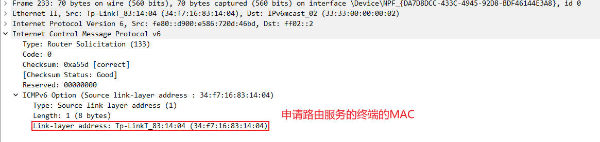

### RA
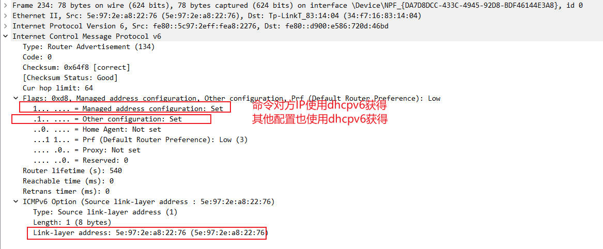

## NS NA
### 用ICMPv6实现地址解析的原理
#### NS
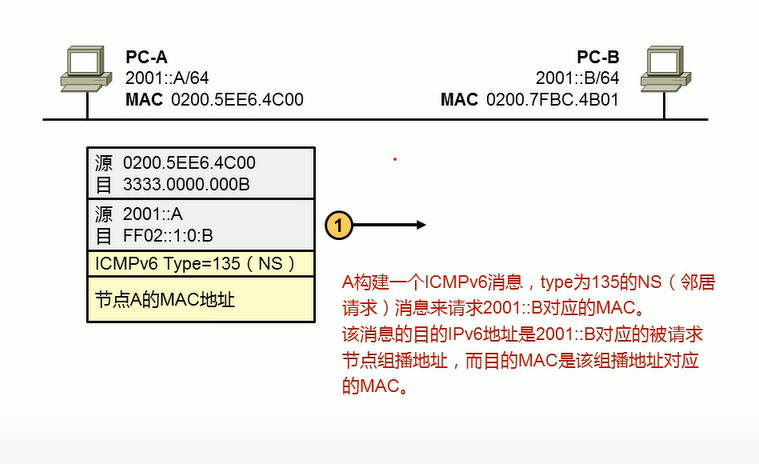

PC-A只知道PC-B的IP，需要解析其MAC，

使用 NS 组播完成解析，

NS的目的IP为组播地址，目的MAC也为组播地址，都是使用 PC-B 的IP后一段位数据组合固定前缀生成。

PC-B的IPv6地址决定了L2层L3层会接受对应的组播包。

#### NA
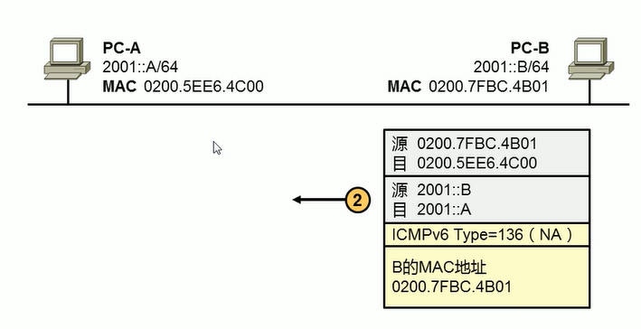

PC-B接受到NS组播后，会回复 NA 单播，其中携带了自己了 MAC

### 抓包

#### NS
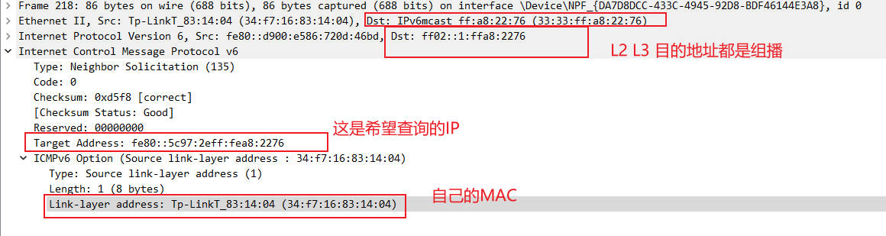

#### NA
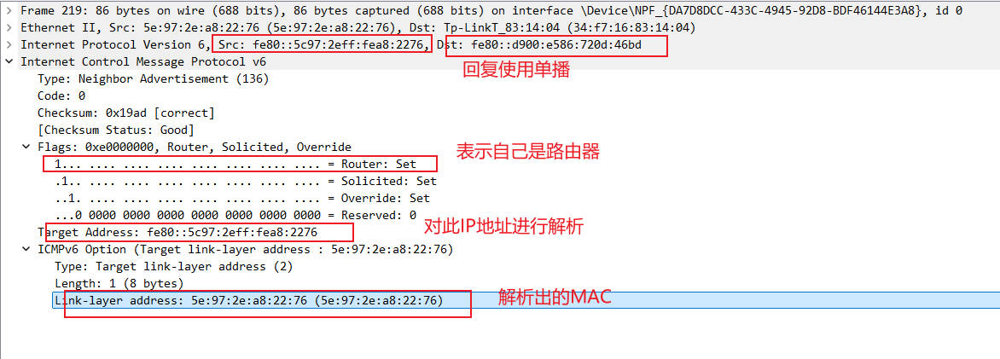

# IPv6分配地址

- 无状态
  - 主机发送RS (请求前缀信息)，路由器回复 RA(通告前缀信息)
  - 主机收到前缀信息后，根据前缀信息，生成自己的地址
  - 好处：不需要dhcpv6 服务器
  - 坏处：只能前缀信息，所以只能生成地址，没有DNS等信息，另外网络管理员无法知道主机和IP的关联
- EVI-64 
  - 链路自动生成的地址FE80:: 开头
- 手动
- DHCPv6
  - 也叫有状态, 即服务器会记录分配状态，并且有续期
  - 能自动配置IP和DNS等信息

## 无状态地址分配
1. PC根据本地接口ID生成IPv6地址，此地址仅用于本地链路通信。
2. PC针对该地址进行DAD检查，确保此地址没有冲突
3. PC发送RS报文，尝试发现链路上的路由器

PC （Link-Local = FF80::1002)
路由器 （Link-Local = FF80:1001)
       （IPv6-Address = 2001:DB8::1/64）

RS报文
FF80::1002 -> FF02::2
FF02::2 是组播,表示链路上所有主机和路由器

4. 路由器响应RA报文，该报文可以携带IPv6地址前缀，路由器在没有收到RS报文时，也可以主动发送RA报文

PC （Link-Local = FF80::1002)
路由器 （Link-Local = FF80:1001)
       （IPv6-Address = 2001:DB8::1/64）

RA报文
FF80:1001 -> FF02::1
(M=0, Prefix=2001:DB8::/64)

5. PC收到RA报文，使用IPv6地址前缀和本地链路地址，生成单播IPv6地址
6. PC针对单播IPv6地址进行DAD检查，确保此地址没有冲突

### M-bit O-bit
RS  RA都是基于ICMPv6协议

RA的flag字段有8bit，前两个bit为 M位和O位

- M位(manager) : 管理地址配置标志位
  - M-bit默认为0，表示终端设备使用无状态地址自动配置，也就是根据PD自动生成IPv6地址
  - M-bit设置为1，表示终端设备使用有状态地址配置，也就是dhcpv6方式获取地址
- O位(other) : 其他有状态配置标识
  - O-bit默认位0，使用除dhcpv6外其他方式设置除IPv6外的配置，如DNS
  - O-bit设置位1，标识终端设备使用dhcpv6的方式配置除了IPv6地址外的其他配置，如DNS

M-bit 和 O-bit的常见组合
M0 O0 : 使用无状态配置IPv6和其他配置
M0 O1 : 使用无状态配置IPv6，使用 dhcpv6配置DNS等
M1 O1 : 使用dhcpv6配置IPv6和DNS等

#### A-bit
RA的ICMPv6 option（prefix information)

- A位(auto addr-config) 终端设备是否能使用前缀进行地址自动生成
  - 0-bit 不能使用 
  - 1-bit 能

#### IPv6的地址的生存周期
RA中还有 vaild lifttime 和 preferred lifttime

vaild lifttime 是长于preferred lifttime

                    | ---------------------------- vaild lifttime ----------------|
  DAD               | -----preferred lifttime---------------|
| --- Tentative --->| ---- preferred ---------------------->| ---- deprecated --->| invailed --->

当终端获得IPv6地址后，会进行DAD检查，确保地址没有冲突后，整个 preferred lifttime 都是正常使用此IPv6地址，当 preferred lifttime 结束，

进入 deprecated期间，IPv6地址依旧可以使用，但不能使用改地址建立新的连接，vaild lifttime 结束，IPv6地址不能使用

## 有状态地址分配
### 协议

客户端发送和接受的端口 UDP 546
服务端发送和接受的端口 UDP 547

### 网络结构

客户端 - 服务器

客户端和服务器在同一个VLAN

客户端 - 中继 - 服务器

客户端和服务器在不同一个VLAN

### DUID

用于标识 服务器或客户端，通常用MAC地址加时间生成

当链路中有多个服务器时，客户端使用服务器的DUID选择使用哪个dhcp服务器。

服务器也使用客户端的DUID区分客户端，不是MAC地址

### 通信的整个流程

#### RS RA 确定使用有状态地址分配
PC发送ICMPv6 RS包，

路由器响应ICMPv6 RA包，M=1 O=1，表示客户端需要使用dhcpv6获得IPv6地址

#### dhcpv6 4阶段分配地址

1. dhcpv6 client发送 solicit 组播包，以发现链路上的dhcpv6服务器，solicit内容为 谁能为我提供 IPv6地址，DNS，Domain等信息
2. dhcpv6服务器收到 solicit后，发送 Adervertise 单播包，内容为我能为你提供如下信息，包括具体的IPv6, DNS, domain
3. client 可能收到多个dhcpv6服务器的 Adervertise 包，选择一个优先级高的报文，并回复 request单播包，内容为我希望用你提供的信息
4. dhcpv6服务器收到 request包，确认无误后，回复 reply包，内容为 你可以使用，同时记录 有一个客户端的DUID和对应的IPv6地址 

### 报文详解

#### 整个流程
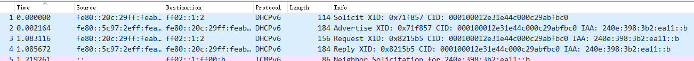

#### solicit
客户端发送组播，以发现能提供dhcpv6服务的对端
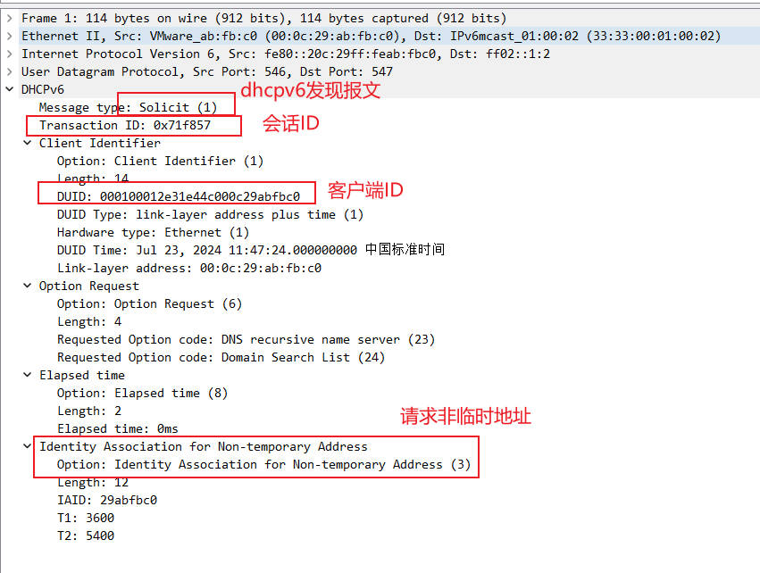

#### Adervertise
服务器回复单播，告知客户端自己能提供服务，并且可用的配置如下
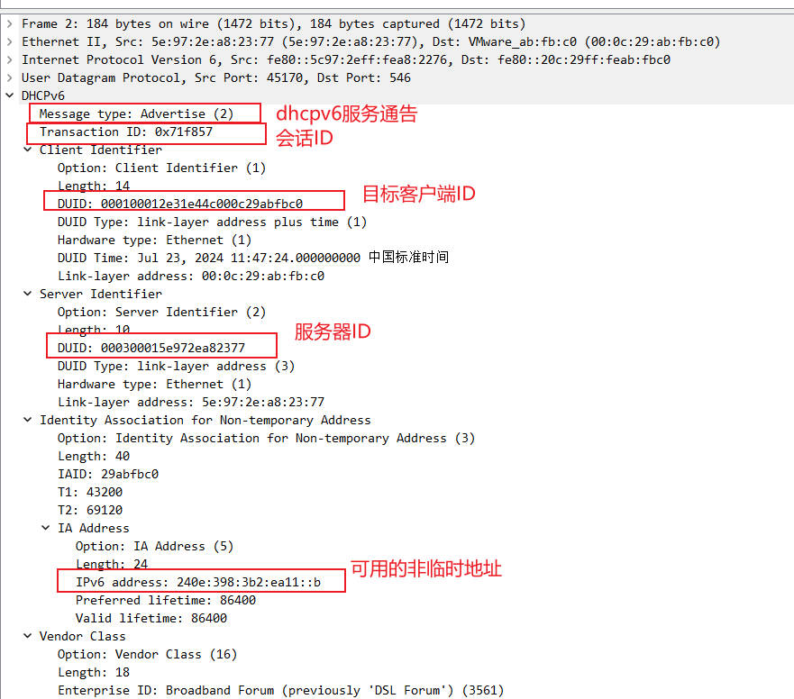

#### request
客户端此时可能收到了多组可用的配置，选择优先级高的，发送组播，告知某服务器，我要使用你的服务，同时通知其他服务器，我不使用你们的配置
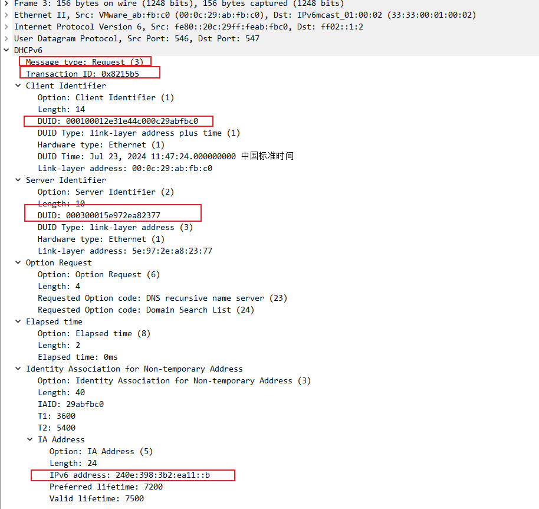

#### reply
服务器发送单播，告知客户端你可以使用我的服务，配置如下
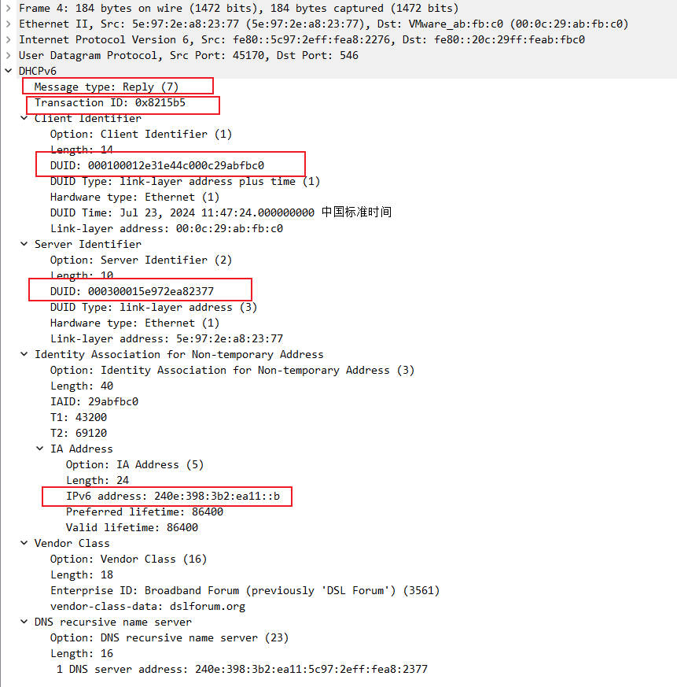

## dhcpv6无状态自动配置
RA 的 M = 0， O =1 ，
终端使用前缀自动配置IPv6，并使用 DPD 确保地址不重复，

终端使用 dhcpv6 配置 DNS, domain 等

### 通信流程

0. PC 自动生成仅在链路使用的链路地址
1. PC 发送RS 组播
2. 路由器回复 RA 单播，其中 M=0 O=1，并且带前缀
3. PC 根据前缀生成IPv6地址，并进行地址冲突检查
4. PC 发送 information-Request(dhcpv6) 以请求 dns domain
5. dhcp服务器回复 reply(dhcpv6) 携带 dns domain

## dhcpv6 中继

当 dhcpv6服务器 和 dhcpv6 客户端不在同一链路时，在两者中加中继器。

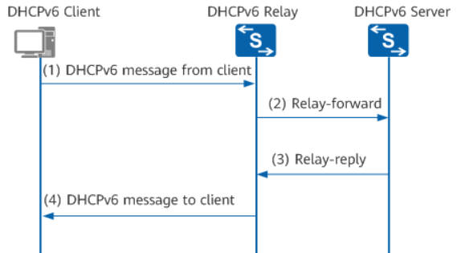

DHCPv6中继工作交互过程如下：

DHCPv6客户端向所有DHCPv6服务器和DHCPv6中继发送目的地址为FF02::1:2（组播地址）的请求报文。

根据DHCPv6中继转发报文有如下两种情况：

如果DHCPv6中继和DHCPv6客户端位于同一个链路上，即DHCPv6中继为DHCPv6客户端的第一跳中继，中继转发直接来自客户端的报文，

此时DHCPv6中继实质上也是客户端的IPv6网关设备。DHCPv6中继收到客户端的报文后，

将其封装在Relay-Forward报文的中继消息选项（Relay Message Option）中，并将Relay-Forward报文发送给DHCPv6服务器或下一跳中继。

如果DHCPv6中继和DHCPv6客户端不在同一个链路上，中继收到的报文是来自其他中继的Relay-Forward报文。

中继构造一个新的Relay-Forward报文，并将Relay-Forward报文发送给DHCPv6服务器或下一跳中继。

DHCPv6服务器从Relay-Forward报文中解析出DHCPv6客户端的请求，为DHCPv6客户端选取IPv6地址和其他配置参数，构造应答消息，

将应答消息封装在Relay-Reply报文的中继消息选项中，并将Relay-Reply报文发送给DHCPv6中继。

DHCPv6中继从Relay-Reply报文中解析出DHCPv6服务器的应答，转发给DHCPv6客户端。如果DHCPv6客户端接收到多个DHCPv6服务器的应答，

则根据报文中的服务器优先级选择一个DHCPv6服务器，后续从该DHCPv6服务器获取IPv6地址和其他网络配置参数。

