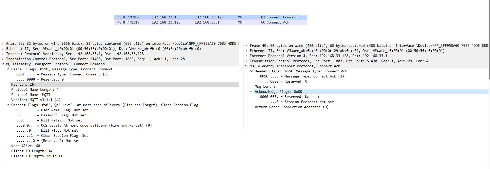
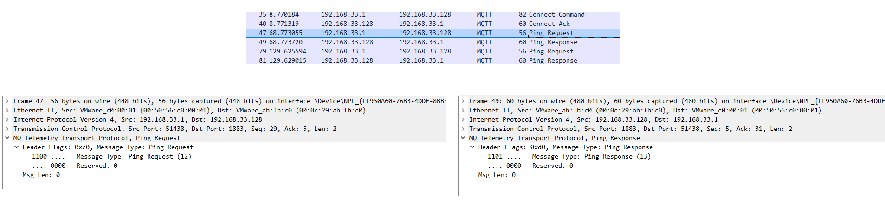
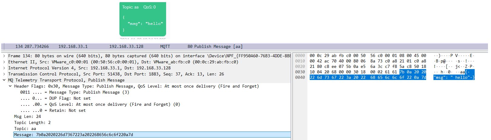
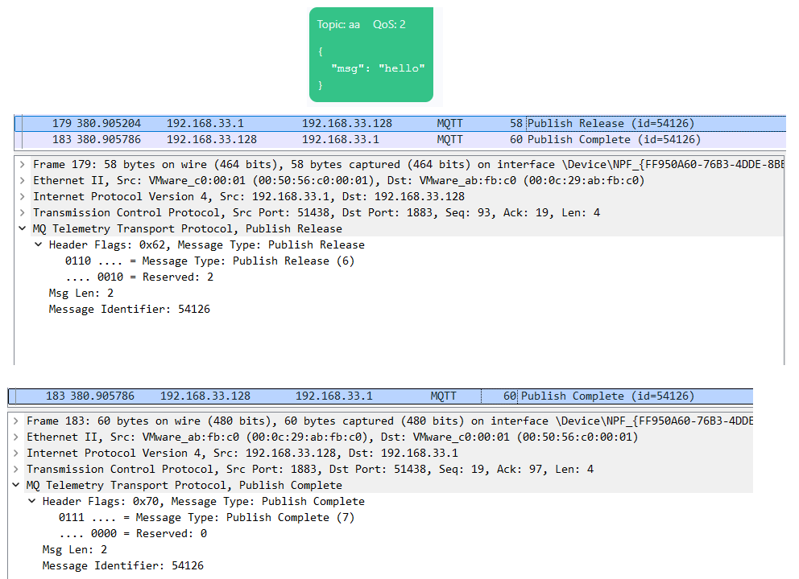
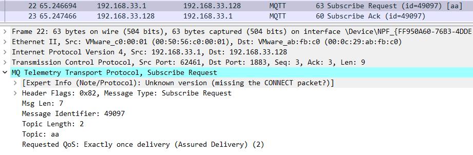
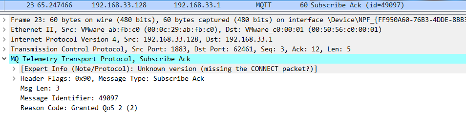

[[toc]]

# MQTT

专用于 低带宽，高延迟，不可靠的网络协议

## 能力概述
### 发布订阅

```ascii
   使用发布订阅模式，而且请求响应
  ┌──────┐ request  ┌───────┐  
  │client├─────────►│ server│              
  └──────┘◄─────────└───────┘  
           response               msg     ┌──────┐
                                  ┌──────►│client│
  ┌──────┐  msg     ┌──────┐      │       └──────┘
  │client├─────────►│broker│──────┘
  └──────┘          └──────┘─────┐        ┌──────┐
                                 └───────►│client│
                                 msg      └──────┘

    基于发布订阅模式，mqtt可以轻松实现
   一对一(点对点通信)
   一对多(消息广播)
   多对一(数据采集)
  ┌────┐       ┌────┐        ┌────┐        ┌────┐   ┌────┐    ┌────┐
  │cli ├──────►│cli │        │cli ├───────►│cli │   │cli │───►│cli │
  └────┘       └────┘        └────┴────┐   └────┘   └────┘    └────┘
                                       │   ┌────┐   ┌────┐    ▲
                                       └──►│cli │   │cli ├────┘
                                           └────┘   └────┘         
```

### 协议堆叠
```ascii

                          将mqtt继承其他协议，而从实现安全可靠支持web的协议
                                                 ┌────────────────────────────────────────┐
                                                 │        payload 业务数据                │
                                                 ├────────────────────────────────────────┤
 ┌────────────────────────────┐                  │        mqtt 业务可靠                   │
 │     mqtt 业务可靠          │                  ├────────────────────────────────────────┤
 ├────────────────────────────┤    ───────►      │        websocket 和流量器通信          │
 │      tcp 字节流可靠        │                  ├────────────────────────────────────────┤
 └────────────────────────────┘                  │        ssl 加密                        │
                                                 ├────────────────────────────────────────┤
                                                 │        tcp 字节流可靠                  │
                                                 └────────────────────────────────────────┘
```

### QoS

TCP不保证消息一定到达，只保证当消息丢失时，通知用户

mqtt支持对每个报文设置不同的qos，以实现可靠和效率的平衡，QoS0(消息可能丢失) QoS1(消息不会丢失可能重复) QoS2(消息不会丢失不会重复)

- QoS0 : 消息可能丢失
- QoS1 : 消息不会丢失但可能重复
- QoS2 : 消息不会丢失也不会重复

QoS越高服务越可靠，但性能开销越大

### keepalive

TCP的keepalive太长了，mqtt有keepalive报文，以实现快速检测异常掉线

### 遗嘱消息

当消息发布者异常断开时，无法通知订阅者自己掉线了，所以mqtt提供遗嘱机制，

消息发布者可以在上线时就上报自己的遗嘱，当Broker检测到发布者异常掉线时，就将其遗嘱广播给其订阅者

```ascii


        ┌────────┐           ┌───────┐              ┌────────┐
        │ client │           │ broker│              │ client │
        └────┬───┘           └───┬───┘              └────┬───┘
             │                   │                       │
             ├────────msg ──────►│                       │
             │                   ├───────────msg ───────►│
             │─────── break ─────┤                       │
             │                   ├───────────will───────►│
             │                   │                       │
             │                   │                       │
             │                   │                       │
             ▼                   ▼                       ▼
```

### 保留消息


发布者可以发送保留消息，Broker会持久化保留此消息，当订阅者上线，会立即获得保留消息。

如此发布者可以降低消息的发送周期，以达到低功耗的目的。订阅者可以迅速获得最新消息，不用等待下一个周期

```ascii
       ┌───────┐           ┌───────┐
       │ client│           │ broker│
       └───┬───┘           └───┬───┘
           ├──────msg ────────►│               ┌───────────┐
           │                   │               │ subscriber│
           │                   │               └─────┬─────┘
           │                   ├────retained msg────►│
           │                   │                     │
           │                   │                     │
           │                   │                     │
           │                   │                     │
           ▼                   ▼                     ▼
```
                                                           
# 报文格式

分为三部分:

    ┌───────────────────────────────┌──────────────────────┌───────────────────────────────────────┐
    │       固定报头                │    可变报头          │  有效载荷                             │
    │───────────┌─────┌─────────────│                      │                                       │
    │   报文类型│ 标志│ 剩余报文长度│    内容视报文类型而定│  内容视报文类型而定                   │
    └───────────────────────────────└──────────────────────└───────────────────────────────────────┘

对于有可变报头的报文，其内容必须严格按照协议顺序排布，否则解析失败

比如对于CONNECT报文的可变报头固定为

    ┌─────────────────────────────────────┐
    │ CONNECT 可变报头                    │
    │───────┌─────────┌─────────┌─────────│
    │ 协议名│ 协议等级│ 连接标识│ 心跳周期│
    │ 6Byte │ 1Byte   │ 1Byte   │ 2Byte   │
    └─────────────────────────────────────┘

如果顺序错误会导致

# 报文类型
## 连接
 
### CONNECT

- 客户端标识符
- 用户名
- 密码
- 遗嘱消息
* keepalive


### CONNACK
### DISCONNECT

## 发布
### PUBLISH

固定报头
报文类型|DUP|QoS|Retain|剩余报文长度 

可能有可变报头
主题|报文标识符

有效载荷
消息内容

- 主题
- QoS
- payload

### PUBACK
### PUBREC
### PUBREL
### PUBCOMP

## 订阅
### SUBSCRIBE

主题
QoS

### SUBACK
### UNSUBSCRIBE
### UNSUBACK

## 心跳
### PINGREQ
固定报头(2字节)
报文类型 保留 剩余报文长度 
0xC      0x0  0x00

无可变报头

无有效载荷

### PINGRESP

# 连接

                 ┌──────┐             ┌──────┐
                 │client│             │broker│
                 └───┬──┘     SYN     └───┬──┘
                     ├───────────────────►│
                     │        SYN,ACK     │
                     │◄───────────────────│
                     │        ACK         │
                     │──────────────────► │
                     │        CONNECT     │
                     │───────────────────►│
                     │        CONNACK     │
                     │◄───────────────────│
                     ▼                    ▼
  
  mqtt基于tcp，发送CONNECT报文前需要完成握手

## CONNECT
- CONNECT报文的可变头部中重要字段
  - ClientID
    - clientID并非必须要，client可以设置长度为0的clientID表示有Broker分配ClientID
    - 如果需要持久会话，client需要自己分配ClientID，因为ClientID由broker分配，则每次建立连接都会获得随机的ClientID
  - UserName
    - 明文发送，建议和tls一起使用
  - Password
    - UserName和Password不需要同时存在，可以只要Password，用于携带token数据
  - keepalive
    - 秒为单位，表示client在发送任意类型的报文间隔不超过keepalive值
    - 要确保client不超时，简单的做法是固定周期发送PINGREQ报文
    - 若发生超时，在1.5倍的keepalive时间时，broker判定client掉线，断开连接，并发送遗嘱消息

## CONNACK
- CONNACK
  - ReasonCode
    - 表示连接是否成功建立，和失败的原因
  - Session Present

## DISCONNECT
- DISCONNECT
  - client断开连接时应该发送DISCONNECT，否则broker会认为client是异常掉线，导致触发遗嘱消息

# 发布订阅

           ┌────────┐  Topic a  ┌───────┐  Topic a  ┌────────┐
           │ client ├──────────►│ broker├──────────►│ client │
           │ 发布者 │           └───────┘           │ 订阅者 │
           └────────┘                               └────────┘

mqtt没有目的地址的概念，而是使用Topic，发布者需要给自己的一个消息增加Topic，
订阅者需要告诉broker自己订阅什么Topic，
broker收到消息后会找到其Topic的订阅者，并转发，如果没有订阅者，则会丢弃消息


                            如果订阅者掉线，broker会缓存消息

           ┌────────┐  Topic a   ┌──────────────────┐            ┌────────┐                                                    
           │ client ├──────────► │ broker           │─────X─────►│ client │                                                    
           │ 发布者 │            │  Topic a 缓存消息│            │ 订阅者 │                                                    
           └────────┘            └──────────────────┘            └────────┘                                                    

## PUBLISH报文重要字段

- Topic Name
  - 用于指定消息的主题，一条消息只能有一个主题
  - 类型 utf-8 string
  - home/temperature
- QoS
  - 类型 int
  - QoS0 : 消息可能丢失
  - QoS1 : 消息不会丢失，可能重复
  - QoS2 : 消息不会丢失，不会重复
- payload
  - 消息内容
  - 可以是任意类型的数据，如json,binary,ciphertext_base64
- Retain
  - 指定消息是否是保留消息
  - 当消息为保留消息时，除了正常转发外，broker会缓存消息，每当有新的订阅者，会立即转发保留消息
  - 好处：对于周期更新的数据，订阅者能立即收到消息，而不需要等待下次的发布周期
- Packet ID
  - 用于标识PUBLISH的ID
  - 有效值 : 1 - 65535
  - 只有当QoS1 和QoS2时，才有防丢包的重传功能，所以只有此时此字段才可能被设置
- DUP
  - 有效值 : 0 - 1
  - 说明本消息是否为重传消息
  - 只有当QoS1 和QoS2时，才有防丢包的重传功能，所以只有此时此字段才可能被置一

## SUBSCRIBE 报文重要字段
- Packet ID
  - 用于标识SUBSCRIBE的ID
  - 有效值 : 1 - 65535
  - 只有当QoS1 和QoS2时，才有防丢包的重传功能，所以只有此时此字段才可能被设置
- Subscription List
  - 订阅列表可以包含多个订阅
  - 每个订阅都由一个 Topic filter 和 QoS组成
    - Topic Filter 和 Topic 不同，Topic Filter可以使用通配符来匹配多个Topic
    - Topic Filter 为 a/+ 则订阅 a/1 a/2 等多个匹配的主题
    - 而Topic 必须为确定的不能为 a/+，只能为 a/1 或 a/2
      - 当订阅者使用相同的 Topic Filter订阅时，如先订阅a/1 QoS1 ，再订阅a/1 QoS2，由于Topic相同，broker会进行覆盖得到 a/1 Qos2 一条订阅
      - 当订阅者使用不同的 Topic Filter订阅时，如先订阅a/1 QoS1 ，再订阅a/+ QoS2，由于Topic不同，broker得到两条订阅 a/1 a/+，当发布a/1时，broker会转发a/1两次给订阅者
  - QoS
    - 订阅者和发布者都可以给消息设置QoS，broker以两者设置的最小值为转发消息的QoS
    - 比如消息发布时QoS设置为2，订阅者给的QoS为1，则broker使用QoS1来转发消息

## SUBACK重要字段
- Packet ID
  - 相当于会话ID，和对应的SUBSCRIBE的Packet ID相等
  - 用于QoS3 和 QoS2的去重和重传
  - 只有当QoS1 和QoS2时，才有防丢包的重传功能，所以只有此时此字段才可能被设置
- Reason Codes
  - 成功
    - 0x00 订阅成功且最大QoS为0
    - 0x01 订阅成功且最大QoS为1
    - 0x02 订阅成功且最大QoS为2
  - 失败
    - 0x80 订阅失败

## UNSUBSCRIBE
- Packet ID
  - 用于标识UNSUBSCRIBE的ID
  - 只有当QoS1 和QoS2时，才有防丢包的重传功能，所以只有此时此字段才可能被设置
- Topic Filters
  - 要取消订阅的主题过滤器列表
  - Topic Filter使用完全的文本匹配

## UNSUBACK
- Packet ID
  - 相当于会话ID，和对应的UNSUBSCRIBE的Packet ID相等
  - 用于QoS3 和 QoS2的去重和重传
- ~~Reason Code~~ 
  - mqtt3.1 UNSUBACK没有原因码

# Topic
- utf-8字符串
- 区分大小写
- 支持分层
  - 主题层级长度可以为0
    - level1//level3
  - 使用通配符实现一次订阅多个主题
    - 单层通配符+
      - home/+/temperature
    - 多层通配符#
      - home/#
      - 多层通配符必须是最后一个层级
        - 错误: home/#/temperature
    - 通配符必须完全占据一个层级
      - 错误：home/+floor/temperature  home/temperature#
- $开头的主题 
  - 内容为broker的系统信息
  - $开头的主题是broker使用的，客户端只能订阅不能发布

# EMQX
- 环境ubuntu18

```shell
curl -s https://assets.emqx.com/scripts/install-emqx-deb.sh | sudo bash
sudo apt-get install emqx

# 后台启动
emqx start
# 前台启动
emqx foreground

emqx stop
emqx restart
emqx ping Ping EMQ X Broke

emqx ctl log set-level debug
```
## mqtt3.1.1
### CONNECT



### PINGREQ


### PUBLISH




## SUBSCRIBE




# 会话

## 为什么需要会话

             1)不使用会话

                当client连接连接断开，会导致已发送未确认的消息丢失，
                待发送的消息由于没有订阅者而被丢弃。
                即使client重新连接并订阅，错过之前的消息

      ┌──────┐                ┌──────────────┐      已发送未确认的msg            ┌──────┐
      │client├───────────────►│ broker       │─────────────X────────────────────►│client│
      └──────┘                │              │                                   └──────┘
                              │ Topic: a/+   │
                              │ 待发送的     │
                              │ msg, msg, msg│
                              │              │
                              └──────────────┘
    
      
     ┌───────┐     继续发送 Topic: a/1的消息       ┌───────────────┐
     │ client├────────────────────────────────────►│ broker        │
     └───────┘                                     │ 没有 a/1的订阅│
                                                   │ 立即丢弃消息  │
                                                   └───────────────┘

              2)使用会话的情况
                   订阅者在在连接时建立会话，broker会根据clientID建立session,
                   session将持久保存该订阅者的Topic
      ┌───────┐                       ┌────────────────────┐                                   ┌────────┐
      │ client├──────────────────────►│  broker            ├──────────────────X───────────────►│ client │
      └───────┘                       │       session:0x01 │                                   └────────┘
                                      │           Topic:a/+│
                                      └────────────────────┘

                   订阅者连接断开，broker由于session存在，会持久存储相关Topic的消息
      ┌────────┐                       ┌─────────────────────────┐
      │ client ├──────────────────────►│ broker                  │
      └────────┘                       │     session:0x01        │
                                       │        Topic:a/+        │
                                       │            msg, msg,msg │
                                       └─────────────────────────┘

                   订阅者使用上次的ClientID重新连接时，broker会让其匹配到上次的会话，并将Topic中缓存的消息推送给订阅者

      ┌────────┐                       ┌────────────────────┐        msg,msg,msg               ┌───────┐
      │ client ├──────────────────────►│ broker             ├─────────────────────────────────►│client │
      └────────┘                       │     session:0x01   │                                  └───────┘
                                       │        Topic:a/+   │
                                       └────────────────────┘

               3)消息存在与broker和client之间，即作为发布者或订阅者和broker建立的会话是独立的


                  client                broker                 client
      ┌─────────────┐│┌─────────────────────┌────────────────────┐│┌─────────────┐
      │             │││    connection       │      connection    │││             │
      │             ││└─────────────────────└────────────────────┘││             │
      │             ││┌─────────────────────┌────────────────────┐││             │
      │  session    │││    connection       │      connection    │││    session  │
      │  0x01       │││                     │                    │││    0x02     │
      │             │││                     │                    │││             │
      │             ││└─────────────────────└────────────────────┘││             │
      │             ││┌─────────────────────┌────────────────────┐││             │
      │             │││    connection       │      connection    │││             │
      └─────────────┘│└─────────────────────└────────────────────┘│└─────────────┘
                     ▼                                            ▼

## 如何实现会话

- 对于server端，需要存储 
  - 客户端的订阅信息，如此当订阅者掉线后，仍然可以为其保存消息，而且当客户端在会话过期时间内重连，都不需要重新订阅 
  - 已发送给客户端，但还未完成确认的 QoS1 和 QoS2 消息，和等待发送给客户端的 QoS0 QoS1 QoS2 消息 
  - 从客户端收到的，还没有完成确认的QoS2消息
  - 遗嘱消息和遗嘱延迟间隔(mqtt3中遗嘱消息会立即下发)
  - 会话本身，当客户端重新连接时，服务端会根据client id 查询获得会话，并用 CONNACK( Session Present 字段) 询问客户端是否复用上次会话
- 对于client，需要存储 
  - 已发送给server，但未完成确认的QoS1 和 QoS2消息
  - 等待发送给server的 QoS0 QoS1 QoS2 消息

## 相关字段
- clean start
  - 是否删除上次会话 
  - 有效值:
    - 0 : server会根据client id 查询是否有存在的session，若已存在，则使用上次的session，若session不存在，则创建新的session
    - 1 : 会存在上次会话，则丢弃，并创建新会话
  - 典型应用: 当client重启后发现自己的会话状态已丢失，则指定 clean start 已使用新会话
- session expiry interval
  - 会话在未连接状态下，多少秒后过期
    - 0 : 会话在断开连接后立即过期
    - n : 断开连接后n秒过期
    - 0xFFFFFFFF : 会话永不过期
  - 希望client在业务未完成时，不受网络波动影响，则在会话开始时设置 session expiry interval > 0 ，以异常的网络断开，
  - 当业务完成主动断开连接时，设置 session expiry interval = 0，以立即删除会话

## 使用会话场景分析
- 使用持久会话的场景
  - 不希望错过离线时的消息
  - 不希望QoS1 QoS2消息丢失
  - 不希望每次连接都需要重新订阅
  - 设备定期休眠，不希望长时间维护连接 
- 不需要持久会话
  - 只对外发布QoS0 消息，不会接受任何消息
  - 只订阅QoS0 消息，不关心离线期间的消息 

# QoS

QoS0 : 消息可能丢失
QoS1 : 消息不会丢失，可能重复
QoS2 : 消息不会丢失，不会重复

随着QoS的增加，靠靠性增加，复杂度增加，传输性能下降

## QoS0

- 发送端只发送一次。
- 发送可能丢失

                     PUBLISH QoS0
       ┌──────┐                         ┌──────────┐
       │sender├────────────────────────►│ recevier │
       └──────┘                         └──────────┘

                     报文可能丢失
                     PUBLISH QoS0
       ┌──────┐                         ┌──────────┐
       │sender├─────────X──────────────►│ recevier │
       └──────┘                         └──────────┘
 
## QoS1
- 引入重传机制
- 接收端必须对每个发送进行响应
- 若没有收到响应，发送端会重传消息
- 为了实现重传机制，会使用字段 Packet ID , DUP
- QoS1 导致消息重复，只能同个业务进行去重，比如给消息增加时间戳或递增的计数


       ┌───────┐                                                       ┌──────────┐
       │ sender│                                                       │ recevier │
       └───┬───┘                                                       └─────┬────┘
           │       PUBLISH QoS1, DUP(0) PacketID(111) payload("aa")          │
           ├────────────────────────────────────────────────────────────────►│
           │                                                                 │
           │       PUBACK PacketID(111)                                      │
           │◄────────────────────────────────────────────────────────────────│
           │                                                                 ▼
           ▼


        ┌───────┐                                                       ┌──────────┐ 
        │ sender│                                                       │ recevier │ 
        └───┬───┘                                                       └─────┬────┘ 
            │       PUBLISH QoS1, DUP(0) PacketID(111) payload("aa")          │                                                                                                                                            # QoS2
            ├──────────────────────────────X─────────────────────────────────►│                                                                                                                                            涉及报文
            │                                                                 │
            │       PUBLISH QoS1, DUP(1) PacketID(111) payload("aa")          │                                                                                                                                            # QoS2
            ├────────────────────────────────────────────────────────────────►│                                                                                                                                            涉及报文
            │                                                                 │      
            │       PUBACK PacketID(111)                                      │                                                                                                                                            UBLISH
            │◄────────────────────────────────────────────────────────────────│      
            │                                                                 │
            ▼                                                                 ▼


            重传导致的问题

            虽然发送方使用DUP标识消息是否是重传消息，但是接收方收到任何消息都必须当成全新的消息，
            考虑下面情况

         ┌───────┐                                                       ┌──────────┐  
         │ sender│                                                       │ recevier │  
         └───┬───┘                                                       └─────┬────┘  
             │       PUBLISH QoS1, DUP(0) PacketID(111) payload("aa")          │       
             ├────────────────────────────────────────────────────────────────►│       
             │         第一个消息成功到达，PacketID 111可以被重复使用          │
             │       PUBACK PacketID(111)                                      │       
             │◄────────────────────────────────────────────────────────────────│       
             │                                                                 │       
             │         使用PacketID 111发送第二个消息，但第二个消息需要重传    │
             │       PUBLISH QoS1, DUP(0) PacketID(111) payload("bb")          │       
             ├──────────────────────────────X─────────────────────────────────►│       
             │                                                                 │
             │         第二个消息的重传到达了，但是由于PacketID是111所以无法   │
             │         和第一个消息做区分，因为第一个消息的ACK丢失的情况也是   │
             │         这样                                                    │
             │       PUBLISH QoS1, DUP(1) PacketID(111) payload("bb")          │       
             ├────────────────────────────────────────────────────────────────►│       
             │                                                                 │       
             │       PUBACK PacketID(111)                                      │       
             │◄────────────────────────────────────────────────────────────────│       
             │                                                                 │       
             ▼                                                                 ▼       
                                                                                       
                  可见仅从mqtt头部分很难去重，这就导致QoS2很复杂

### mqtt重传和tcp重传
- 在tcp未断开时，tcp负责重传
- QoS1 QoS2的消息重传必须在上次tcp连接断开后，进行新的tcp连接，并重传上次未响应的消息.
 
## QoS2

报文
PUBLISH : 发送消息
PUBREC : 相当于PUBACK，表示收到了消息
PUBREL : 发送者准备释放缓存的消息
PUBCOMP : 接收方通知可以释放缓存的消息

              ┌───────┐                                                       ┌──────────┐    
              │ sender│                                                       │ recevier │    
              └───┬───┘                                                       └─────┬────┘    
             ┌────┤                                                                 │
       ┌─────┴──┐ │                                                                 │
       │缓存报文│ │                                                                 │
       └─────┬──┘ │                                                                 │
             └────┤       PUBLISH QoS2, DUP(0) PacketID(111) payload("aa")          │         
                  ├──────────────────────────────X─────────────────────────────────►│         
                  │                                                                 │         
                  │       PUBLISH QoS2, DUP(1) PacketID(111) payload("aa")          │         
                  ├────────────────────────────────────────────────────────────────►│         
                  │                                                                 │         
                  │       PUBREC PacketID(111)                                      │         
                  │◄────────────────────────────────────────────────────────────────│         
                  │                                                                 │         
                  │       PUBREL PacketID(111) 准备释放相关报文                     │
                  ├────────────────────────────────────────────────────────────────►│
                  │                                                                 │
                  │       PUBCOMP PacketID(111) 可以释放                            │
                  │◄────────────────────────────────────────────────────────────────│
           ┌──────┤                                                                 │
    ┌──────┴──┐   │                                                                 │         
    │ 释放报文│   │                                                                 │
    └──────┬──┘   │                                                                 │
           └─────►│                                                                 ▼
                  ▼

                   QoS2 之所以可以去重，关键在于 PUBREL，PUBREL之前不能发送新的报文,
                   所以接收方能根据PUBREL，认为PUBREL之前的报文都是重复的，PUBREL之后的报文才是新的


               ┌───────┐                                                       ┌──────────┐     
               │ sender│                                                       │ recevier │     
               └───┬───┘                                                       └─────┬────┘     
              ┌────┤                                                                 │          
        ┌─────┴──┐ │                                                                 │          
        │缓存报文│ │                                                                 │          
        └─────┬──┘ │                                                                 │          
              └────┤       PUBLISH QoS2, DUP(0) PacketID(111) payload("aa")          │       │  
                   ├──────────────────────────────X─────────────────────────────────►│       │  都是重复报文
                   │                                                                 │       │  
                   │       PUBLISH QoS2, DUP(1) PacketID(111) payload("aa")          │       │  
                   ├────────────────────────────────────────────────────────────────►│       │  
                   │                                                                 │       │  
                   │       PUBREC PacketID(111)                                      │       │  
                   │◄────────────────────────────────────────────────────────────────│       │  
                   │                                                                 │       │  
                   │       PUBREL PacketID(111) 准备释放相关报文                     │       ▼  
                   ├────────────────────────────────────────────────────────────────►│          
                   │                                                                 │            │
                   │       PUBCOMP PacketID(111) 可以释放                            │            │
                   │◄────────────────────────────────────────────────────────────────│            │
            ┌──────┤                                                                 │            │
     ┌──────┴──┐   │                                                                 │            │
     │ 释放报文│   │                                                                 │            │
     └──────┬──┘   │                                                                 │            │ 开始有新报文
            └─────►│                                                                 │            │
                   │                                                                 │            │                                                                                                                                                                                                                                 
                   │       PUBLISH QoS2, DUP(0) PacketID(111) payload("bb")          │            │
                   ├────────────────────────────────────────────────────────────────►│            │
                   │                                                                 │            │
                   │                                                                 │            ▼
                   ▼                                                                 ▼


## 不同QoS的应用场景 
- QoS0 ：传输不重要可丢失的数据，如传感器
- QoS1 ：传输可重复的数据,或应用完成了去重
- QoS2 ：传输重要数据 

# 保留消息
## 为什么需要保留消息

                       broker收到消息，若Topic没有被订阅，则会立即丢弃消息
                       若订阅者错过了发布，则必须等待下次发布才能收到消息
                        
       ┌────────┐       msg          ┌───────────────┐
       │  client├───────────────────►│  broker       │
       └────────┘                    │    sub        │
                                     │       没有订阅│
                                     └───────────────┘

                       当使用保留消息后，broker会根据Topic存储一条消息

        ┌───────┐       msg          ┌───────────────────┐
        │ client│───────────────────►│  broker           │
        └───────┘                    │     Retain        │
                                     │        Topic1:msg │
                                     │        Topic2:msg │
                                     └───────────────────┘

                       当client订阅后，broker会根据Topic将保留的msg推送给client

                                      ┌─────────────────────────────────┐
                                      │ broker                          │                         ┌────────┐
                                      │  ┌──────────────┐   ┌──────────┐│────────────────────────►│ client │
                                      │  │ Retain       │   │ sub      ││                         └────────┘
                                      │  │    Topic1:msg│   │    Topic1││
                                      │  │    Topic2:msg│   └──────────┘│
                                      │  └──────────────┘               │
                                      └─────────────────────────────────┘

## 保留消息的特点
每个Topic只能存储一个消息
默认保留消息会一直存储在broker中


##  重要字段
- PUBLISH时涉及的字段
  - TopicName demo
    - 每个Topic只会存储一个保留消息
  - Retain    1
    - 1: 表示当前消息作为保留消息
    - 0: 当前消息是普通消息
  - message expiry interval
    - 保留消息默认在broker 中一直存储
    - 若有此字段，则设置broker存储此保留消息的最大时间
  - Retain As Published
    - 0: 默认情况，broker转发保留消息给client时，Retain字段会被设置未0，或清除
    - 1: broker转发保留消息时，Retain字段保留为1
- SUBSCRIBE涉及的字段
  - Retain Handling
    - 0: 订阅建立时发送保留消息
    - 1: 订阅建立时，若订阅当前不存在则发送保留消息
    - 2: 订阅建立时，不发送保留消息

# 遗嘱消息
## 为什么要遗嘱消息
由于Broker的存在，订阅者无法知道对端的情况，所以需要遗嘱消息，让发布者意外断线时有发布遗嘱的能力

## 重要字段
- CONNECT
  - Will Topic
    - 遗嘱消息和普通消息一样，也需要设置Topic和QoS
  - Will QoS
  - Will Retain
    - 将遗嘱消息设置为保留消息，这样任意订阅者上线都能立即获知发布者的在线情况
  - Will Properties
    - Will Delay interval
      - 默认情况，broker检查到发布者异常断开，会立即发布遗嘱消息
      - 此字段可以设置延迟发送遗嘱消息的时间
      - 若在延迟时间内发送者重新上线，会取消发布遗嘱消息
  - Will payload
    - 遗嘱内容

## broker如何判断是否发送遗嘱消息
- 客户端正常断开不会发送遗嘱消息
- 客户端异常断开会发送遗嘱消息，异常断开的情况
  - 服务端检测到IO故障或网络故障
  - 客户端在keepalive时间内未能通信
  - 客户端在没有发送Reason code 为0的DISCONNECT报文的情况下关闭了网络
  - 服务端在没有收到DISCONNECT报文的情况下主动关闭了网络

# mqtt Broker 的使用
## mosquitto

mosquitto [-c config file] [-d | --daemon] [-p port number] [-v]

mosquitto is a broker for the MQTT protocol version 5.0/3.1.1/3.1.


OPTIONS
       -c, --config-file
           Load configuration from a file. If not given, then the broker will listen on port 1883 bound to the loopback interface, and the default values as described
           in mosquitto.conf(5) are used.

               Important
               See the -p option for a description of changes in behaviour from 1.6.x to 2.0.

       -d, --daemon
           Run mosquitto in the background as a daemon. All other behaviour remains the same.

       -p, --port
            监听指定的端口。可以指定多达10次，以打开多个监听不同端口的套接字。

