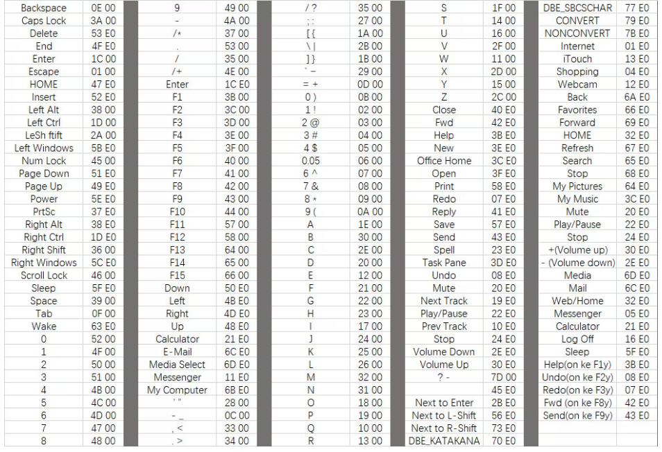

[[toc]]

# windows
##  包管理 - scoop
### scoop 安装
打开 powershell
为了让PowerShell可以执行脚本，首先需要设置PowerShell执行策略，通过输入以下命令

`Set-ExecutionPolicy -ExecutionPolicy RemoteSigned -Scope CurrentUser`

更改默认的安装目录，添加环境变量的定义，通过执行以下命令完成：

```shell
$env:SCOOP='E:\scoop'
[Environment]::SetEnvironmentVariable('SCOOP', $env:SCOOP, 'User')
```

安装scoop

```shell
iwr -useb get.scoop.sh | iex
```

scoop的目录
- apps——所有通过scoop安装的软件都在里面。
- buckets——管理软件的仓库，用于记录哪些软件可以安装、更新等信息，默认添加main仓库
- cache——软件下载后安装包暂存目录。
- persit——用于储存一些用户数据，不会随软件更新而替换。
- shims——用于软链接应用，使应用之间不会互相干扰，实际使用过程中无用户操作不必细究。

### scoop使用
Scoop的操作命令十分简单，基本结构是scoop + 动词 + 对象，动词就是一个操作动作，如安装、卸载，对象一般就是软件名了（支持通配符*操作），

当然这需要你先打开命令行工具。比如我想安装typora，通过输入scoop install typora即可自动完成软件的官网进入+下载+安装等操作。

以下是一些常用的命令说明：
- search——搜索仓库中是否有相应软件。
- install——安装软件。
- uninstall——卸载软件。
- update——更新软件。可通过scoop update *更新所有已安装软件，或通过scoop update更新所有软件仓库资料及Scoop自身而不更新软件。
- hold——锁定软件阻止其更新。
- info——查询软件简要信息。
- home——打开浏览器进入软件官网。

### 修改源 设置代理
使用Gitee镜像源。在命令行中输入
```shell
# 更换scoop的repo地址
scoop config SCOOP_REPO "https://gitee.com/scoop-installer/scoop"
# 拉取新库地址
scoop update
```
或者直接修改找到Scoop配置文件，路径
`C:\Users\username\.config\scoop\config.json`
然后直接修改里面的配置

### 扩展仓库
默认安装Scoop后仅有main仓库，其中主要是面向程序员的工具，对于一般用户而言并不是那么实用。好在Scoop本身考虑到了这一点，添加了面向一般用户的软件仓库extras

Scoop添加软件仓库的命令是

`scoop bucket add bucketname (+ url可选)`

如添加extras的命令是

`scoop bucket add extras`

执行此命令后会在scoop文件夹中的buckets子文件夹中添加extras文件夹。

除了官方的软件仓库，Scoop也支持用户自建仓库并共享，于是又有很多大佬提供了许多好用的软件仓库。

这里强推dorado仓库，里面有许多适合中国用户的软件，添加dorado仓库的命令如下：

`scoop bucket add dorado https://github.com/chawyehsu/dorado`

此外，若多个仓库间的软件名称冲突，可以通过在软件名前添加仓库名的方式避免冲突，

`scoop install dorado/appname`

Scoop安装的软件：sudo和scoop-completion，前者可以像debian系Linux临时提权，后者可以自动补全Scoop命令
### 安装常用软件

```shell
scoop install aria2
```

```shell
scoop install \
7zip cmake curl dark fd gcc git gzip latex \
lua lua-for-windows make neovide neovim nodejs \
pnpm python ripgrep tree-sitter wezterm yarn
```
## wezterm

### scoop安装 wezterm 和 gitbash

`scoop install wezterm git`

### 将gitbash中的linux工具加入PATH

获得工具路径

```shell
scoop prefix git
C:\Users\CJTX\scoop\apps\git\current
```
工具路径为
`C:\Users\CJTX\scoop\apps\git\current\usr\bin`
将其加入PATH

### 配置wezterm

创建wezterm配置文件
`C:\Users\<user>\.config\wezterm\wezterm.lua`

```lua

-- 加载 wezterm API 和获取 config 对象
local wezterm = require 'wezterm'
local config = wezterm.config_builder()

-------------------- 颜色配置 --------------------
-- config.color_scheme = 'tokyonight_moon'
-- config.color_scheme = 'Gruvbox (Gogh)'
config.color_scheme = 'Molokai'
config.window_decorations = "RESIZE"
config.enable_tab_bar = true
config.hide_tab_bar_if_only_one_tab = true
config.show_tab_index_in_tab_bar = true
config.tab_bar_at_bottom = false
config.use_fancy_tab_bar = false

-- 突出活跃的pane
config.inactive_pane_hsb = {
    saturation = 0.9,
    brightness = 0.5, -- 不活跃的pane亮度降低
}

-- 设置窗口透明度
config.window_background_opacity = 0.9
config.macos_window_background_blur = 10

-- 设置字体和窗口大小
-- config.font = wezterm.font("CaskaydiaCove Nerd Font")
config.font = wezterm.font("JetBrains Mono",  { weight = 'Light', italic = false })
config.font_size = 15
config.initial_cols = 140
config.initial_rows = 30

-- 设置默认的启动shell
config.set_environment_variables = {
    COMSPEC='C:\\scoop\\apps\\git\\current\\usr\\bin\\bash.exe',
    -- COMSPEC = 'C:\\Windows\\System32\\WindowsPowerShell\\v1.0\\powershell.exe',
    -- COMSPEC = 'C:\\Users\\CJTX\\scoop\\apps\\nu\\current\\nu.exe',
}

-------------------- 键盘绑定 --------------------
local act = wezterm.action

-- config.leader = { key = 'x', mods = 'CTRL', timeout_milliseconds = 1000 }
config.keys = {
    -- 分割Pane
    { key = 'H',  mods = 'ALT',     action = act.SplitHorizontal { domain = 'CurrentPaneDomain' } },
    { key = 'J',  mods = 'ALT',     action = act.SplitVertical { domain = 'CurrentPaneDomain' } },

    -- 选择
    { key = 'q',  mods = 'ALT',     action = act.QuitApplication },

    -- 选择pane
    { key = 'h',  mods = 'ALT',     action = act.ActivatePaneDirection 'Left' },
    { key = 'l',  mods = 'ALT',     action = act.ActivatePaneDirection 'Right' },
    { key = 'k',  mods = 'ALT',     action = act.ActivatePaneDirection 'Up' },
    { key = 'j',  mods = 'ALT',     action = act.ActivatePaneDirection 'Down' },

    -- CTRL + T 创建默认的Tab 
    { key = 't', mods = 'ALT', action = act.SpawnTab 'DefaultDomain' },
    -- CTRL + W 关闭当前Tab
    { key = 'w', mods = 'ALT', action = act.CloseCurrentTab { confirm = false } },
}

-- tmux 使用 ALT + num 切换tab
for i = 1, 9 do
  table.insert(config.keys, {
    key = tostring(i),
    mods = 'ALT',
    action = wezterm.action.Multiple ({
        wezterm.action.SendKey({mods = "CTRL", key = "b"}),
        wezterm.action.SendKey({key = tostring(i)}),
    }),
  })
end

-- wezterm 使用 CTRL + num 切换tab
for i = 1, 8 do
  table.insert(config.keys, {
    key = tostring(i),
    mods = 'CTRL',
    action = act.ActivateTab(i - 1),
  })
end

-------------------- 鼠标绑定 --------------------
config.mouse_bindings = {
  -- 拷贝选择的部分
  {
    event = { Up = { streak = 1, button = 'Left' } },
    mods = 'NONE',
    action = act.CompleteSelection 'ClipboardAndPrimarySelection',
  },
}

return config
```

## mykey

写入 `MyKeymap-2.0-beta29\data`

```json
{
  "keymaps": [
    {
      "id": 5,
      "name": "CapsLock",
      "enable": true,
      "hotkey": "*CapsLock",
      "parentID": 0,
      "delay": 0,
      "hotkeys": {
        "*,": [
          {
            "windowGroupID": 0,
            "actionTypeID": 4,
            "comment": "label:36",
            "actionValueID": 12
          }
        ],
        "*.": [
          {
            "windowGroupID": 0,
            "actionTypeID": 3,
            "comment": "label:15",
            "actionValueID": 13
          }
        ],
        "*/": [
          {
            "windowGroupID": 0,
            "actionTypeID": 4,
            "comment": "label:37",
            "actionValueID": 13
          }
        ],
        "*;": [
          {
            "windowGroupID": 0,
            "actionTypeID": 4,
            "comment": "label:32",
            "actionValueID": 8
          }
        ],
        "*f": [
          {
            "windowGroupID": 0,
            "actionTypeID": 4,
            "comment": "label:33",
            "actionValueID": 9
          }
        ],
        "*h": [
          {
            "windowGroupID": 0,
            "actionTypeID": 4,
            "comment": "label:27",
            "actionValueID": 3
          }
        ],
        "*i": [
          {
            "windowGroupID": 0,
            "actionTypeID": 4,
            "comment": "label:30",
            "actionValueID": 6
          }
        ],
        "*j": [
          {
            "windowGroupID": 0,
            "actionTypeID": 4,
            "comment": "label:26",
            "actionValueID": 2
          }
        ],
        "*k": [
          {
            "windowGroupID": 0,
            "actionTypeID": 4,
            "comment": "label:25",
            "actionValueID": 1
          }
        ],
        "*l": [
          {
            "windowGroupID": 0,
            "actionTypeID": 4,
            "comment": "label:28",
            "actionValueID": 4
          }
        ],
        "*m": [
          {
            "windowGroupID": 0,
            "actionTypeID": 4,
            "comment": "label:34",
            "actionValueID": 10
          }
        ],
        "*n": [
          {
            "windowGroupID": 0,
            "actionTypeID": 4,
            "comment": "label:36",
            "actionValueID": 12
          }
        ],
        "*o": [
          {
            "windowGroupID": 0,
            "actionTypeID": 3,
            "comment": "label:11",
            "actionValueID": 9
          }
        ],
        "*p": [
          {
            "windowGroupID": 0,
            "actionTypeID": 3,
            "comment": "label:4",
            "actionValueID": 4
          }
        ],
        "*q": [
          {
            "windowGroupID": 0,
            "actionTypeID": 3,
            "comment": "label:1",
            "actionValueID": 1
          }
        ],
        "*r": [
          {
            "windowGroupID": 0,
            "actionTypeID": 4,
            "comment": "label:34",
            "actionValueID": 10
          }
        ],
        "*u": [
          {
            "windowGroupID": 0,
            "actionTypeID": 4,
            "comment": "label:29",
            "actionValueID": 5
          }
        ],
        "*z": [
          {
            "windowGroupID": 0,
            "actionTypeID": 4,
            "comment": "label:33",
            "actionValueID": 9
          }
        ],
        "singlePress": [
          {
            "windowGroupID": 0,
            "actionTypeID": 9,
            "comment": "label:76",
            "actionValueID": 6
          }
        ]
      }
    },
    {
      "id": 6,
      "name": "CapsLock+ F",
      "enable": false,
      "hotkey": "*f",
      "parentID": 5,
      "delay": 0,
      "hotkeys": {
        "*a": [
          {
            "windowGroupID": 0,
            "actionTypeID": 1,
            "comment": "Windows Terminal",
            "winTitle": "ahk_exe WindowsTerminal.exe",
            "target": "shortcuts\\终端预览.lnk"
          }
        ],
        "*d": [
          {
            "windowGroupID": 0,
            "actionTypeID": 1,
            "comment": "Edge",
            "winTitle": "ahk_exe msedge.exe",
            "target": "shortcuts\\Microsoft Edge.lnk"
          }
        ],
        "*e": [
          {
            "windowGroupID": 0,
            "actionTypeID": 1,
            "comment": "File Explorer",
            "winTitle": "ahk_class CabinetWClass ahk_exe Explorer.EXE",
            "target": "D:\\"
          }
        ],
        "*h": [
          {
            "windowGroupID": 0,
            "actionTypeID": 1,
            "comment": "Visual Studio",
            "winTitle": "- Microsoft Visual Studio",
            "target": "shortcuts\\Visual Studio 2019.lnk"
          }
        ],
        "*i": [
          {
            "windowGroupID": 0,
            "actionTypeID": 1,
            "comment": "Typora",
            "winTitle": "ahk_exe Typora.exe",
            "target": "shortcuts\\Typora.lnk"
          }
        ],
        "*j": [
          {
            "windowGroupID": 0,
            "actionTypeID": 1,
            "comment": "IntelliJ IDEA",
            "winTitle": "ahk_exe idea64.exe",
            "target": "shortcuts\\IntelliJ IDEA Ultimate.lnk"
          }
        ],
        "*k": [
          {
            "windowGroupID": 0,
            "actionTypeID": 1,
            "comment": "PotPlayer",
            "winTitle": "ahk_class PotPlayer64",
            "target": "shortcuts\\PotPlayer 64 bit.lnk"
          }
        ],
        "*l": [
          {
            "windowGroupID": 0,
            "actionTypeID": 1,
            "comment": "Excel",
            "winTitle": "ahk_exe EXCEL.EXE",
            "target": "shortcuts\\Excel.lnk"
          }
        ],
        "*m": [
          {
            "windowGroupID": 0,
            "actionTypeID": 8,
            "comment": "如果 TIM.exe 进程存在则输入 Ctrl+Alt+Z 热键激活 TIM，否则启动 TIM",
            "ahkCode": "ProcessExistSendKeyOrRun(\"TIM.exe\", \"^!z\", \"shortcuts\\TIM.lnk\")"
          }
        ],
        "*n": [
          {
            "windowGroupID": 0,
            "actionTypeID": 1,
            "comment": "GoLand",
            "winTitle": "ahk_exe goland64.exe",
            "target": "shortcuts\\GoLand.lnk"
          }
        ],
        "*o": [
          {
            "windowGroupID": 0,
            "actionTypeID": 1,
            "comment": "OneNote 桌面版",
            "winTitle": "ahk_exe ONENOTE.EXE",
            "target": "shortcuts\\OneNote.lnk"
          }
        ],
        "*p": [
          {
            "windowGroupID": 0,
            "actionTypeID": 1,
            "comment": "PowerPoint",
            "winTitle": "ahk_exe POWERPNT.EXE",
            "target": "shortcuts\\PowerPoint.lnk"
          }
        ],
        "*q": [
          {
            "windowGroupID": 0,
            "actionTypeID": 1,
            "comment": "Everything",
            "winTitle": "ahk_class EVERYTHING",
            "target": "shortcuts\\Everything.lnk"
          }
        ],
        "*r": [
          {
            "windowGroupID": 0,
            "actionTypeID": 1,
            "comment": "FoxitReader",
            "winTitle": "ahk_exe FoxitReader.exe",
            "target": "D:\\install\\Foxit Reader\\FoxitReader.exe"
          }
        ],
        "*s": [
          {
            "windowGroupID": 0,
            "actionTypeID": 1,
            "comment": "Visual Studio Code",
            "winTitle": "ahk_exe Code.exe",
            "target": "shortcuts\\Visual Studio Code.lnk"
          }
        ],
        "*w": [
          {
            "windowGroupID": 0,
            "actionTypeID": 1,
            "comment": "Chrome",
            "winTitle": "ahk_exe chrome.exe",
            "target": "shortcuts\\Google Chrome.lnk"
          }
        ],
        "singlePress": [
          {
            "windowGroupID": 0,
            "actionTypeID": 6,
            "comment": "输入 f 键",
            "keysToSend": "{blind}{f}"
          }
        ]
      }
    },
    {
      "id": 7,
      "name": "CapsLock+ Space",
      "enable": false,
      "hotkey": "*Space",
      "parentID": 5,
      "delay": 0,
      "hotkeys": {
        "*d": [
          {
            "windowGroupID": 0,
            "actionTypeID": 1,
            "comment": "DataGrip",
            "winTitle": "ahk_exe datagrip64.exe",
            "target": "shortcuts\\DataGrip.lnk"
          }
        ],
        "*w": [
          {
            "windowGroupID": 0,
            "actionTypeID": 8,
            "comment": "如果 WeChat.exe 进程存在则输入 Ctrl+Alt+W 热键激活微信，否则启动微信",
            "ahkCode": "ProcessExistSendKeyOrRun(\"WeChat.exe\", \"^!w\", \"shortcuts\\微信.lnk\")"
          }
        ],
        "singlePress": [
          {
            "windowGroupID": 0,
            "actionTypeID": 6,
            "comment": "输入 space 键",
            "keysToSend": "{blind}{space}"
          }
        ]
      }
    },
    {
      "id": 8,
      "name": "J 模式",
      "enable": false,
      "hotkey": "*j",
      "parentID": 0,
      "delay": 0,
      "hotkeys": {
        "*,": [
          {
            "windowGroupID": 0,
            "actionTypeID": 7,
            "comment": "label:65",
            "actionValueID": 23
          }
        ],
        "*.": [
          {
            "windowGroupID": 0,
            "actionTypeID": 7,
            "comment": "label:66",
            "actionValueID": 24
          }
        ],
        "*2": [
          {
            "windowGroupID": 0,
            "actionTypeID": 7,
            "comment": "label:70",
            "actionValueID": 28
          }
        ],
        "*3": [
          {
            "windowGroupID": 0,
            "actionTypeID": 7,
            "comment": "label:68",
            "actionValueID": 26
          }
        ],
        "*a": [
          {
            "windowGroupID": 0,
            "actionTypeID": 7,
            "comment": "label:42",
            "actionValueID": 5
          }
        ],
        "*b": [
          {
            "windowGroupID": 0,
            "actionTypeID": 7,
            "comment": "label:56",
            "actionValueID": 18
          }
        ],
        "*c": [
          {
            "windowGroupID": 0,
            "actionTypeID": 7,
            "comment": "label:63",
            "actionValueID": 21
          }
        ],
        "*d": [
          {
            "windowGroupID": 0,
            "actionTypeID": 7,
            "comment": "label:39",
            "actionValueID": 2
          }
        ],
        "*e": [
          {
            "windowGroupID": 0,
            "actionTypeID": 7,
            "comment": "label:38",
            "actionValueID": 1
          }
        ],
        "*f": [
          {
            "windowGroupID": 0,
            "actionTypeID": 7,
            "comment": "label:41",
            "actionValueID": 4
          }
        ],
        "*g": [
          {
            "windowGroupID": 0,
            "actionTypeID": 7,
            "comment": "label:43",
            "actionValueID": 6
          }
        ],
        "*k": [
          {
            "windowGroupID": 0,
            "actionTypeID": 7,
            "comment": "label:57",
            "actionValueID": 19
          }
        ],
        "*q": [
          {
            "windowGroupID": 0,
            "actionTypeID": 7,
            "comment": "label:54",
            "actionValueID": 17
          }
        ],
        "*r": [
          {
            "windowGroupID": 0,
            "actionTypeID": 7,
            "comment": "label:67",
            "actionValueID": 25
          }
        ],
        "*s": [
          {
            "windowGroupID": 0,
            "actionTypeID": 7,
            "comment": "label:40",
            "actionValueID": 3
          }
        ],
        "*space": [
          {
            "windowGroupID": 0,
            "actionTypeID": 7,
            "comment": "label:64",
            "actionValueID": 22
          }
        ],
        "*t": [
          {
            "windowGroupID": 0,
            "actionTypeID": 7,
            "comment": "label:55",
            "actionValueID": 33
          }
        ],
        "*v": [
          {
            "windowGroupID": 0,
            "actionTypeID": 7,
            "comment": "label:45",
            "actionValueID": 8
          }
        ],
        "*w": [
          {
            "windowGroupID": 0,
            "actionTypeID": 7,
            "comment": "label:69",
            "actionValueID": 27
          }
        ],
        "*x": [
          {
            "windowGroupID": 0,
            "actionTypeID": 7,
            "comment": "label:62",
            "actionValueID": 20
          }
        ],
        "*z": [
          {
            "windowGroupID": 0,
            "actionTypeID": 7,
            "comment": "label:44",
            "actionValueID": 7
          }
        ],
        "singlePress": [
          {
            "windowGroupID": 0,
            "actionTypeID": 6,
            "comment": "输入 j 键",
            "keysToSend": "{blind}{j}"
          }
        ]
      }
    },
    {
      "id": 9,
      "name": "F 模式",
      "enable": false,
      "hotkey": "f",
      "parentID": 0,
      "delay": 100,
      "hotkeys": {
        "*,": [
          {
            "windowGroupID": 0,
            "actionTypeID": 7,
            "comment": "label:65",
            "actionValueID": 23
          }
        ],
        "*.": [
          {
            "windowGroupID": 0,
            "actionTypeID": 7,
            "comment": "label:66",
            "actionValueID": 24
          }
        ],
        "*;": [
          {
            "windowGroupID": 0,
            "actionTypeID": 7,
            "comment": "label:43",
            "actionValueID": 6
          }
        ],
        "*b": [
          {
            "windowGroupID": 0,
            "actionTypeID": 7,
            "comment": "label:63",
            "actionValueID": 21
          }
        ],
        "*e": [
          {
            "windowGroupID": 0,
            "actionTypeID": 7,
            "comment": "label:62",
            "actionValueID": 20
          }
        ],
        "*h": [
          {
            "windowGroupID": 0,
            "actionTypeID": 7,
            "comment": "label:42",
            "actionValueID": 5
          }
        ],
        "*i": [
          {
            "windowGroupID": 0,
            "actionTypeID": 7,
            "comment": "label:38",
            "actionValueID": 1
          }
        ],
        "*j": [
          {
            "windowGroupID": 0,
            "actionTypeID": 7,
            "comment": "label:40",
            "actionValueID": 3
          }
        ],
        "*k": [
          {
            "windowGroupID": 0,
            "actionTypeID": 7,
            "comment": "label:39",
            "actionValueID": 2
          }
        ],
        "*l": [
          {
            "windowGroupID": 0,
            "actionTypeID": 7,
            "comment": "label:41",
            "actionValueID": 4
          }
        ],
        "*m": [
          {
            "windowGroupID": 0,
            "actionTypeID": 7,
            "comment": "label:45",
            "actionValueID": 8
          }
        ],
        "*n": [
          {
            "windowGroupID": 0,
            "actionTypeID": 7,
            "comment": "label:44",
            "actionValueID": 7
          }
        ],
        "*o": [
          {
            "windowGroupID": 0,
            "actionTypeID": 7,
            "comment": "label:67",
            "actionValueID": 25
          }
        ],
        "*p": [
          {
            "windowGroupID": 0,
            "actionTypeID": 7,
            "comment": "label:68",
            "actionValueID": 26
          }
        ],
        "*q": [
          {
            "windowGroupID": 0,
            "actionTypeID": 7,
            "comment": "label:54",
            "actionValueID": 17
          }
        ],
        "*s": [
          {
            "windowGroupID": 0,
            "actionTypeID": 7,
            "comment": "label:57",
            "actionValueID": 19
          }
        ],
        "*space": [
          {
            "windowGroupID": 0,
            "actionTypeID": 7,
            "comment": "label:64",
            "actionValueID": 22
          }
        ],
        "*u": [
          {
            "windowGroupID": 0,
            "actionTypeID": 7,
            "comment": "label:69",
            "actionValueID": 27
          }
        ],
        "*w": [
          {
            "windowGroupID": 0,
            "actionTypeID": 7,
            "comment": "label:56",
            "actionValueID": 18
          }
        ],
        "*y": [
          {
            "windowGroupID": 0,
            "actionTypeID": 7,
            "comment": "label:70",
            "actionValueID": 28
          }
        ],
        "singlePress": [
          {
            "windowGroupID": 0,
            "actionTypeID": 6,
            "comment": "输入 f 键",
            "keysToSend": "{blind}{f}"
          }
        ]
      }
    },
    {
      "id": 10,
      "name": "3 模式",
      "enable": false,
      "hotkey": "*3",
      "parentID": 0,
      "delay": 0,
      "hotkeys": {
        "*/": [
          {
            "windowGroupID": 0,
            "actionTypeID": 9,
            "comment": "label:78",
            "actionValueID": 8
          }
        ],
        "*0": [
          {
            "windowGroupID": 0,
            "actionTypeID": 5,
            "comment": "Remap to F10",
            "remapToKey": "F10"
          }
        ],
        "*2": [
          {
            "windowGroupID": 0,
            "actionTypeID": 5,
            "comment": "Remap to F2",
            "remapToKey": "F2"
          }
        ],
        "*4": [
          {
            "windowGroupID": 0,
            "actionTypeID": 5,
            "comment": "Remap to F4",
            "remapToKey": "F4"
          }
        ],
        "*5": [
          {
            "windowGroupID": 0,
            "actionTypeID": 5,
            "comment": "Remap to F5",
            "remapToKey": "F5"
          }
        ],
        "*9": [
          {
            "windowGroupID": 0,
            "actionTypeID": 5,
            "comment": "Remap to F9",
            "remapToKey": "F9"
          }
        ],
        "*b": [
          {
            "windowGroupID": 0,
            "actionTypeID": 5,
            "comment": "Remap to 7",
            "remapToKey": "7"
          }
        ],
        "*e": [
          {
            "windowGroupID": 0,
            "actionTypeID": 5,
            "comment": "Remap to F11",
            "remapToKey": "F11"
          }
        ],
        "*h": [
          {
            "windowGroupID": 0,
            "actionTypeID": 5,
            "comment": "Remap to 0",
            "remapToKey": "0"
          }
        ],
        "*i": [
          {
            "windowGroupID": 0,
            "actionTypeID": 5,
            "comment": "Remap to 5",
            "remapToKey": "5"
          }
        ],
        "*j": [
          {
            "windowGroupID": 0,
            "actionTypeID": 5,
            "comment": "Remap to 1",
            "remapToKey": "1"
          }
        ],
        "*k": [
          {
            "windowGroupID": 0,
            "actionTypeID": 5,
            "comment": "Remap to 2",
            "remapToKey": "2"
          }
        ],
        "*l": [
          {
            "windowGroupID": 0,
            "actionTypeID": 5,
            "comment": "Remap to 3",
            "remapToKey": "3"
          }
        ],
        "*m": [
          {
            "windowGroupID": 0,
            "actionTypeID": 5,
            "comment": "Remap to 9",
            "remapToKey": "9"
          }
        ],
        "*n": [
          {
            "windowGroupID": 0,
            "actionTypeID": 5,
            "comment": "Remap to 8",
            "remapToKey": "8"
          }
        ],
        "*o": [
          {
            "windowGroupID": 0,
            "actionTypeID": 5,
            "comment": "Remap to 6",
            "remapToKey": "6"
          }
        ],
        "*r": [
          {
            "windowGroupID": 0,
            "actionTypeID": 5,
            "comment": "Remap to F12",
            "remapToKey": "F12"
          }
        ],
        "*space": [
          {
            "windowGroupID": 0,
            "actionTypeID": 5,
            "comment": "Remap to F1",
            "remapToKey": "F1"
          }
        ],
        "*t": [
          {
            "windowGroupID": 0,
            "actionTypeID": 5,
            "comment": "Remap to Volume_Up",
            "remapToKey": "Volume_Up"
          }
        ],
        "*u": [
          {
            "windowGroupID": 0,
            "actionTypeID": 5,
            "comment": "Remap to 4",
            "remapToKey": "4"
          }
        ],
        "*w": [
          {
            "windowGroupID": 0,
            "actionTypeID": 5,
            "comment": "Remap to Volume_Down",
            "remapToKey": "Volume_Down"
          }
        ],
        "singlePress": [
          {
            "windowGroupID": 0,
            "actionTypeID": 6,
            "comment": "输入 3 键",
            "keysToSend": "{blind}{3}"
          }
        ]
      }
    },
    {
      "id": 11,
      "name": "Tab 模式",
      "enable": false,
      "hotkey": "Tab",
      "parentID": 0,
      "delay": 0,
      "hotkeys": {
        "singlePress": [
          {
            "windowGroupID": 0,
            "actionTypeID": 6,
            "comment": "输入 tab 键",
            "keysToSend": "{blind}{tab}"
          }
        ]
      }
    },
    {
      "id": 12,
      "name": "空格模式",
      "enable": false,
      "hotkey": "*Space",
      "parentID": 0,
      "delay": 100,
      "hotkeys": {
        "*,": [
          {
            "windowGroupID": 0,
            "actionTypeID": 7,
            "comment": "label:65",
            "actionValueID": 23
          }
        ],
        "*.": [
          {
            "windowGroupID": 0,
            "actionTypeID": 7,
            "comment": "label:66",
            "actionValueID": 24
          }
        ],
        "*2": [
          {
            "windowGroupID": 0,
            "actionTypeID": 7,
            "comment": "label:70",
            "actionValueID": 28
          }
        ],
        "*3": [
          {
            "windowGroupID": 0,
            "actionTypeID": 7,
            "comment": "label:68",
            "actionValueID": 26
          }
        ],
        "*a": [
          {
            "windowGroupID": 0,
            "actionTypeID": 7,
            "comment": "label:42",
            "actionValueID": 5
          }
        ],
        "*b": [
          {
            "windowGroupID": 0,
            "actionTypeID": 7,
            "comment": "label:56",
            "actionValueID": 18
          }
        ],
        "*c": [
          {
            "windowGroupID": 0,
            "actionTypeID": 7,
            "comment": "label:63",
            "actionValueID": 21
          }
        ],
        "*d": [
          {
            "windowGroupID": 0,
            "actionTypeID": 7,
            "comment": "label:39",
            "actionValueID": 2
          }
        ],
        "*e": [
          {
            "windowGroupID": 0,
            "actionTypeID": 7,
            "comment": "label:38",
            "actionValueID": 1
          }
        ],
        "*f": [
          {
            "windowGroupID": 0,
            "actionTypeID": 7,
            "comment": "label:41",
            "actionValueID": 4
          }
        ],
        "*g": [
          {
            "windowGroupID": 0,
            "actionTypeID": 7,
            "comment": "label:43",
            "actionValueID": 6
          }
        ],
        "*k": [
          {
            "windowGroupID": 0,
            "actionTypeID": 7,
            "comment": "label:57",
            "actionValueID": 19
          }
        ],
        "*q": [
          {
            "windowGroupID": 0,
            "actionTypeID": 7,
            "comment": "label:54",
            "actionValueID": 17
          }
        ],
        "*r": [
          {
            "windowGroupID": 0,
            "actionTypeID": 7,
            "comment": "label:67",
            "actionValueID": 25
          }
        ],
        "*s": [
          {
            "windowGroupID": 0,
            "actionTypeID": 7,
            "comment": "label:40",
            "actionValueID": 3
          }
        ],
        "*v": [
          {
            "windowGroupID": 0,
            "actionTypeID": 7,
            "comment": "label:45",
            "actionValueID": 8
          }
        ],
        "*w": [
          {
            "windowGroupID": 0,
            "actionTypeID": 7,
            "comment": "label:69",
            "actionValueID": 27
          }
        ],
        "*x": [
          {
            "windowGroupID": 0,
            "actionTypeID": 7,
            "comment": "label:62",
            "actionValueID": 20
          }
        ],
        "*z": [
          {
            "windowGroupID": 0,
            "actionTypeID": 7,
            "comment": "label:44",
            "actionValueID": 7
          }
        ],
        "singlePress": [
          {
            "windowGroupID": 0,
            "actionTypeID": 6,
            "comment": "输入 space 键",
            "keysToSend": "{blind}{space}"
          }
        ]
      }
    },
    {
      "id": 13,
      "name": "分号模式( ; )",
      "enable": false,
      "hotkey": "*;",
      "parentID": 0,
      "delay": 0,
      "hotkeys": {
        "*a": [
          {
            "windowGroupID": 0,
            "actionTypeID": 6,
            "comment": "符号 *",
            "keysToSend": "{blind}*"
          }
        ],
        "*b": [
          {
            "windowGroupID": 0,
            "actionTypeID": 6,
            "comment": "符号 %",
            "keysToSend": "{blind}%"
          }
        ],
        "*c": [
          {
            "windowGroupID": 0,
            "actionTypeID": 6,
            "comment": "符号 .",
            "keysToSend": "{blind}."
          }
        ],
        "*d": [
          {
            "windowGroupID": 0,
            "actionTypeID": 6,
            "comment": "符号 =",
            "keysToSend": "{blind}="
          }
        ],
        "*e": [
          {
            "windowGroupID": 0,
            "actionTypeID": 6,
            "comment": "符号 ^",
            "keysToSend": "{blind}{^}"
          }
        ],
        "*f": [
          {
            "windowGroupID": 0,
            "actionTypeID": 6,
            "comment": "符号 >",
            "keysToSend": "{blind}>"
          }
        ],
        "*g": [
          {
            "windowGroupID": 0,
            "actionTypeID": 6,
            "comment": "符号 !",
            "keysToSend": "{blind}{!}"
          }
        ],
        "*h": [
          {
            "windowGroupID": 0,
            "actionTypeID": 6,
            "comment": "符号 +",
            "keysToSend": "{blind}{+}"
          }
        ],
        "*i": [
          {
            "windowGroupID": 0,
            "actionTypeID": 6,
            "comment": "符号 :",
            "keysToSend": "{blind}:"
          }
        ],
        "*j": [
          {
            "windowGroupID": 0,
            "actionTypeID": 6,
            "comment": "符号 ;",
            "keysToSend": "{blind};"
          }
        ],
        "*k": [
          {
            "windowGroupID": 0,
            "actionTypeID": 6,
            "comment": "符号 `",
            "keysToSend": "{blind}`"
          }
        ],
        "*m": [
          {
            "windowGroupID": 0,
            "actionTypeID": 6,
            "comment": "符号 -",
            "keysToSend": "{blind}-"
          }
        ],
        "*n": [
          {
            "windowGroupID": 0,
            "actionTypeID": 6,
            "comment": "符号 /",
            "keysToSend": "{blind}/"
          }
        ],
        "*r": [
          {
            "windowGroupID": 0,
            "actionTypeID": 6,
            "comment": "符号 &",
            "keysToSend": "{blind}&"
          }
        ],
        "*s": [
          {
            "windowGroupID": 0,
            "actionTypeID": 6,
            "comment": "符号 <",
            "keysToSend": "{blind}<"
          }
        ],
        "*t": [
          {
            "windowGroupID": 0,
            "actionTypeID": 6,
            "comment": "符号 ~",
            "keysToSend": "{blind}~"
          }
        ],
        "*u": [
          {
            "windowGroupID": 0,
            "actionTypeID": 6,
            "comment": "符号 $",
            "keysToSend": "{blind}$"
          }
        ],
        "*v": [
          {
            "windowGroupID": 0,
            "actionTypeID": 6,
            "comment": "符号 |",
            "keysToSend": "{blind}|"
          }
        ],
        "*w": [
          {
            "windowGroupID": 0,
            "actionTypeID": 6,
            "comment": "符号 #",
            "keysToSend": "{blind}{#}"
          }
        ],
        "*x": [
          {
            "windowGroupID": 0,
            "actionTypeID": 6,
            "comment": "符号 _",
            "keysToSend": "{blind}_"
          }
        ],
        "*y": [
          {
            "windowGroupID": 0,
            "actionTypeID": 6,
            "comment": "符号 @",
            "keysToSend": "{blind}@"
          }
        ],
        "*z": [
          {
            "windowGroupID": 0,
            "actionTypeID": 6,
            "comment": "符号 \\",
            "keysToSend": "{blind}\\"
          }
        ],
        "singlePress": [
          {
            "windowGroupID": 0,
            "actionTypeID": 9,
            "comment": "label:75",
            "actionValueID": 5
          }
        ]
      }
    },
    {
      "id": 14,
      "name": "句号模式( . )",
      "enable": false,
      "hotkey": "*.",
      "parentID": 0,
      "delay": 0,
      "hotkeys": {
        "*,": [
          {
            "windowGroupID": 0,
            "actionTypeID": 7,
            "comment": "label:57",
            "actionValueID": 19
          }
        ],
        "*2": [
          {
            "windowGroupID": 0,
            "actionTypeID": 7,
            "comment": "label:70",
            "actionValueID": 28
          }
        ],
        "*3": [
          {
            "windowGroupID": 0,
            "actionTypeID": 7,
            "comment": "label:68",
            "actionValueID": 26
          }
        ],
        "*a": [
          {
            "windowGroupID": 0,
            "actionTypeID": 7,
            "comment": "label:42",
            "actionValueID": 5
          }
        ],
        "*b": [
          {
            "windowGroupID": 0,
            "actionTypeID": 7,
            "comment": "label:56",
            "actionValueID": 18
          }
        ],
        "*c": [
          {
            "windowGroupID": 0,
            "actionTypeID": 7,
            "comment": "label:63",
            "actionValueID": 21
          }
        ],
        "*d": [
          {
            "windowGroupID": 0,
            "actionTypeID": 7,
            "comment": "label:39",
            "actionValueID": 2
          }
        ],
        "*e": [
          {
            "windowGroupID": 0,
            "actionTypeID": 7,
            "comment": "label:38",
            "actionValueID": 1
          }
        ],
        "*f": [
          {
            "windowGroupID": 0,
            "actionTypeID": 7,
            "comment": "label:41",
            "actionValueID": 4
          }
        ],
        "*g": [
          {
            "windowGroupID": 0,
            "actionTypeID": 7,
            "comment": "label:43",
            "actionValueID": 6
          }
        ],
        "*q": [
          {
            "windowGroupID": 0,
            "actionTypeID": 7,
            "comment": "label:54",
            "actionValueID": 17
          }
        ],
        "*r": [
          {
            "windowGroupID": 0,
            "actionTypeID": 7,
            "comment": "label:67",
            "actionValueID": 25
          }
        ],
        "*s": [
          {
            "windowGroupID": 0,
            "actionTypeID": 7,
            "comment": "label:40",
            "actionValueID": 3
          }
        ],
        "*space": [
          {
            "windowGroupID": 0,
            "actionTypeID": 7,
            "comment": "label:64",
            "actionValueID": 22
          }
        ],
        "*v": [
          {
            "windowGroupID": 0,
            "actionTypeID": 7,
            "comment": "label:45",
            "actionValueID": 8
          }
        ],
        "*w": [
          {
            "windowGroupID": 0,
            "actionTypeID": 7,
            "comment": "label:69",
            "actionValueID": 27
          }
        ],
        "*x": [
          {
            "windowGroupID": 0,
            "actionTypeID": 7,
            "comment": "label:62",
            "actionValueID": 20
          }
        ],
        "*z": [
          {
            "windowGroupID": 0,
            "actionTypeID": 7,
            "comment": "label:44",
            "actionValueID": 7
          }
        ],
        "singlePress": [
          {
            "windowGroupID": 0,
            "actionTypeID": 6,
            "comment": "输入 . 键",
            "keysToSend": "{blind}{.}"
          }
        ]
      }
    },
    {
      "id": 16,
      "name": "鼠标右键",
      "enable": false,
      "hotkey": "RButton",
      "parentID": 0,
      "delay": 0,
      "hotkeys": {
        "*LButton": [
          {
            "windowGroupID": 0,
            "actionTypeID": 6,
            "comment": "Ctrl + Alt + Tab ( 可用鼠标中键关闭窗口 )",
            "keysToSend": "^!{tab}"
          }
        ],
        "*MButton": [
          {
            "windowGroupID": 0,
            "actionTypeID": 6,
            "comment": "Win + Tab",
            "keysToSend": "#{tab}"
          }
        ],
        "*WheelDown": [
          {
            "windowGroupID": 0,
            "actionTypeID": 7,
            "comment": "label:68",
            "actionValueID": 26
          }
        ],
        "*WheelUp": [
          {
            "windowGroupID": 0,
            "actionTypeID": 7,
            "comment": "label:70",
            "actionValueID": 28
          }
        ],
        "*XButton1": [
          {
            "windowGroupID": 0,
            "actionTypeID": 3,
            "comment": "label:6",
            "actionValueID": 6
          }
        ],
        "*XButton2": [
          {
            "windowGroupID": 0,
            "actionTypeID": 3,
            "comment": "label:5",
            "actionValueID": 5
          }
        ],
        "*c": [
          {
            "windowGroupID": 0,
            "actionTypeID": 7,
            "comment": "label:63",
            "actionValueID": 21
          }
        ],
        "*d": [
          {
            "windowGroupID": 0,
            "actionTypeID": 7,
            "comment": "label:65",
            "actionValueID": 23
          }
        ],
        "*space": [
          {
            "windowGroupID": 0,
            "actionTypeID": 7,
            "comment": "label:64",
            "actionValueID": 22
          }
        ],
        "*x": [
          {
            "windowGroupID": 0,
            "actionTypeID": 7,
            "comment": "label:62",
            "actionValueID": 20
          }
        ],
        "singlePress": [
          {
            "windowGroupID": 0,
            "actionTypeID": 4,
            "comment": "label:34",
            "actionValueID": 10
          }
        ]
      }
    },
    {
      "id": 17,
      "name": "鼠标侧键( Back )",
      "enable": false,
      "hotkey": "XButton1",
      "parentID": 0,
      "delay": 0,
      "hotkeys": {
        "*LButton": [
          {
            "windowGroupID": 0,
            "actionTypeID": 5,
            "comment": "Remap to Media_Play_Pause",
            "remapToKey": "Media_Play_Pause"
          }
        ],
        "*RButton": [
          {
            "windowGroupID": 0,
            "actionTypeID": 5,
            "comment": "Remap to Media_Next",
            "remapToKey": "Media_Next"
          }
        ],
        "*WheelDown": [
          {
            "windowGroupID": 0,
            "actionTypeID": 5,
            "comment": "Remap to Volume_Down",
            "remapToKey": "Volume_Down"
          }
        ],
        "*WheelUp": [
          {
            "windowGroupID": 0,
            "actionTypeID": 5,
            "comment": "Remap to Volume_Up",
            "remapToKey": "Volume_Up"
          }
        ],
        "singlePress": [
          {
            "windowGroupID": 0,
            "actionTypeID": 6,
            "comment": "输入 xbutton1 键",
            "keysToSend": "{blind}{xbutton1}"
          }
        ]
      }
    },
    {
      "id": 1,
      "name": "Custom Hotkeys",
      "enable": true,
      "hotkey": "customHotkeys",
      "parentID": 0,
      "delay": 0,
      "hotkeys": {}
    },
    {
      "id": 2,
      "name": "Command",
      "enable": true,
      "hotkey": "capslockAbbr",
      "parentID": 0,
      "delay": 0,
      "hotkeys": {
        "ca": [
          {
            "windowGroupID": 0,
            "actionTypeID": 1,
            "comment": "Calculator ( 计算器 )",
            "winTitle": "计算器",
            "target": "calc.exe"
          }
        ],
        "doc": [
          {
            "windowGroupID": 0,
            "actionTypeID": 1,
            "comment": "This PC > Documents",
            "target": "shell:Local Documents"
          }
        ],
        "edge": [
          {
            "windowGroupID": 0,
            "actionTypeID": 1,
            "comment": "edge",
            "winTitle": "ahk_exe msedge.exe",
            "target": "C:\\Users\\CJTX\\Documents\\个人\\MyKeymap-2.0-beta29\\MyKeymap-2.0-beta29\\shortcuts\\Microsoft Edge.lnk"
          }
        ],
        "poweroff": [
          {
            "windowGroupID": 0,
            "actionTypeID": 2,
            "comment": "label:19",
            "actionValueID": 3
          }
        ],
        "reader": [
          {
            "windowGroupID": 0,
            "actionTypeID": 1,
            "winTitle": "ahk_exe Koodo Reader.exe",
            "target": "F:\\koodo.exe"
          }
        ],
        "reboot": [
          {
            "windowGroupID": 0,
            "actionTypeID": 2,
            "comment": "label:20",
            "actionValueID": 4
          }
        ],
        "reset": [
          {
            "windowGroupID": 0,
            "actionTypeID": 9,
            "comment": "label:72",
            "actionValueID": 2
          }
        ],
        "search": [
          {
            "windowGroupID": 0,
            "actionTypeID": 1,
            "winTitle": "ahk_exe Everything.exe",
            "target": "C:\\scoop\\apps\\everything\\current\\everything.exe"
          }
        ],
        "set": [
          {
            "windowGroupID": 0,
            "actionTypeID": 9,
            "comment": "label:74",
            "actionValueID": 4
          }
        ],
        "sleep": [
          {
            "windowGroupID": 0,
            "actionTypeID": 2,
            "comment": "label:17",
            "actionValueID": 1
          }
        ],
        "term": [
          {
            "windowGroupID": 0,
            "actionTypeID": 1,
            "comment": "wezterm",
            "winTitle": "ahk_class org.wezfurlong.wezterm",
            "target": "C:\\scoop\\apps\\wezterm\\current\\wezterm-gui.exe",
            "runAsAdmin": true
          }
        ],
        "vm": [
          {
            "windowGroupID": 0,
            "actionTypeID": 1,
            "comment": "vmware",
            "winTitle": "ahk_exe vmware.exe",
            "target": "C:\\Program Files (x86)\\VMware\\VMware Workstation\\vmware.exe"
          }
        ],
        "wechat": [
          {
            "windowGroupID": 0,
            "actionTypeID": 1,
            "comment": "微信",
            "winTitle": "ahk_exe WeChat.exe",
            "target": "C:\\Program Files\\Tencent\\WeChat\\WeChat.exe"
          }
        ]
      }
    },
    {
      "id": 3,
      "name": "Abbreviation",
      "enable": false,
      "hotkey": "semicolonAbbr",
      "parentID": 0,
      "delay": 0,
      "hotkeys": {
        ",": [
          {
            "windowGroupID": 0,
            "actionTypeID": 6,
            "comment": "因为在输入法中设置了「 中文状态下使用英文标点 」, 所以用这个输入中文逗号",
            "keysToSend": "，"
          }
        ],
        ".": [
          {
            "windowGroupID": 0,
            "actionTypeID": 6,
            "comment": "因为在输入法中设置了「 中文状态下使用英文标点 」, 所以用这个输入中文句号",
            "keysToSend": "。"
          }
        ],
        "/": [
          {
            "windowGroupID": 0,
            "actionTypeID": 6,
            "comment": "因为在输入法中设置了「 中文状态下使用英文标点 」, 所以用这个输入中文顿号",
            "keysToSend": "、"
          }
        ],
        "dk": [
          {
            "windowGroupID": 0,
            "actionTypeID": 6,
            "comment": "输入一对 {} 并把光标移动中间",
            "keysToSend": "{text}{}\n{left}"
          }
        ],
        "dq": [
          {
            "windowGroupID": 0,
            "actionTypeID": 1,
            "comment": "对齐代码注释",
            "target": "bin\\AutoHotkey64.exe",
            "args": "bin\\AlignComment.ahk",
            "runInBackground": true
          }
        ],
        "fz": [
          {
            "windowGroupID": 0,
            "actionTypeID": 1,
            "comment": "用剪切板收集文本 (连续复制然后合并粘贴)",
            "target": "bin\\AutoHotkey64.exe",
            "args": "bin\\CollectText.ahk"
          }
        ],
        "gg": [
          {
            "windowGroupID": 0,
            "actionTypeID": 6,
            "comment": "一键 Git 提交",
            "keysToSend": "{text}git add -A; git commit -a -m \"\"; git push origin (git branch --show-current);\n{left 47}"
          }
        ],
        "gt": [
          {
            "windowGroupID": 0,
            "actionTypeID": 6,
            "comment": "狗头 🐶",
            "keysToSend": "🐶"
          }
        ],
        "i love nia": [
          {
            "windowGroupID": 0,
            "actionTypeID": 6,
            "comment": "没错，缩写中可以包含空格，用del i love nia删掉这个示例",
            "keysToSend": "{text}我爱尼娅! \n{text}( 还 有 大 家 )"
          }
        ],
        "jt": [
          {
            "windowGroupID": 0,
            "actionTypeID": 6,
            "comment": "输入箭头符号",
            "keysToSend": "{text}➤ "
          }
        ],
        "sj": [
          {
            "windowGroupID": 0,
            "actionTypeID": 6,
            "comment": "输入当前时间",
            "keysToSend": "ahk-expression: Format(\"{}年{}月{}日 {}:{}\", A_YYYY, A_MM, A_DD, A_Hour, A_Min)"
          }
        ],
        "sk": [
          {
            "windowGroupID": 0,
            "actionTypeID": 6,
            "comment": "输入一对「」并把光标移动中间",
            "keysToSend": "「  」\n{left 2}"
          }
        ],
        "xf": [
          {
            "windowGroupID": 0,
            "actionTypeID": 6,
            "comment": "输入小括号和分号",
            "keysToSend": "();{left 2}"
          }
        ],
        "xk": [
          {
            "windowGroupID": 0,
            "actionTypeID": 6,
            "comment": "输入一对 () 并把光标移到中间",
            "keysToSend": "(){left}"
          }
        ],
        "zh": [
          {
            "windowGroupID": 0,
            "actionTypeID": 6,
            "comment": "搜索时加上 site: 选项，能让搜索引擎只搜某网站的内容，另外用 inurl: 过滤掉专栏和视频内容",
            "keysToSend": "{text} site:zhihu.com inurl:question"
          }
        ],
        "zk": [
          {
            "windowGroupID": 0,
            "actionTypeID": 6,
            "comment": "输入一对 [] 并把光标移到中间",
            "keysToSend": "[]{left}"
          }
        ]
      }
    },
    {
      "id": 4,
      "name": "Settings",
      "enable": true,
      "hotkey": "settings",
      "parentID": 0,
      "delay": 0,
      "hotkeys": {}
    }
  ],
  "options": {
    "mykeymapVersion": "2.0-beta31",
    "windowGroups": [
      {
        "id": -1,
        "name": "🚫 Exclude"
      },
      {
        "id": 0,
        "name": "🌎 Global"
      },
      {
        "id": 1,
        "name": "🌐 Web Browser",
        "value": "ahk_exe chrome.exe\nahk_exe msedge.exe\nahk_exe firefox.exe",
        "conditionType": 1
      },
      {
        "id": 3,
        "name": "📁 File Explorer",
        "value": "ahk_exe explorer.exe",
        "conditionType": 1
      }
    ],
    "mouse": {
      "keepMouseMode": true,
      "showTip": true,
      "tipSymbol": "🐶",
      "delay1": "0",
      "delay2": "0.01",
      "fastSingle": "1",
      "fastRepeat": "25",
      "slowSingle": "1",
      "slowRepeat": "5"
    },
    "scroll": {
      "delay1": "0.05",
      "delay2": "0.07",
      "onceLineCount": "1"
    },
    "commandInputSkin": {
      "backgroundColor": "#FFFFFF",
      "backgroundOpacity": "0.9",
      "borderWidth": "3",
      "borderColor": "#FFFFFF",
      "borderOpacity": "1.0",
      "borderRadius": "10",
      "cornerColor": "#000000",
      "cornerOpacity": "0.0",
      "gridlineColor": "#2843AD",
      "gridlineOpacity": "0.04",
      "keyColor": "#000000",
      "keyOpacity": "1.0",
      "hideAnimationDuration": "0.34",
      "windowYPos": "0.25",
      "windowWidth": "700",
      "windowShadowColor": "#000000",
      "windowShadowOpacity": "0.5",
      "windowShadowSize": "3.0"
    },
    "pathVariables": [
      {
        "name": "programs",
        "value": "C:\\ProgramData\\Microsoft\\Windows\\Start Menu\\Programs\\"
      }
    ],
    "startup": true,
    "language": "zh",
    "keyMapping": "",
    "keyboardLayout": "1 2 3 4 5 6 7 8 9 0\nq w e r t y u i o p\na s d f g h j k l ;\nz x c v b n m , . /\nspace enter backspace - [ ' singlePress"
  }
}
```
## nvim

运行nvim，并输入 `:help init.lua` ，确定配置目录

通常为 `~/AppData/Local/nvim`

## 修改键盘映射

执行 win+R 打开 regedit

在`计算机\HKEY_LOCAL_MACHINE\SYSTEM\CurrentControlSet\Control\Keyboard Layout`下添加二进制值，命名为`Scancode Map`

```
# 4字节为1个单元
# 第一行2个单元全0
# 第二行第一个单元描述要修改的数量N + 1
# 接着为  修改后的按键扫描码（在前）+原按键的扫描码（在后）
# 结尾为4字节0
# 将tab和 caps lock 互换
00 00 00 00 00 00 00 00 
03 00 00 00 1D 00 3A 00
3A 00 1D 00 00 00 00 00
```


# linux

## zsh
### 安装

安装zsh并切换sh为zsh
```shell
apt install zsh  -y
chsh -s /bin/zsh
```
重新登录

### 设置主题

安装ohmyzsh
```shell
# 官方
sh -c "$(curl -fsSL https://raw.githubusercontent.com/ohmyzsh/ohmyzsh/master/tools/install.sh)"
# 国内镜像
sh -c "$(curl -fsSL https://gitee.com/Devkings/oh_my_zsh_install/raw/master/install.sh)"
```

不推荐 : 宿主机安装powerlevel10k需要的字体
`https://github.com/romkatv/powerlevel10k-media/raw/master/MesloLGS%20NF%20Regular.ttf`
`https://github.com/romkatv/powerlevel10k-media/raw/master/MesloLGS%20NF%20Bold.ttf`
`https://github.com/romkatv/powerlevel10k-media/raw/master/MesloLGS%20NF%20Italic.ttf`
`https://github.com/romkatv/powerlevel10k-media/raw/master/MesloLGS%20NF%20Bold%20Italic.ttf`

建议用 `JetBrains Mono` 字体

安装powerlevel10k
```shell
git clone --depth=1 https://gitee.com/romkatv/powerlevel10k.git ~/powerlevel10k
echo 'source ~/powerlevel10k/powerlevel10k.zsh-theme' >>~/.zshrc
```
重启后会进行配置

如果需要重新配置 `p10k configure`

### 插件
使用插件的方法，编辑 `.zshrc`, 写入
```shell
plugins=(
    # other plugins...
    zsh-autosuggestions
	zsh-syntax-highlighting
	git
	z
)
```

#### z
zsh自带插件，无需安装，用于快速跳转历史目录

#### zsh-autosuggestions
下载
```shell
git clone https://github.com/zsh-users/zsh-autosuggestions ~/.oh-my-zsh/custom/plugins/zsh-autosuggestions
```
启用
```shell
plugins=( 
    # other plugins...
    zsh-autosuggestions
)
```

#### zsh-syntax-highlighting
下载
```shell
git clone https://github.com/zsh-users/zsh-syntax-highlighting.git ~/.oh-my-zsh/custom/plugins/zsh-syntax-highlighting
```
启用
```shell
plugins=( [plugins...] zsh-syntax-highlighting)
```
## fzf

```shell
git clone --depth 1 https://github.com/junegunn/fzf.git ~/.fzf
~/.fzf/install
```
## tmux

安装
```shell
apt install libevent-dev libncurses5-dev -y
wget https://github.com/tmux/tmux/archive/refs/tags/3.5a.tar.gz
tar xf 3.5a.tar.gz
cd tmux-3.5a
./configure && make
sudo make install
```

### tpm 插件管理器
配置
```shell
git clone https://github.com/tmux-plugins/tpm ~/.tmux/plugins/tpm
```

创建 `~/.tmux.conf`
```shell
# List of plugins
set -g @plugin 'tmux-plugins/tpm'
set -g @plugin 'tmux-plugins/tmux-sensible'

# Other examples:
set -g @plugin 'christoomey/vim-tmux-navigator'
set -g @plugin 'tmux-plugins/tmux-yank'
set -g @plugin 'jimeh/tmuxifier'

# 显示时间
set-option -g status-right "#(date +'%F %H:%M')"

# 设置终端类型为256色
set -g default-terminal "xterm-256color"
set-option -ga terminal-overrides ",*256col*:Tc"
set-option -g default-terminal "screen-256color"

bind | split-window -h -c "#{pane_current_path}"
bind - split-window -v -c "#{pane_current_path}"

# 按下 prefix [ 进入复制模式，使用vi 进行搜素，然后按下y 将结果复制到系统剪切板
# 按下 prefix ] 粘贴
setw -g mode-keys vi
bind-key -T copy-mode-vi v send-keys -X begin-selection
bind-key -T copy-mode-vi C-v send-keys -X rectangle-toggle
bind-key -T copy-mode-vi y send-keys -X copy-selection-and-cancel

set -g mouse on
set -g base-index 1
set -g pane-base-index 1
set -g renumber-windows on

# 使用系统剪切板 tmux-yank
set -g set-clipboard external
set -g copy-command 'xsel -i'

# Initialize TMUX plugin manager (keep this line at the very bottom of tmux.conf)
run '/root/.tmux/plugins/tpm/tpm'
```

输入 `preifx + I` 安装插件

### tmuxifier
已在tpm中安装

配置示例

```shell
session_root "~/"

function change_cur_dir()
{
	dir=$1
	for i in $(seq 1 4); do
		select_pane $i
		run_cmd "cd $dir"
		run_cmd "clear"
	done
}

# Create session with specified name if it does not already exist. If no
# argument is given, session name will be based on layout file name.
if initialize_session "person"; then

	new_window "main"
    split_h 50
    split_v 50
    select_pane   1
    split_v 50
    select_pane   1

	new_window "cpp"
	split_h 50
    split_v 50
    select_pane   1
    split_v 50
	change_cur_dir "/mnt/share/cpp_study"
    select_pane   1

	new_window "test"
	split_h 50
    split_v 50
    select_pane   1
    split_v 50
	change_cur_dir "/root/test"
    select_pane   1

	select_window "main"
	select_pane 1

fi

# Finalize session creation and switch/attach to it.
finalize_and_go_to_session
```

## nvim
### 编译
ubuntu18需要升级cmake

```shell
wget https://cmake.org/files/v3.16/cmake-3.16.0-Linux-x86_64.tar.gz
tar xf cmake-3.16.0-Linux-x86_64.tar.gz
cp cmake-3.16.0-Linux-x86_64/* /usr/ -rfd
```

下载nvim 编译安装
```shell
wget https://github.com/neovim/neovim/archive/refs/tags/nightly.tar.gz
tar xf nightly.tar.gz
cd neovim-nightly
make CMAKE_BUILD_TYPE=RelWithDebInfo
cd build
cpack -G DEB
dpkg -i nvim-linux64.deb
```

```shell
apt install -y yarn npm luarocks python3.8 python3.8-pip python3.8-venv

wget https://github.com/tree-sitter/tree-sitter/releases/download/0.16.0/tree-sitter-linux-x64.gz

git clone git@github.com:yangxr1995/my-nvim-cfg.git ~/.config/nvim/
```

### nvim 优化启动速度


```lua
-- 使用keys实现lazy
return {
    "ivechan/telescope-gtags",
    dependencies = {'nvim-telescope/telescope.nvim'},
    -- 使用lazy的keys，当用户键入时，加载插件，并绑定keymap
    keys = {
        { "<leader>gd", mode = "n", function () require("telescope-gtags").showDefinition() end, desc = "gtags查找定义" },
        { "<leader>gr", mode = "n", function () require("telescope-gtags").showReference() end, desc = "gtags查找引用" }
    },
    -- lazy不支持的部分，config中定义
    config = function()
        local status_ok, gtags = pcall(require, "telescope-gtags")
        if not status_ok then
            print("没有找到 telescope-gtags")
            return
        end
        -- 不要使用nvim的keymap，因为不会有lazy效果
        -- local opts = { noremap = true, silent = true }
        -- vim.keymap.set('n', '<leader>gd', gtags.showDefinition, opts)
        -- vim.keymap.set('n', '<leader>gr', gtags.showReference, opts)
        gtags.setAutoIncUpdate(true)
    end
},

-- ft，当打开匹配的后缀匹配文件时加载插件
return {
        "iamcco/markdown-preview.nvim",
        cmd = { "MarkdownPreviewToggle", "MarkdownPreview", "MarkdownPreviewStop" },
        build = "cd app && yarn install",
        init = function()
            vim.g.mkdp_filetypes = { "markdown" }
        end,
        ft = { "md", "markdown" },
        -- 默认lazy是false，当keys ft event 等触发或者手动调用require("xxx")时才加载插件
        lazy = true,
}

-- event
return {
        "kylechui/nvim-surround",
        -- 当事件触发时加载插件
        -- 常用事件
        -- VeryLazy : 最后自动加载
        -- InsertEnter : 键入文本时加载
        -- CmdlineEnter : 键入命令行时加载
        event = "VeryLazy",
        config = function()
            require("nvim-surround").setup({
                -- Configuration here, or leave empty to use defaults
            })
        end
}

-- cmd
{
        'xiyaowong/transparent.nvim',
        cmd = {"Trans"},
        -- 命令行键入Trans时加载插件
        config = function()
            require("transparent").setup({
                groups = { -- table: default groups
                    'Normal', 'NormalNC', 'Comment', 'Constant', 'Special', 'Identifier',
                    'Statement', 'PreProc', 'Type', 'Underlined', 'Todo', 'String', 'Function',
                    'Conditional', 'Repeat', 'Operator', 'Structure', 'LineNr', 'NonText',
                    'SignColumn', 'CursorLine', 'CursorLineNr', 'StatusLine', 'StatusLineNC',
                    'EndOfBuffer',
                },
                extra_groups = {},   -- table: additional groups that should be cleared
                exclude_groups = {}, -- table: groups you don't want to clear
            })
        end
    }
```

### wsl ubuntu24 支持音频
```bash
sudo apt update
sudo apt install -y pulseaudio alsa-utils mpg321

mkdir -p ~/.config/pulse
echo "default-server = unix:/mnt/wslg/PulseServer" > ~/.config/pulse/client.conf

mpg321 /path/to/your/song.mp3
```
